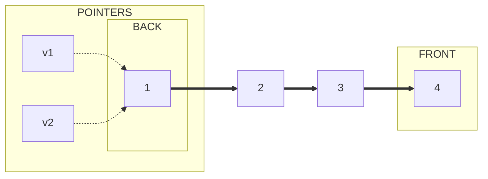

course: [[CSC 135-01 - Computing Theory and Programming Languages]]

instructor: [[Ted Krovetz]]

related_notes: [[2022-02-10]]

# Topic: Mutable Data Structures 

W06.4 | Thursday, February 10, 2022 | 09:00 AM

## Announcements

1. New code-step-by-step homework
	1. Practice class
	2. Practice maps and reduce

## Notes

A data structure is **persistent** if old versions are maintained when changed.
Persistent implies that it is immutable

## ArrayList - Not Persistent

Time-complexity: O() ==ASK WHAT WAS THE BIG O==

```python
# [1|2|3|4]
#  ^ ^
# v1 v2    NOT PERSISTENT
v1.add(4)
```

## Linked List

```text
Back                                    Front
  [ 1 | ] -> [ 2 | ] -> [ 3 | ] -> [ 4 | ]
    ^
v1 and v2
```



**Solution**: Make sure new elements have no in-pointers.

Have a reverse-pointer. Have the pointer at the end of the list.

Adding and removing is at the "front of the list"

Time-complexity: O(1)

```text
Back                                  Front
[ 1 | ] <- [ 2 | ] <- [ 3 | ] <- [ 4 | ]
                        ^          ^
                        v2         v1
```

## "Cons list" Operations

"Cons list"
- "Cons": is short for construction

Time-complexity: O(1)

- empty: Ability to create an empty list
- cons: Return "copy" of old list with new element at the front
- rest: Return "copy" of old list with front element removed
	- Can't call when the list is empty
	- Use `is_empty` before running 
- first: Return the front element
	- Can't call when the list is empty
	- Use `is_empty` before running 
- is_empty: is the list empty? Returns `True` or `False`

### "Cons list" in Pseudo-code
Fields/variable:
- Pointer rest_of_list
- Pointer item

```text
if rest_of_list == None
	Then this node represents empty list

v1 = empty
v1 = v1.cons(10)
v2 = v1.cons(20)
v3 = v1.cons(30)
v4 = v3.rest()
```

![[Screenshot from 2022-02-10 10-28-39.png|550]]

### "Cons list" in Python

Requires only one class

```python
class list135:
	# Need a constructor
	# self is a reference of the node
	def __init__(self, item=None, rest_of_list=None):
		self._item = item
		self._rest_of_list = rest_of_list

	# __init__
	# { / | / } ~~> [ / | / ] -> [ / | / ] -> ...
	#                 ^
	#                 self

	def cons(self, item):
		new_node = list135(item, self)
		return new_node

	# CONS
	# [ / | / ] -> [ / | / ] -> [ / | / ] -> ...
	#   ^
	#  self

	def first(self):
		"""
		Returns: the front element
		"""
		return self._item

	def rest(self):
		"""
		Returns: the "copy" of old list with front element removed
		"""
		return self._rest_of_list

	def is_empty(self):
		"""
		Checks if the list is empty
		Returns: boolean
		"""
		return self._rest_of_list == None

	# Create test
	# this is tricky, for it's a "fence post algorithm"
	def __str__(self):
		# cur is a reference to the current node
		cur = self
		result = "["
		if cur._rest_of_list != None:
			result = result + str(cur._item)
			cur = cur_rest_of_list
		while cur._rest_of_list != None:
			result = result + "," + str(cur._item)
			cur = cur_rest_of_list
		return result + "]"

v1 = list135()
print(v1)
v2 = v1.cons(3)
v3 = v2.cons(2)
v4 = v3.cons(1)
```

### fence post algorithm

`[1,2,3]`  or  `|==|==|==|==|`

Notice that there are fewer commas to the numbers it sits between or the wire between the posts in the fence
