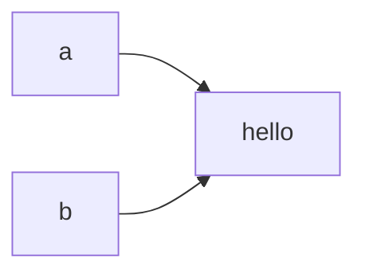
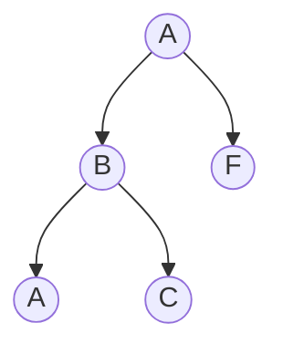
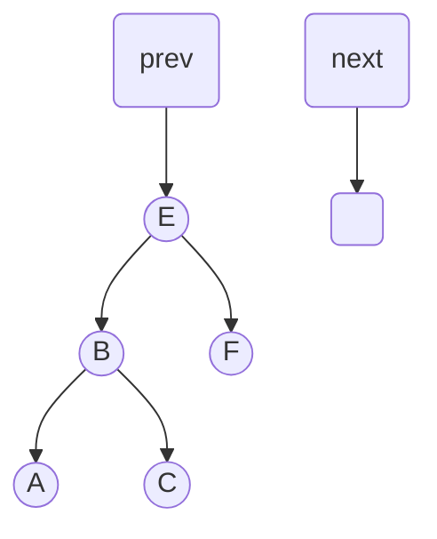
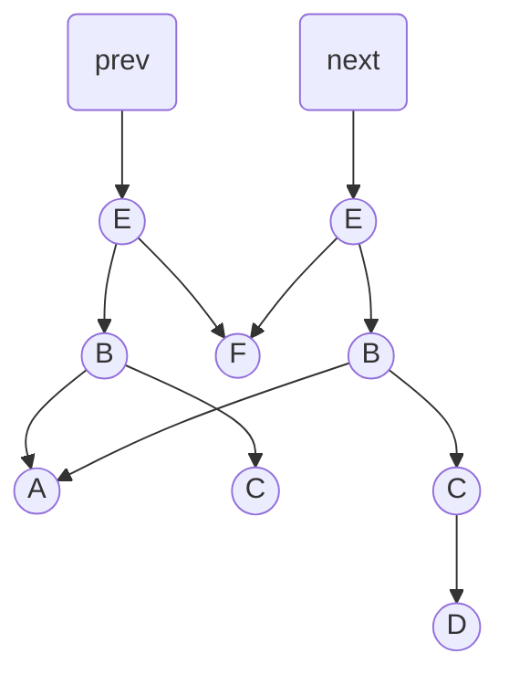

course: [[CSC 135-01 - Computing Theory and Programming Languages]]

instructor: [[Ted Krovetz]]

related_notes: [[2022-02-15]] [[2022-02-10-CSC135-01-LEC]]

# Higher Order Functions and Recursion

W07.2 | Tuesday, February 15, 2022 | 08:57 AM


## Notes

In Java ==a== and ==b== points to the same object; in addition, it's safe because Strings are immutable.



```java
String a = "hello";
String b = "hello";
```

## `list135` + Higher Order Functions

```text
Back                                    Front
  [   | ] -> [   | ] -> [   | ] -> [   | ]
    ^          ^
list01       list2
list.map(lambda x: x + 1) [1,2,3] -> [2,3,4]
```

### Recall the Cons list structure

```python
class list135:

	def __init__(self, item=None, rest_of_list=None):
		self._item = item
		self._rest_of_list = rest_of_list

	def cons(self, item):
		new_node = list135(item, self)
		return new_node

	def first(self):
		"""
		Returns: the front element
		"""
		return self._item

	def rest(self):
		"""
		Returns: the "copy" of old list with front 
		element removed
		"""
		return self._rest_of_list

	def is_empty(self):
		"""
		Checks if the list is empty
		Returns: boolean
		"""
		return self._rest_of_list == None
```

### `list135` Recursive Approach - O(n) Space

```text
Back                                           Front
  [   A  | ] -> [   B  | ] -> [   C  | ] -> [ / ]
  [ f(A) | ] -> [ f(B) | ] -> [ f(C) | ] -> [ / ]

Recursive solutions would not best for the computational overhead; where, the, often small, call stack would be too greate and would amount to O(n) calls on the run time stack.
```

```python
def map(self, f):
	if(self.is_empty()):
		return self
	else:
		mapped_smaller_list = self._next.map(f)
		return mapped_smaller_list.cons(f(self._item))
```

### `list135` Loop Approach

**Time complexity**: O(n) because it has to go though the whole list

**Space complexity**: O(1)

```text
self and old
    v   
[   A  | ] -> [   B  | ] -> [   C  | ] -> [ / ]

[ f(A) | ] -> [ f(B) | ] -> [ f(C) | ] -> [ / ]
    ^
    new
```

```python
def map(self,f):
	if(self.is_empty())
		return self
	else:
		old = self
		new = list135(self._item)
		result = new
		while not old._next.is_empty():
			# single paramter version of list135
			# rest_of_list defaults to None
			new._next = list135(f(old._next._item))
			new = new._next
			old = old._next
		# exit while old._next.is_empty() is true
		new._next = old._next
		return result
```

## Binary Search Trees

**Time, Space, Changes**: O(log n)



### Insert D



Need to have a copy of the tree



### Binary Search Trees Recursive Code

```python
def insert_new(cur, x):
	if x < cur.item:
		if cur.left == None:
			tmp = node(x)
			return node(cur.item, tmp, cur.right)
		else:
			return node(cur.item, insert(cur.left, x), cur.right)
```