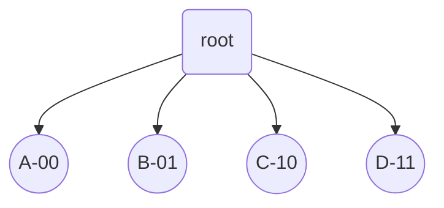
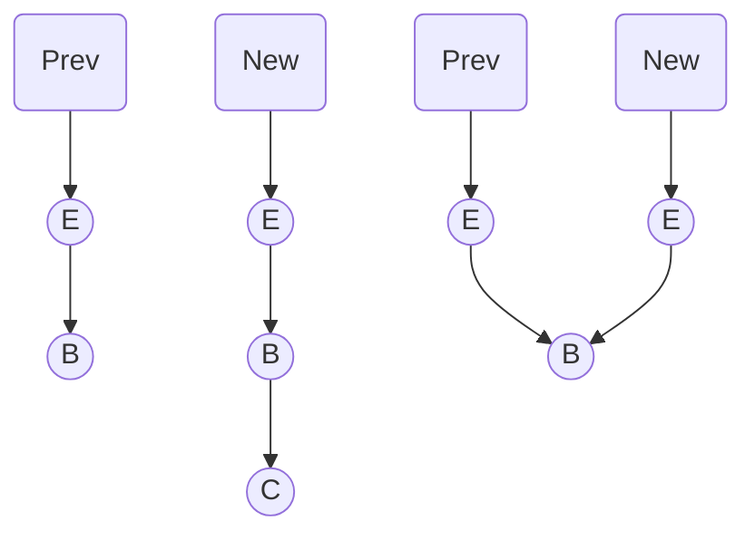
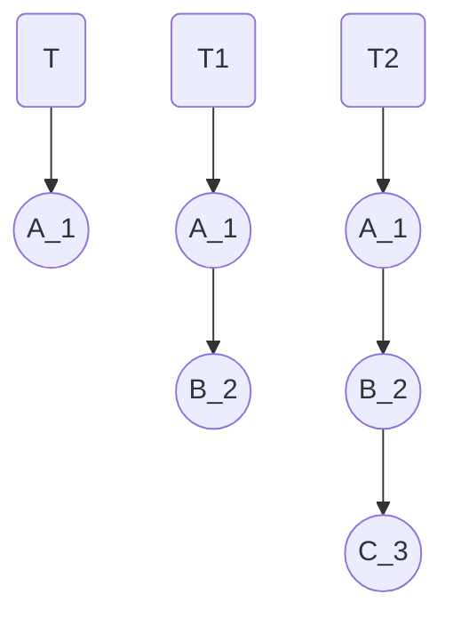
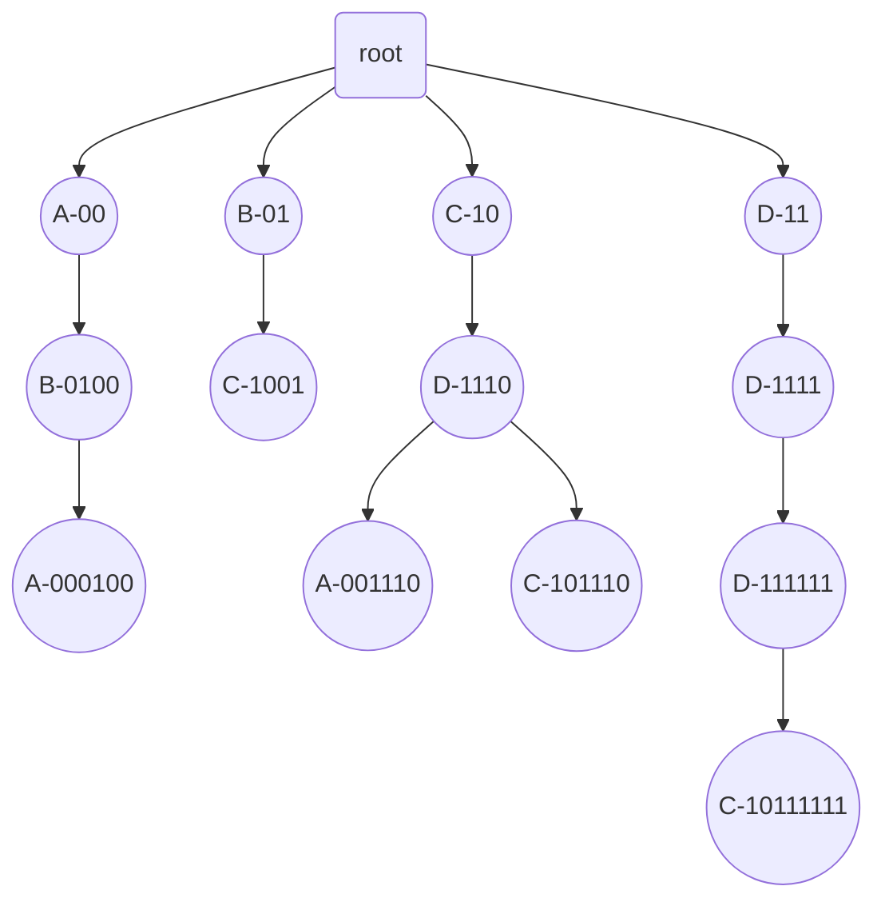
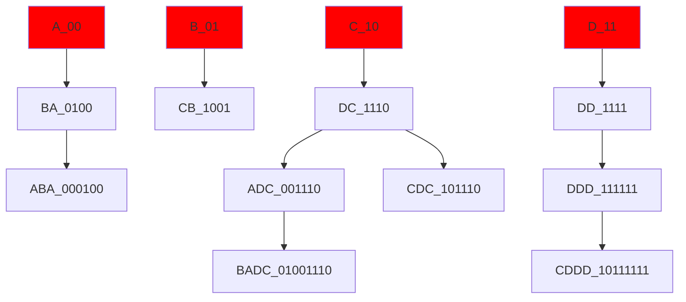
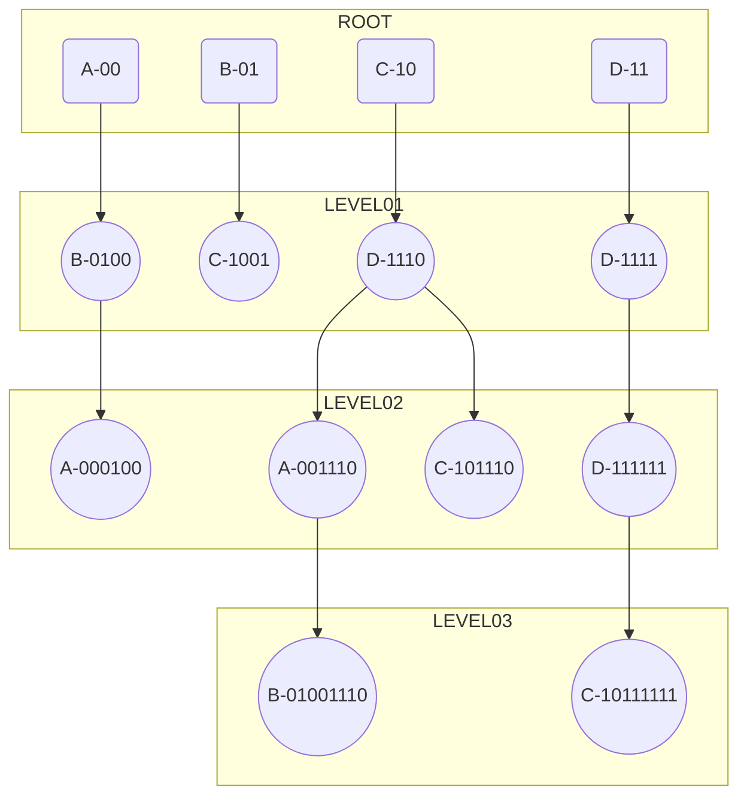

course: [[CSC 135-01 - Computing Theory and Programming Languages|CSC 135]]

instructor: [[Ted Krovetz]]

related_notes: [[2022-02-17]]

# Hash Array Mapped Tries

W07.4 | Thursday, February 17, 2022 | 09:00 AM

## HAMT - Hash Array Mapped Trie (Tree-retrieval)

Implementation we are going apply will have four children

- Binary search tree searches with a key `gen(c)`
- In a HAMT will need to compare with bits (00, 01, 10, 11)
	- Where do they come from? - with a good hash function It's random... 
	- Using two pairs of bits will allow us to determine which branch to go down
	- ==**PRO**==: HAMT is self-balancing
	


```python
set(c, "c")
hash(c) = 01100110 # random-ish hash hash(c) == hash(c)
```



## HAMT Pseudocode Algorithm

```python
def set(k,v): 
	"""
	Map key (k) -> value (v) in tree rooted at self
	return reference to copy of self
	"""
	if self.key == k:
		return # copy of self with new value
	else:
		# copy self
		child_num = # next bits from hashbits
		if child[child_num] == None:
			# Update copy, with link to new node with k, v
		else:
			# Update copy with link to child[child_num].set(k,v)
		return # Copy of self
```

## random.org

8 bits (1 byte) hashes

| x   | hash(x)  |
|:--- |:-------- |
| A   | 10100111 |
| B   | 01101000 |
| C   | 11101100 |
| D   | 00001011 |
| E   | 11100100 |

```python
t = hamt(A,1)
t1 = t.set(B,2)
t2 = t1.set(C,3)
```



## BOW DOWN TO THE HAMT

**NOTE**:

- **Bits are read right to left**
- All nodes have 4 children, but to save space `null` nodes will not be shown



### ALTERNATIVE PERSPECTIVES

**RED** IS ROOT and remember that **bits are read right to left**



---

HEY LISTEN!

When traversing down the Hash Array Mapped Trie (HAMT) **bits are read right to left**



## Cues/Questions

- What is a "side effect"
	- A print statement is an example
	- A side effect is a change to the global state
- $f(x) = x + y$
	- $x$ is bound
	- $y$ is free
	- $f(1)$ is not really possible
