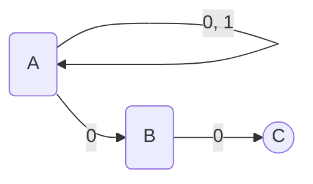
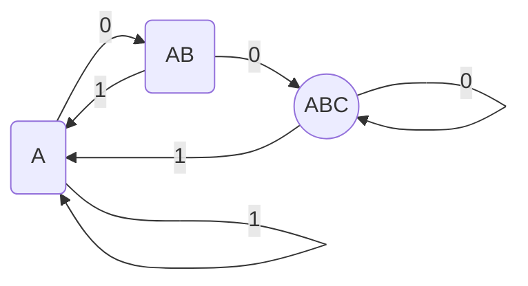
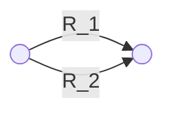
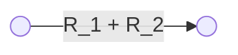
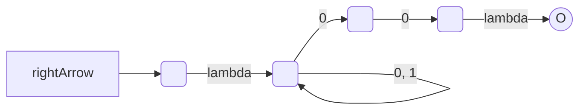
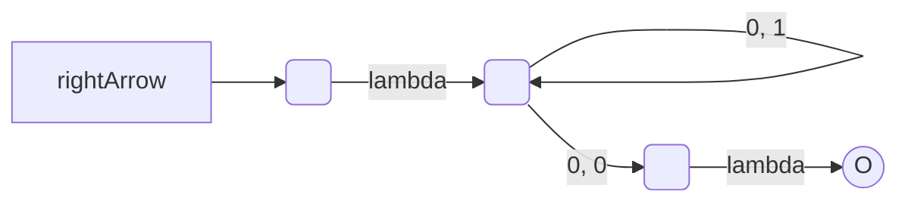
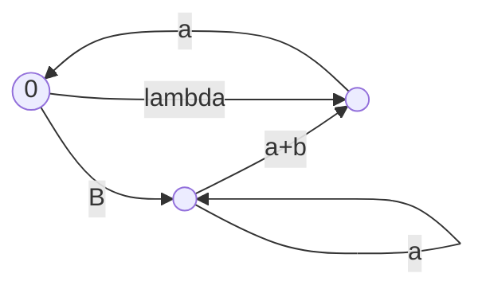

course: [[CSC 135-01 - Computing Theory and Programming Languages]]

instructor: [[Ted Krovetz]]

related_notes: [[2022-03-08]]

# Conversion Algorithms: DFA, NFA, and FA

W10.2 | Tuesday, March 8, 2022 | 08:58 AM

## Notes

- NFA is like DFA, but with additional features
	- $\LARGE \lambda$ in NFA you can feed in an empty/nothing string

```Mermaid
flowchart LR
	DFA <—> NFA <—> RE
```

### NFA To DFA

- NFA are often simpler to design, but are equivalent to DFA
- NFA to DFA may mean O(n) -> O(2n) time complexity

`Node C` is an accepting state

#### NFA



#### DFA

**Idea**: Each DFA tracks which NFA states the NFA could be in after consuming a sequence of characters

1. Label DFA start state with where NFA could be without consuming anything
2. Make DFA legal. Repeat:
	1. Identify missing DFA arrow and determine which states NFA could be in if consuming that character
	2. New arrow goes to state labeled with the states
3. Any DFA state listing NFA accept is accept




### Regular Expressions (RE) to NFA

$\LARGE (a + bb)^\ast$

Intermediate visualization device

```mermaid
flowchart LR
	A( ) --> B[“(a+bb)^*”]
	B --> C()
```

The conversion
![[image.jpg]]

#### Example 02: $\LARGE (a+bb)^\ast$
![[image 1.jpg]]
##### Step 01: $\LARGE bb$

```mermaid
Flowchart LR
	[*] --> A()
```

##### Step 02: $\LARGE +$

##### Step 03: $\LARGE \ast$

### NFA to RE

Note

Replace parallel edges as needed





#### NFA to RE Conversion Example 01

NFA that accepts a pair of 1s and 0s


we want only one accept state

![[image 2.jpg]]





#### NFA to RE Conversion Example 02

Convert this NFA to RE


