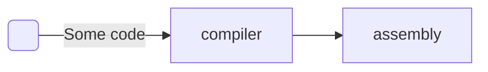
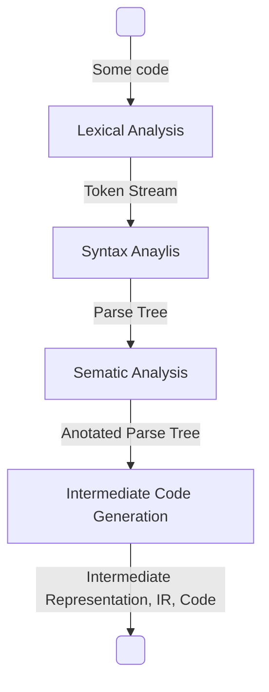
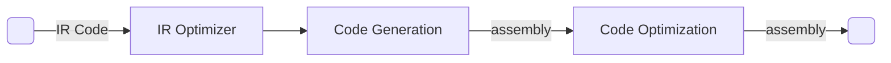
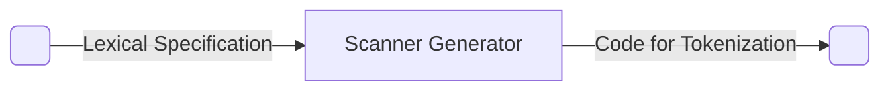

course: [[CSC 135-01 - Computing Theory and Programming Languages]]

instructor: [[Ted Krovetz]]

related_notes: [[2022-03-15]]

# Tokenization

W11.2 | Tuesday, March 15, 2022 | 09:08 AM

## Notes

### Compiler

Lexical Analysis Also Known As: "Lexer", "Scanner", "Tokenizer"
Syntax Analysis AKA: "Parser"



#### The "Front End"



#### The "Back End"



### Lexical Analysis

Often done by hand (a bunch of `if statements`)

```python
if (ch[i] == '{')
	return '}'
```

Also, "Scanner generators"



#### Lexical Specification

Lexical specifications look like the following

```text
TOKENTYPE: RE
TOKENTYPE: RE <- (Regular Expression)
```

##### Lexical analysis code works like this

**When a token is requested**:

1. Skip all white space on input
2. Find longest prefix of input that matches **any** regular expression in specification
3. Return the longest prefix and its type that matches any regular expression. **If longest prefix matches two regular expression**, return the type listed in the first specification


#### Lexical Specification Example 01

| spec                |
| ------------------- |
| ABTYPE: $ab+ba$     |
| CTHER: $(a+b)^\ast$ |

Input: aaa abb aba baa ab ba

##### Step 1: Skip all white space on input

Input: aaaabbababaaabba

##### Step 2: Find longest prefix of input that matches **any** regular expression in specification

| Input: aaaabbababaaabba | Tokens         |
|:----------------------- |:-------------- |
| **aaa**abbababaaabba    | ("aaa", OTHER) |
| **abb**ababaaabba       | ("abb", OTHER) |
| **baa**abba             | ("baa", OTHER) |

##### Step 3: Return the longest prefix and its type that matches any regular expression. **If longest prefix matches two regular expression**, return the type listed in the first specification

| spec            | Remaining Input | Tokens        |
| --------------- |:--------------- |:------------- |
| ABTYPE: $ab+ba$ | **ab**ba        | ("ab", OTHER) |
|                 | **ba**          | ("ba", OTHER) |

##### RESULT

| Input: aaaabbababaaabba | Tokens         |
|:----------------------- |:-------------- |
| **aaa**abbababaaabba    | ("aaa", OTHER) |
| **abb**ababaaabba       | ("abb", OTHER) |
| **baa**abba             | ("baa", OTHER) |
| **ab**ba                | ("ab", OTHER)  |
| **ba**                  | ("ba", OTHER)  |

### Using DFA to find Tokens

1. Write an NFA for each RE
2. Create a new spot state with $\lambda$ transitions to each NFA
3. Convert to DFA
4. Mark each accept state with the type associated with it
5. Have DFA consume input as far as possible, noting most recent accept state passed though
6. Return string and type that led to the most recent accept state passed though
