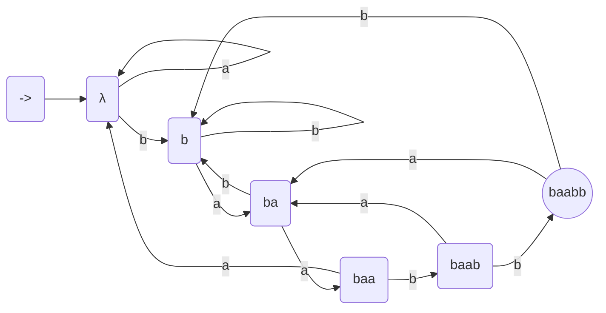

course: [[CSC 135-01 - Computing Theory and Programming Languages]]

instructor: [[Ted Krovetz]]

related_notes: [[2022-03-17]]

# Finite Automata 

W11.4 | Thursday, March 17, 2022 | 09:01 AM

Multiple approaches to text search
- Exact search
- Computational Biology: loosely match

## Exact Match

Have a pattern `P`, length `M`
Text `T`, with length `N`
Find all occurrences of `P` in `T`

### The Naive Approach

`T` [xxxxxxxxxxxxxxxxxxxxxxxx]
`P` [...] <- test to match with the text above
`T` [xxxxxxxxxxxxxxxxxxxxxxxx]
`P` [...][...]
`T` [xxxxxxxxxxxxxxxxxxxxxxxx]
`P` [...][...][...] <- And so on...

#### The Naive Algorithm

```python
for i = 1 to n-m+1 # Time-complication: O([n-m]*m) <- O(n*m) if n > m
	if P == T[i...i+m-i]  # Time-complication: O(m)
		output "match at"
```


#### Naive Approach Example

```text
T: ..abcde](f)g...  # ..abcdef suffix of T upto the mismatch
P: not{abcde}k
         abcdek <- naive shift
              abcdek <- clever shift
P: abfdek
     [ab(f)dek] # If a suffix matches the prefix of our pattern...
```

### The Clever Approach

**Idea**: Shift `P` so that we have a match between a prefix of `P` and a suffix of T up to `T`'s mismatch

#### Clever Approach Example

**At each step**: we compare prefix of `P` with suffix of `T`
- This is "expensive" time-compilation at O(m\*n) 

==TODO: MAKE SURE TO ASK THE PROFESSOR/DISCORD TO HOW THIS WORKS==
```text
T: aaabaaabaaab
P: baab

# 1) first `a` of T against `b` of P
T: a]aabaaabaaab
P: [baab


# 2)
T: aaabaaabaaab
P: baab


# 3)
T: aaabaaabaaab
P: baab


# 4)
T: aaabaaabaaab
P: baab

```

### Clever Approach via Pre-processing

````text
              w    c
T: [    |/////////|X|       ]
P:      [/////////|Y]
````

#### Pre-computation

A = {a, b} <- our language
P: baabb

| `w` (matches) | `c` (miss-matches) | Biggest Prefix of P = Suffix of wc (DFA Transitions) |
|:------------- |:------------------ |:---------------------------------------------------- |
| $\lambda$     | a                  | $\lambda$                                            |
| a             | b                  | b                                                    |
| ba            | b                  | b                                                    |
| baa           | b                  | $\lambda$                                            |
| baab          | a                  | ba                                                   |
| match {baabb} | a                  | ba                                                   |
| match {baabb} | b                  | b                                                    |

This allows us to make into a DFA and can be seen as DFA transitions

- We can name our states with what we matched
- Time-complication for search: O(n)
	- Each time entering accept state output: Found `P`
- Time-complication for preprocessing: multiply the below we get $O\left(m^3\cdot \left|A\right|\right)$, but clever algorithms can do so in $O\left(m\cdot \left|A\right|\right)$
	- Lengths of P prefixes: O(m) 
	- To find longest prefix = suffix: $O(m^c)$
	- Possible `c` values: $O\left(\left|A\right|\right)$
- All together and overall time-complication: $O\left(n+m\cdot \left|A\right|\right)$ very good if n >> m

Note: **baabb** is the accepting state


