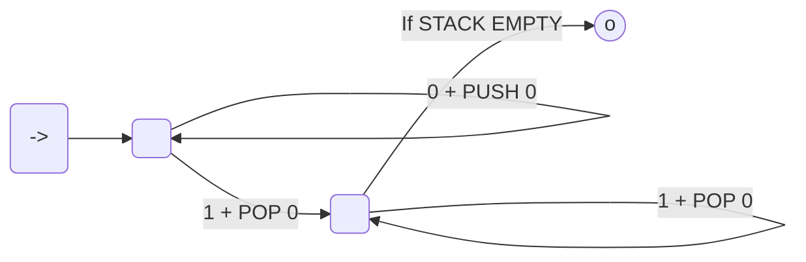
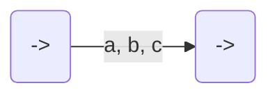
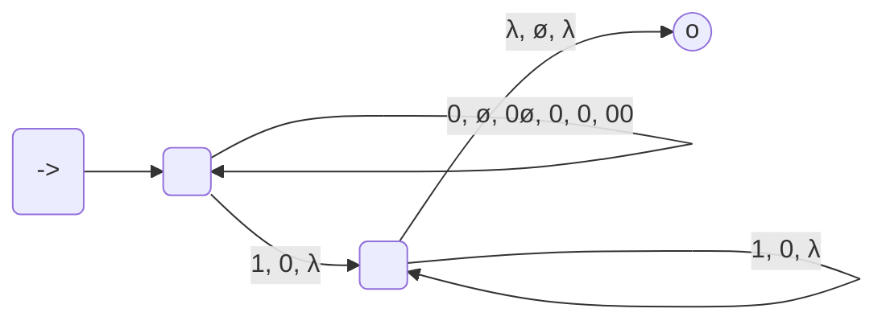
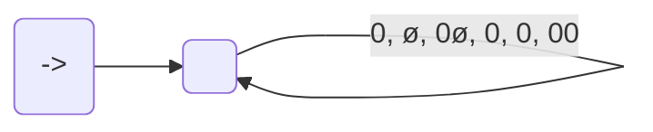
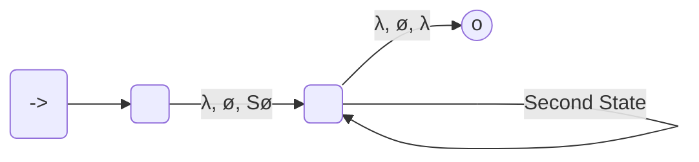

course: [[CSC 135-01 - Computing Theory and Programming Languages]]

instructor: [[Ted Krovetz]]

related_notes: [[2022-03-29]]

# Push-down Automata (PDA - "recognizer"): A Finite Automata, But With a stack

W13.2 | Tuesday, March 29, 2022 | 09:02 AM

**Problem**:a finite automata isn't able to count
**Solution**: 
- If the 1's run out or if the stack runs out (typically both runs out)



### Push-down Automata (PDA) is a Non-Finite Automata (NFA)
- String is accepted if and only if a path to an accept state exist that consumes entire input.

**BUT WITH A STACK**:
- Labels have triples



"**a**": Consumed from input or $\large \lambda$ ("$\lambda$" means don't consume anything)
"**b**": Top of stack, always gets popped
"**c**": String of characters (chars) that gets pushed RIGHT-TO-LEFT
- Cross arrow if and only if "a" is consumed and "b" matches TOP OF STACK
	- "a" is consumed
	- "b" is popped
	- "c" is pushed right-to-left
- Stack begins with special char $\large \varnothing$

## Example 01 $\left\{0^n1^n|n\ge 1\right\}$

> [!info]
> The accept state can get there on $0^n1^m$ where $0 < n \le m$ but... input accept ONLY if entirely consumed



0
0
0
0
ø
=====
STACK

### Example 01 - Simulated: 0011 (TODO-FLUSH OUT NOTE SECTION)

#### STEP 01.1 : 0011



0
=====
STACK

#### STEP 01.2: <s>0</s> 011

### Example 02 - Simulated: 1100 (TODO-FLUSH OUT NOTE SECTION)

> [!failure]
> NOT EXCEPTED BECAUSE IT STARTS WITH A $1$

#### STEP 02.1


0
=====
STACK


### Example 03 - Simulated: 011 (TODO-FLUSH OUT NOTE SECTION)

ALTHOUGH ENDS AT THE ACCEPT STATE. THE STRING IS NOT ACCEPTED, FOR IT DID NOT CONSUME THE WHOLE INPUT.

#### STEP 03.1


## To write a Push-down Automata (PDA)

1. Think stack algorithm
2. Write the PDA to implement the algorithm
3. Test good and bad strings 

## Theorem: PDA is more powerful than an NFA

1. A PDA can do anything an NFA can
	![[Pasted image 20220329094858.png|200]]
	Let $M$ be an arbitrary NFA convert all arrows in NFA

	TO
	```mermaid
	flowchart LR
		start( ) --"x"--> A( )
	```
	
	in PDA
	```mermaid
	flowchart LR
		start( ) --"x, ø, ø"--> A( )
	```
	
	"**x, $\large \varnothing$, $\large \varnothing$**": Don't use the stack.

2. Show the PDA can solve a problem the NFA can't
	1. $\large \left\{0^n1^n|n\ge 1\right\}$

## Context Free Grammar ("generator")

- Regular Expression <-- "generator"
- DFA/NFA <-- "recognizers"

### Context Free Grammar Example 01: $S\large \:\rightarrow \:aSa\:\left|bSb\right|\:x$

$\LARGE S\:\rightarrow \:aSa\:\left|bSb\right|\:x$

> [!Idea]
> PDA simulate a left-most derivation for a string

$\Large abxba$
1. $\Large S\:\rightarrow \:aSa$
2. $\Large S\:\rightarrow \:\:aSa\:\rightarrow \:abSba$
3. $\Large S\:\rightarrow \:\:aSa\:\rightarrow \:abSba\:\rightarrow \:abxba$

One triple per production in grammar



> [!Second State]
> - a, a, λ
> - b, b, λ
> - x, x, λ
> - λ, S, aSa
> - λ, S, bSb
> - λ, S, λ

### Context Free Grammar Example 02

Grammar:
- $S\:\rightarrow \:\:AE$
- $A\:\rightarrow \:aA|a$
- $E\:\rightarrow \:aEb|\lambda$

Produces Language: $L = \left\{a^n b^m| n>m \right\}$
