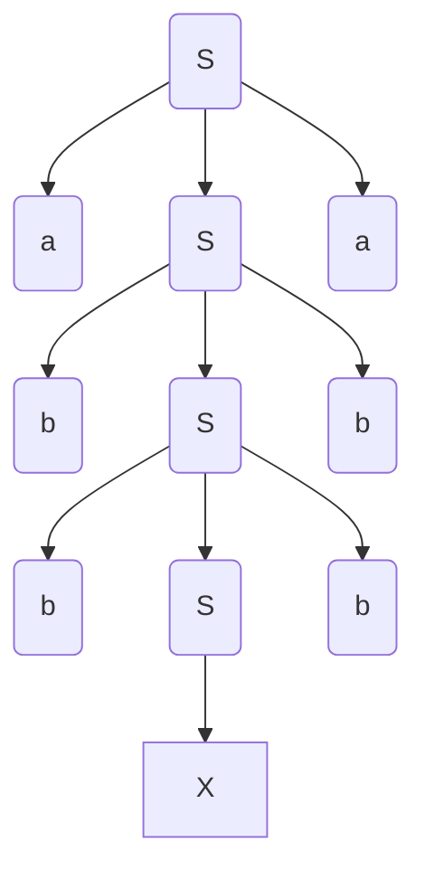

course: [[CSC 135-01 - Computing Theory and Programming Languages]]

instructor: [[Ted Krovetz]]

related_notes: [[2022-04-05]]

# Parsing

W14.2 | Tuesday, April 5, 2022 | 09:03 AM

## Two Possible Goals For Parsing

1. **Build a parse tree**; or
2. **Recognize** that a parse tree exist
	1. Simple goal is to ask "is this parse-able"

### Recognizing

Grammar: $\LARGE S\rightarrow aSa\left|bSb\right|x$
Language: abbxbba

**Denervation from the string** `abbxbba`:

- **Terminals** are lowercase letters
- **Nonterminal** are uppercase letters



### Algorithm For Pushdown Automata (PDA) Parsing

```python
while Stack not empty:
	top = pop
	token = next # Reads what's next in token string, but does not remove from token string
	if top is a terminal:
		match(top) # Consumes next input if they match, otherwise error
	elif top is nonterminal:
		push production right hand side

if input is empty:
	print("accept")
else:
	print("reject")
```

Further abstraction

```python
while Stack not empty:
	top = pop
	token = next # Reads what's next in token string, but does not remove from token string
	if top is a terminal:
		match(top) # Consumes next input if they match, otherwise error
	elif top == A_subOne and token ∈ first(w_subOne) # A_1 --> w_1
		push(w_subOne)
	elif if top == a_subTwo and token ∈ first(w_subTwo) # a_2 --> w_2
		pust(w_subTwo)
	⋮
	⋮
	⋮

if input is empty:
	print("accept")
else:
	print("reject")
```

For each `elif` $\LARGE A_i \rightarrow w_2$

Only works if (cant read his hand writing) has only one production for the current  state

### Parsing PDA Code

Grammar: $S\rightarrow aSa\left|bSb\right|x$

```python
While stack not empty:
    top = pop
	token = next
	if top == a,b,x:
		match(top)
	elif top == S and token == a:
		push(aSa)
	elif top == S and token == b:
		push(bSb)
	elif top == S and token == x:
		push(x)
	else:
		error
if input is empty:
	print("accept")
```

## Which production to chose?

First(A) is the set of all first terminals of all strings derived form A

$A\rightarrow aA\rightarrow aB\rightarrow ...\rightarrow abb$

First(A) = $\large \left\{c\:|\:cs\:\in L\left(A\right)\:where\:'c'\:is\:a\:terminal\:and\:'s'\:is\:a\:string\:of\:terminals\right\}$

$\huge S\rightarrow\:aSa\left|bSb\right|x$

- $\LARGE S\rightarrow\:aSa\rightarrow\:\ldots\:all\:start\:with\:'a'$
- $\LARGE S\rightarrow\:aSa\rightarrow\:\ldots\:all\:start\:with\:'b'$
- $\LARGE S\rightarrow\:x\rightarrow\:\ldots\:all\:start\:with\:'x'$
- First(aSa) = {a}
- First(bSb) = {b}
- First(x) = {x}

### Example 01

$\LARGE A\rightarrow aA|\lambda$
$\LARGE B\rightarrow aB|\lambda$
$\LARGE S\rightarrow AB$

$\LARGE First(a) = {a}$
- $\LARGE A\rightarrow aA \ldots\:\:\:a\:\in$ First(A) doesn't have first terminal
- $\LARGE First(A)\rightarrow\lambda$

$\LARGE First(B) = {b}$
$\LARGE First(S) = {a,b}$
- $S\LARGE \rightarrow AB\rightarrow aAB\rightarrow \ldots a\in First\left(S\right)$
- $S\LARGE \rightarrow AB\rightarrow B\rightarrow \ldots b\in First\left(S\right)$
- $\LARGE S\rightarrow \:AB\rightarrow \:B\:\rightarrow \lambda$

## To Find Sets

1. Identify all set constraints
2. Seed the first sets with the $\LARGE \in$ constraints
3. Satisfy **C** constraints by copying anything in the Left Hand Side missing in the Right Hand Side
4. Repeat step 3 until nothing happens

## Methodical way to find First

| If you have...                                             | you can deduce                               |
| ---------------------------------------------------------- | -------------------------------------------- |
| $\Large A\rightarrow\lambda$                               | nothing                                      |
| $\Large A\rightarrow xw$                                   | $x\in\:First(A)$                             |
| $\Large A\rightarrow Bw$                                   | $First\left(B\right)\le First\left(B\right)$ |
| $\Large A\rightarrow Bw$ and $\lambda \in L\left(B\right)$ | $First\left(w\right)\le First\left(A\right)$ |                    |
