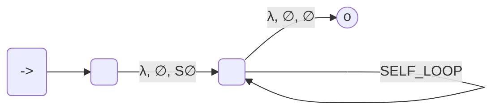

course: [[CSC 135-01 - Computing Theory and Programming Languages]]

instructor: [[Ted Krovetz]]

related notes: [[2022-04-07]] [[2022-04-05-CSC135-01-LEC-parsing]]

# Parsing, LL(1) Parsing, Pushdown Automata (PDA)

W14.4 | Thursday, April 7, 2022 | 08:58 AM

Say that we have a grammar

$\LARGE S \rightarrow\:ABCd$
$\LARGE A\rightarrow\:aA\:|\:\lambda$
$\LARGE B \rightarrow\:bB\:|\:\lambda$
$\LARGE C \rightarrow\:cC\:|\:\lambda$

If we wanted to change to a Pushdown Automata (PDA)

| SELF_LOOP INPUTS       |                                       |                                       |
|:---------------------- |:------------------------------------- |:------------------------------------- |
| a, a, $\LARGE \lambda$ | $\LARGE \lambda$, S, ABcd             | $\LARGE \lambda$, B, bB               |
| b, b, $\LARGE \lambda$ | $\LARGE \lambda$, A, aA               | $\LARGE \lambda$, B, $\LARGE \lambda$ |
| c, c, $\LARGE \lambda$ | $\LARGE \lambda$, A, $\LARGE \lambda$ | $\LARGE \lambda$, C, cC               |
| d, d, $\LARGE \lambda$ |                                       | $\LARGE \lambda$, c, $\LARGE \lambda$ |

> TOK = next
> TOP = pop
> ⋮
> if TOP = X; and TOK ∈ first($w_i$) // $X_i \rightarrow w_i$
> 	push($w_i$)

- $\LARGE X \rightarrow \lambda$: nothing
- $\LARGE X \rightarrow xw$: $x \in$ first(X)
- $\LARGE X \rightarrow yw$: first(Y) $\leq$ first(X)

> if Y is nullable ...
> 	first(w) $\leq$ first(X)

| Logic                   |     |
|:----------------------- | --- |
| $A\rightarrow\:aA$     |     |
| $A\rightarrow\:\lambda$ |     |
| $B\rightarrow\:bB$      |     |
| $B\rightarrow\:\lambda$ |     |
| $C\rightarrow\:cC$      |     |
| $C\rightarrow\:\lambda$ |     |
| $S\rightarrow\:ABCd$    |     |

## Improved Pushdown Automata (PDA)

Follow(A) is the set of all terminals that can appear immediately after **A** in a derivation

**Methodically**:

1. Find set constraints
2. Seed sets with $\LARGE \in$ statements
3. Copy Left-Hand-Side (LHS) at $\leq$ statements to Right-Hand-Side (RHS)
4. Repeat Until no more changes

**Patterns to look for**:

| Pattern                   | Meaning                               |
| ------------------------- |:------------------------------------- |
| $X\rightarrow\:....Yz...$ | **z $\large \in$ follow(Y)**          |
| $X\rightarrow\:....YZ...$ | **first(Z) $\large \leq$ follow(Y)**  |
| $X\rightarrow\:....Y$     | **follow(X) $\large \leq$ follow(Y)** |
- $X\rightarrow\:....Y$
	- Where **Y** is at the end of production

### Example01 $\LARGE S\rightarrow\:aSa\left|bSb\right|x$

1. $\LARGE S\rightarrow aSa\rightarrow abSba$
	1. aS`a`: $\large a\in\:follow(S)$
	2. abS`b`a: $\large b\in\:follow(S)$
2. $follow\left(S\right)\:=\:\left\{a,\:b\right\}$

**Impossible**: $....Sx..$ 

### Example02

1. $\large A\rightarrow\:aA$
2. $\large A\rightarrow\:\lambda$
3. $\large B\rightarrow\:bB$
4. $\large B\rightarrow\:\lambda$
5. $\large C\rightarrow\:cC$
6. $\large C\rightarrow\:\lambda$
7. $\large S\rightarrow\:ABCd$

What is our set constraints?

$\large S\rightarrow\:ABCd$
- $\large first(b)\:\leq\:follow(A)$
- $\large first(c)\:\leq\:follow(B)$
- $\large d\:\in\:follow(C)$
- $\large d\:\in\:follow(B)$
- $\large d\:\in\:follow(A)$
- $\large first(C)\:\leq\:follow(A)$

| FIRST        | FOLLOW |
| ------------ | ------ |
| $S\:d,a,b,c$ |        |
| $A\:a$       | d,b,c  |
| $B\:b$       | d,c    |
| $C\:c$       | d      |

**What to do with these**? Build prediction table

| $\Huge LHS\rightarrow\:RHS$    | FIRST RHS           | IF RHS nullable follow of LHS | Predictor (The union of the two other columns) |
|:------------------------------ |:------------------- |:----------------------------- |:---------------------------------------------- |
| $\large A\rightarrow\:aA$      | $\large a$          |                               | $\large a$                                     |
| $\large A\rightarrow\:\lambda$ |                     | $\large b, c, d$              | $\large a, c, d$                               |
| $\large B\rightarrow\:bB$      | $\large b$          |                               | $\large b$                                     |
| $\large B\rightarrow\:\lambda$ |                     | $\large c, d$                 | $\large c, d$                                  |
| $\large C\rightarrow\:cC$      | $\large c$          |                               | $\large c$                                     |
| $\large C\rightarrow\:\lambda$ |                     | $\large d$                    | $\large d$                                     |
| $\large S\rightarrow\:ABCd$    | $\large a, b, c, d$ |                               | $\large a, b, c, d$                            |

Pushdown Automata (PDA) parsing, sometimes called **LL(1) parsing**, is appropriate for this grammar if...

1. Each non-terminal group has disjoint predictors
2. Grammar is **NOT** left-recursive
3. Grammar is **NOT** ambiguous

### Example03

**Grammar**:

$\Huge T\rightarrow\:aTc$
$\Huge T\rightarrow\:R$
$\Huge R\rightarrow\:bR$
$\Huge R\rightarrow\:\lambda$

#### STEP 01 - WRITE DOWN OUR CONSTRAINTS

| GRAMMAR                        | CONSTRAINTS                                      |
|:------------------------------ |:------------------------------------------------ |
| $\large T\rightarrow\:aTc$     | $\large a\in\:first(T)$, $\large c\in\:follow(T)$ |
| $\large T\rightarrow\:R$       | $\large $                                        |
| $\large R\rightarrow\:bR$      | $\large $                                        |
| $\large R\rightarrow\:\lambda$ | $\large $                                        |

#### STEP 02 - SEED SETS WITH $\in$ STATEMENTS
Take our non-terminals

#### STEP

| GRAMMAR                        | CONSTRAINTS | IF RHS nullable follow of LHS | Predictor     |
|:------------------------------ |:----------- |:----------------------------- |:------------- |
| $\large T\rightarrow\:aTc$     | $\large a$  |                               | $\large a$    |
| $\large T\rightarrow\:R$       | $\large b$  | $\large c$                    | $\large b, c$ |
| $\large R\rightarrow\:bR$      | $\large b$  |                               | $\large b$    |
| $\large R\rightarrow\:\lambda$ |             | $\large c$                    | $\large c$    |