course: [[CSC 135-01 - Computing Theory and Programming Languages|CSC 135 - Computing Theory and Programming Languages]]

instructor: [[Ted Krovetz]]

related notes: [[2022-04-12]] [[2022-04-07-CSC135-01-LEC-parsing]]

# Pushdown Automata Parsing

W15.2 | Tuesday, April 12, 2022 | 10:27 AM

## PDA Parsing Example01

$\LARGE S\rightarrow\:aS$
$\LARGE S\rightarrow\:T$
$\LARGE T\rightarrow\:bT$
$\LARGE T\rightarrow\:R$
$\LARGE R\rightarrow\:cR$
$\LARGE R\rightarrow\:\lambda$

### Step01: Find which are Nullable?

All are Nullable: $\LARGE S, T, R$

### Step02: What is our set constraints?

| Grammar                        |                                   |                                   |
| ------------------------------ |:--------------------------------- | --------------------------------- |
| $\LARGE S\rightarrow\:aS$      | $\LARGE a\:\in\:first(S)$         |                                   |
| $\LARGE S\rightarrow\:T$       | $\LARGE First(T)\:\leq\:First(S)$ | $\LARGE First(S)\:\leq\:First(T)$ |
| $\LARGE T\rightarrow\:bT$      | $\LARGE b\:\in\:first(T)$         |                                   |
| $\LARGE T\rightarrow\:R$       | $\LARGE First(R)\:\leq\:First(T)$ | $\LARGE First(T)\:\leq\:First(R)$ |
| $\LARGE R\rightarrow\:cR$      | $\LARGE c\:\in\:first(R)$         |                                   |
| $\LARGE R\rightarrow\:\lambda$ |                                   |                                   |
| $\LARGE R\rightarrow\:\$\$$    | $\LARGE\$\:\in\:Follows(S)$       |                                   |

S -> aS -> aT -> abT -> abbT -> abbR -> abbc
- `abbR` -> $\Large R\rightarrow\lambda$ -> abbc ->

### Step03: Build out our sets

|     |   FIRST   | Follow |
| --- |:---------:|:------:|
| $S$ | $a, b, c$ | $\$$   |
| $T$ |  $b, c$   | $\$$   |
| $R$ |    $c$    | $\$$   |


### STEP04: Build out our prediction table


| Grammar                        | FIRST RHS     | IF RHS Nullable FOLLOWS LHS | PREDICTORS        |
|:------------------------------ |:------------- |:--------------------------- |:-----------------: |
| $\LARGE S\rightarrow\:aS$      | $\LARGE a$    | $\LARGE -$                  | $\LARGE a$        |
| $\LARGE S\rightarrow\:T$       | $\LARGE b, c$ | $\LARGE \$$                 | $\LARGE b, c, \$$ |
| $\LARGE T\rightarrow\:bT$      | $\LARGE b$    | $\LARGE -$                  | $\LARGE b$        |
| $\LARGE T\rightarrow\:R$       | $\LARGE c$    | $\LARGE \$$                 | $\LARGE c, \$$    |
| $\LARGE R\rightarrow\:cR$      | $\LARGE c$    | $\LARGE -$                  | $\LARGE c$        |
| $\LARGE R\rightarrow\:\lambda$ | $\LARGE -$    | $\LARGE \$$                 | $\LARGE \$$       |

### STEP05: Is this grammar suitable for LL(1) parsing?

Check for three properties - if all are "NO" then yes the grammar is suitable for LL(1) parsing - Need prediction table
1. Is ambiguous grammar? - **has to be "NO"**
	1. Two left most _______
	2. Does it have any left recursion? - Is it left recursive? - **has to be "NO"**
		1. $\large A\:\rightarrow\:fw$
	3. Are there conflicting predictors for any non-terminal? - **has to be "NO"** 

### STEP 06: now write the parser...

> [!code] Code writing the parser - Pushdown Automata Parsing
> ```python
> def parse(input):
>     toks = scanner(input)
>     stack = ['S']
>     while len(stack) > 0:
>         top = stack.pop()                 # Always pop top of stack
>         tok = toks.next()                 # None indicates token stream empty
>         if top in ('a', 'b', 'c'):        # Try input/stack match
>             toks.match(top)
>         elif top == 'S' and tok == 'a':
>             stack.append('S')
>             stack.append('a')
>         elif top == 'S' and (tok == None or tok in ('b', 'c')):
>             stack.append('T')
>         elif top == 'T' and (tok == None or tok in ('b'):
>             stack.append('R')             # production to follow here
>         elif top == 'R' and tok == 'c':
>             stack.append('R')
>             stack.append('c')             # production to follow here
>         elif top == 'R' and tok == None:
>             pass # Push nothing
>         else:
>             raise Exception               # Unrecognized top/tok combination
>     if toks.next() != None:
>         raise Exception
> ```

## Recursive Decent Parsing

If you have a production

| Production                   |       |
| ---------------------------- | ----- |
| $\LARGE A\:\rightarrow\:bCD$ | in: b |

b
C
D
STACK
where b, C, D is our to-do list

```mermaid
flowchart TD
rootS(S) --> aLHS1(a)
rootS --> SLHS1(S)

SLHS1 --> tRHS2(T)
tRHS2 --> bLHS2(b)
tRHS2 --> tRHS3(T)

tRHS3 --> bLHS3(b)
tRHS3 --> tRHS4(T)

tRHS4(T) --> center5(R)
center5 --> cLHS5(c)
center5 --> RLHS5(R)

RLHS5 --> lambda5(λ)
```



> [!code] CODE: Recursive Decent Parsing
> ```python
> def parseT(toks):
> 	toks = toks.next()
> 	if tok == 'b'
> 		toks.match(toks)
> 		parseS(toks)
> 	elif tok == None or tok == 'c':
> 		parseR(toks)
> 	else:
> 		rise Exception
>
> def parseS(toks):
> 	tok = toks.next()
> 	if tok == 'a'
> 		toks.match(toks)
> 		parseS(toks)
> 	elif tok == None or tok in ('b', 'c'):
> 		parseT(toks)
> 	else:
> 		rise Exception
>
>
>def recursive_parse(input):
>	toks = scanner(input)
>	parseS(toks)
>	if toks.next() != None:
>		raise Exception
>
>
>try:
>	recursive_parse("aabbcc")
>except:
>	print("Reject")
>else:
>	print("Accept")
> ```
