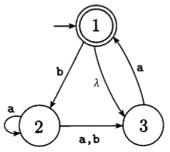
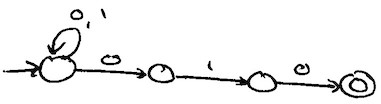

# CSC 135 - Nondeterministic Finite Automata

A variation of the finite automata is the _**nondeterministic finite automata**_ (**NFA**). The word nondeterministic means that as the machine proceeds, it is not guaranteed which state the machine will be in. The FA we have been looking at are deterministic, meaning there is only one state the machine can be in after consuming each input character (these are often called DFA). The main benefit of NFA is that they can be easier to design with.

An NFA differs from a FA in the following ways:

- NFAs can have any number of arrows out of each state for each character (ie, 0, 1, 2, etc.), and
- Arrows may come out of states labeled `λ`.

For example, in the following you see that there is no "a" arrow out of state 1, and there are two "a" arrows out of state 2. (BTW, "a,b" is shorthand for two arrows, one labeled "a" and one labeled "b").



The operation of a NFA is also changed. A `λ` arrow may be followed any time without consuming an input character, and a string is accepted if and only if there exists a path from the start state to an accept state that consumes all the input characters.

As an example of nondeterminism, consider when "baab" is the input to the above NFA. There are exactly two states the NFA could end in and consume the input. One follows this sequence: b to 2, a to 2, a to 2, b to 3. Another is: b to 2, a to 3, a to 1, and b to 2. No other path exists that consumes all of "baab". Since none of the paths end in an accept state the string is rejected.

## Easier Design

Certain problems are easy to solve with nondeterminism. For example, all strings over alphabet {0, 1} ending with 010 can be drawn as follows as an NFA. The only way a string gets accepted is if it ends 010.



## Computational Power

An NFA has more features than an FA. Does this mean an NFA is a more powerful computer than a FA? To answer "yes", we would need to show two things.

1. An NFA could do anything a FA could (ie, any language recognized by a FA could be recognized by a NFA); and
2. There is at least one thing a NFA can do that a FA can't (ie, show a language that an NFA can recognize and an FA can't).

The easiest way to do #1 is to let `_M_` be an arbitrary FA ("arbitrary FA" means we know `_M_` is an FA but we don't know anything else about it), and explain how to construct a NFA that recognizes the same language as `_M_`.

The easiest way to do #2 is to find a language `_L_` and do two things: write a NFA that recognizes `_L_` and argue that it's impossible to write a FA that recognizes `_L_`. This shows the NFA can do something the FA can't.

If you were to do these two things, you'd prove that NFA are more powerful than FA. But, it's actually not true. DFA and FA are equivalent in power. Any language recognized by one can be recognized by the other.

How would you prove FA and NFA have equivalent power? Show that anything a FA can do so can a NFA, and show that anything a NFA can do so can a FA.

_Theorem:_ Let `_M_` be a FA. Then there exists a NFA `_M'_` where `_L(M)_` =` `_L(M')_``.

_Proof sketch:_ Let `_M'_` be a NFA with the same definition as `_M_`. Because the definition of what makes a legal NFA is the same as that of a FA but with additional powers, every legal FA can simply be considered a legal NFA too. NFA `_M'_` does not use any of the nondeterministic features of the NFA model, so even when run as an NFA it will have deterministic behavior. Thus `_M_` and `_M'_` will behave identically, recognizing the same language. QED.

That theorem shows that anything a FA can do so can a NFA. The next theorem needs to show the opposite.

_Theorem:_ Let `_M_` be a NFA. Then there exists a FA `_M'_` where `_L(M)_` = `_L(M')_`.

_Proof sketch:_ The NFA-to-FA algorithm converts NFA `_M_` into FA `_M'_` with `_L(M)_` = `_L(M')_`. QED.

## NFA-to-DFA Algorithm

Key idea: Keep track of all states an NFA could be in after consuming each character of the input. For example, in this NFA before consuming any input characters the NFA could be in start state 1 or state 3 (remember `λ` can be followed anytime without consuming any input).


So, without consuming anything the machine could be in 1 or 3. What about after consuming the first a? If the machine is in state 1 and needs to consume an a, it could follow `λ` to 3 and then consume a and follow the arrow to 1. Once in 1, the machine could stay in 1 or follow `λ` to 3. So, if it were in state 1 and consumed an a it could be in 1 or 3 afterward. If the machine had been in 3 and needed to consume an a it could follow the a arrow to 1. Once in 1, the machine could stay in 1 or follow `λ` to 3. So, if it were in state 3 and consumed an a it could be in 1 or 3 afterward. So, after consuming the first a of the input, the machine could be in state 1 or 3.

This kind of case by case analysis can be pursued until the entire input is consumed. Like so...

Initial input: aba

After consuming nothing: 1, 3.

After consuming a: 1, 3.

After consuming ab: 2.

After consuming aba: 2, 3.

So, when aba is input to the above NFA, there are paths to states 2 and 3 which consume the entire input. Does the NFA accept aba? No. A string is accepted if there are any paths to an accept state, and in this case there are none.

You can use this idea to take an NFA and create an equivalent FA. The idea is to begin the process by drawing the FA start state and then "growing" it into a legal FA. The start state of the FA will be labeled by the set of states the NFA could be in without consuming any input characters. In the above example: "`{1,3}`". Just having a state labeled "`{1,3}`" is not a legal FA because it needs to have an arrow for each alphabet character. To fix that, ask where the machine could be if it were in 1 or 3 and needed to consume an a: as we saw above, the answer is 1 or 3. So, draw a loop labeled a from the state labeled `{1,3}` to itself. Next ask where the machine could go if it were in 1 or 3 and needed to consume a b. The answer: only 2, because there's an arrow from 1 to 2 on b, but no arrow from 3 to anything on b. Since there's not a state in the FA labeled "`{2}`", we need to draw a new state labeled "`{2}`" and draw a label from "`{1,3}`" to "`{2}`" labeled b. You keep doing this analysis, creating new states as needed, until you have a legal FA. Finally, any state in the FA with a label that includes an accept state in the NFA gets marked as an accept state in the FA. That's it.

This procedure creates an FA that keeps track of which states the NFA could be in after each input character is consumed, just like we did in the first example of this section. In summary, the process goes like this:

Idea: Make FA states track possible NFA states.

1. Label FA start state with where NFA could be without consuming anything.
2. Make FA legal. Repeat:
   - Identify missing FA arrow and determine which states NFA could be in if consuming that character.
   - New arrow goes to state labeled with the states.
3. Any FA state listing NFA accept is accept.

See below for an example DFA created in this manner for the NFA above. You may want to put it into the simulator from homework and run it on a few inputs to see how it works.

## Summary

- NFA is like FA except it can have any number of arrows for each letter and `λ` arrows allow state movement without consuming any characters. Input is accepted if there is any path to an accept state that consumes entire input.
- NFA and FA are equal in power. Any language recognized by one can be recognized by the other.
- Any NFA can be converted into an FA by following an algorithm. This shows that anything a NFA can do a FA can do too

```text
#states
empty
13
2
23
3
123
#initial
13
#accepting
13
123
#alphabet
a
b
#transitions
13:a>13
13:b>2
2:a>23
2:b>3
23:a>123
23:b>3
3:a>13
3:b>empty
empty:a>empty
empty:b>empty
123:a>123
123:b>23
```
