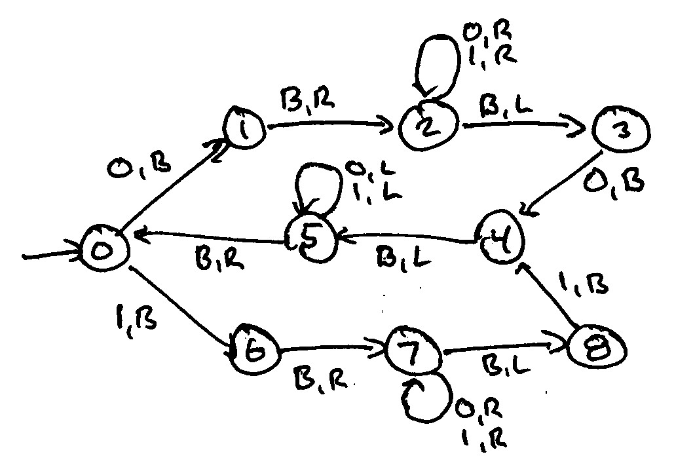

# Homework 8 - Quiz Instructions

- [Homework 8 - Quiz Instructions](#homework-8---quiz-instructions)
  - [Question 1](#question-1)
    - [Question 1 Solution](#question-1-solution)
  - [Question 2](#question-2)
    - [Question 2 Solution](#question-2-solution)
  - [Question 3](#question-3)
    - [Question 3 Solution](#question-3-solution)
  - [Question 4](#question-4)
    - [Question 4 Solution](#question-4-solution)

## Question 1

A Turing machine that deletes all initial 1 characters from the beginning of the input and leaves the head over the next character can be written with just two states and two transitions. Here's a few examples of its behavior.

    Before   After
    1100     00     // Delete any initial 1s; head at first non-1
    ^        ^
    00       00     // Delete any initial 1s; head at first non-1
    ^        ^
    B        B      // Delete any initial 1s; head at first non-1
    ^        ^

Fill in the blanks to make a TM that achieves this task.

q0, [ ], [ ], q1

q1, [ ], [ ], q0

### Question 1 Solution

> $q_0, [ ], [ ], q_1$
> > $q_0, 1, B, q_1$
>
> $q_1, [ ], [ ], q_0$
> > $q_1, B, R, q_0$

## Question 2

Below is a Turing machine that consumes a palindrome made of 0s and 1s and leaves the tape blank. For example, on the following inputs, the output is a blank tape.

    Before   After
    0110
    ^        ^
    010
    ^        ^

If the input to this machine is 0110, what state does the machine end in? (Answer as a single digit integer.)

If the input to this machine is 010, what state does the machine end in? (Answer as a single digit integer.)

If you wanted to output a 1 in the case that the input was an even length palindrome, you could achieve that be adding one more transition arrow (pointing to a new state 9). Specify the transition: [ ], [ ], [ ], q9.

### Question 2 Solution

> If the input to this machine is 0110, what state does the machine end in? (Answer as a single digit integer.)
> > 0 (zero)
>
> If the input to this machine is 010, what state does the machine end in? (Answer as a single digit integer.)
> > 8 (eight)
>
> If you wanted to output a 1 in the case that the input was an even length palindrome, you could achieve that be adding one more transition arrow (pointing to a new state 9). Specify the transition: [ ], [ ], [ ], q9.
> > $q_0, B, 1, q_9$

## Question 3

Here is an almost complete Turing machine. It moves the first bit of input to the end of the input. Here are a few examples.

    Before  After
    B       B
    ^       ^
    1       1
    ^       ^
    10      01
    ^       ^
    100     001
    ^       ^
    11000   10001
    ^       ^

$\large q_0, 1, B, q_1$

$\large q_0, 0, B, q_5$

$\large q_1, B, R, q_2$

$\large q_2, 0, R, q_2$

$\large q_2, 1, R, q_2$

$\large q_2, B, [ ], q_3$

$\large q_3, 0, L, q_3$

$\large q_3, 1, L, q_3$

$\large q_3, [ ], R q_4$

$\large q_5, B, R, q_6$

$\large q_6, 0, R, q_6$

$\large q_6, [ ], R q_6$

$\large q_6, B, [ ], q_3$

### Question 3 Solution

> $q_2, B, [ ], q_3$
> > $\Large q_2, B, 1, q_3$
>
> $q_3, [ ], R, q_4$
> > $\large q_3, B, R, q_4$
>
> $q_6, [ ], R, q_6$
> > $\large q_6, 1, R, q_6$
>
> $q_6, B, [ ], q_3$
> > $\large q_6, B, 0, q_3$

## Question 4

Trace the first three steps of the Turing machine in the previous question giving the following initial configuration by showing the successive configurations. List one configuration per line with a single space separating each part of the configuration. Recall that the parts of the configuration are in the following order: current-state current-head tape-to-left tape-to-right.

Use "e" for ε and use it only in the "tape-to-left" or "tape-to-right" positions when there is nothing but blanks in those directions. Otherwise list all characters explicitly (and use B for a blank character when needed).

$\Huge initially: q_0, 1, e, 00$

Step 1

Step 2

Step 3

### Question 4 Solution

> Step 1
> > $\large q_1, B, e, 00$
>
> Step 2
> > $\large q_2, 0, e, 0$
>
> Step 3
> > $\large q_2, 0, 0, e$
