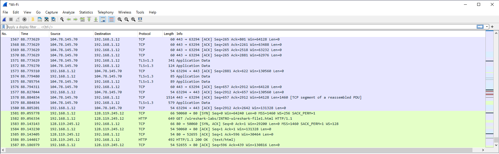
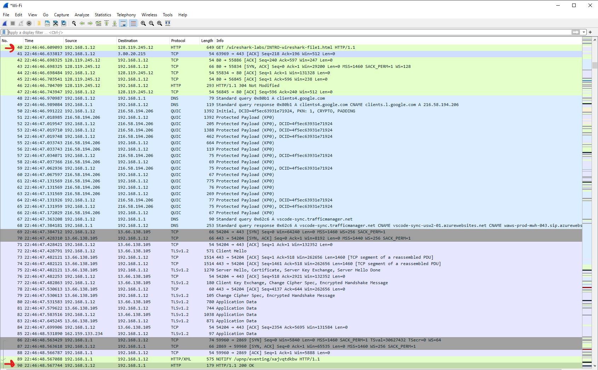
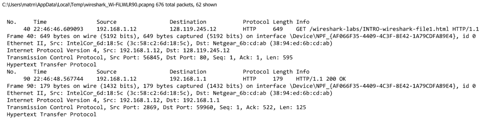

# CSC138_sec06_lab1_Matthew_Mendoza

Author: Matthew Mendoza

Course: CSC 138

Section: 06

- [CSC138_sec06_lab1_Matthew_Mendoza](#csc138_sec06_lab1_matthew_mendoza)
  - [1. List 3 different protocols that appear in the protocol column in the unfiltered packet-listing window in lab1 step 7](#1-list-3-different-protocols-that-appear-in-the-protocol-column-in-the-unfiltered-packet-listing-window-in-lab1-step-7)
  - [2. How long did it take from when the HTTP GET message was sent until the HTTP OK reply was received? (By default, the value of the Time column in the packetlisting window is the amount of time, in seconds, since Wireshark tracing began. To display the Time field in time-of-day format, select the Wireshark View pull down menu, then select Time Display Format, then select Time-of-day.)](#2-how-long-did-it-take-from-when-the-http-get-message-was-sent-until-the-http-ok-reply-was-received-by-default-the-value-of-the-time-column-in-the-packetlisting-window-is-the-amount-of-time-in-seconds-since-wireshark-tracing-began-to-display-the-time-field-in-time-of-day-format-select-the-wireshark-view-pull-down-menu-then-select-time-display-format-then-select-time-of-day)
  - [3. What is the Internet address of the gaia.cs.umass.edu (also known as wwwnet.cs.umass.edu)? What is the Internet address of your computer?](#3-what-is-the-internet-address-of-the-gaiacsumassedu-also-known-as-wwwnetcsumassedu-what-is-the-internet-address-of-your-computer)
  - [4. Print the two HTTP messages (GET and OK) referred to in question 2 above. To do so, select Print from the Wireshark File command menu, and select the “Selected Packet Only” and “Print as displayed” radial buttons, and then click OK](#4-print-the-two-http-messages-get-and-ok-referred-to-in-question-2-above-to-do-so-select-print-from-the-wireshark-file-command-menu-and-select-the-selected-packet-only-and-print-as-displayed-radial-buttons-and-then-click-ok)

## 1. List 3 different protocols that appear in the protocol column in the unfiltered packet-listing window in [lab1](lab1.pdf) step 7

- TCP
- TLSv1.3
- HTTP

## 2. How long did it take from when the HTTP GET message was sent until the HTTP OK reply was received? (By default, the value of the Time column in the packetlisting window is the amount of time, in seconds, since Wireshark tracing began. To display the Time field in time-of-day format, select the Wireshark View pull down menu, then select Time Display Format, then select Time-of-day.)

It took 00:00:1.958651, a difference of nearly two seconds, from when the HTTP GET message was sent until the HTTP OK reply was received.

| No. | Time            | Source       | Destination    | Protocol | Length | Info                                                    |
| --- | --------------- | ------------ | -------------- | -------- | ------ | ------------------------------------------------------- |
| 40  | 22:46:46.609093 | 192.168.1.12 | 128.119.245.12 | HTTP     | 649    | GET /wireshark-labs/INTRO-wireshark-file1.html HTTP/1.1 |
| 90  | 22:46:48.567744 | 192.168.1.12 | 192.168.1.1    | HTTP     | 179    | HTTP/1.1 200 OK                                         |

## 3. What is the Internet address of the gaia.cs.umass.edu (also known as wwwnet.cs.umass.edu)? What is the Internet address of your computer?

- The Internet address of the gaia.cs.umass.edu (also known as wwwnet.cs.umass.edu) is 128.119.245.12
- The Internet address of my computer is 192.168.1.12

## 4. Print the two HTTP messages (GET and OK) referred to in question 2 above. To do so, select Print from the Wireshark File command menu, and select the “Selected Packet Only” and “Print as displayed” radial buttons, and then click OK

