# CSC138_sec06_lab2_Matthew_Mendoza - Homework 3: Wireshark Lab: HTTPv7.0 (Intro to Computer Networks)

**Author:** Matthew Mendoza

**Course:** CSC 138

**Section:** 06

- [CSC138_sec06_lab2_Matthew_Mendoza - Homework 3: Wireshark Lab: HTTPv7.0 (Intro to Computer Networks)](#csc138_sec06_lab2_matthew_mendoza---homework-3-wireshark-lab-httpv70-intro-to-computer-networks)
  - [1. The Basic HTTP GET/response interaction](#1-the-basic-http-getresponse-interaction)
    - [1. Is your browser running HTTP version 1.0 or 1.1? What version of HTTP is the server running?](#1-is-your-browser-running-http-version-10-or-11-what-version-of-http-is-the-server-running)
    - [2. What languages (if any) does your browser indicate that it can accept to the server?](#2-what-languages-if-any-does-your-browser-indicate-that-it-can-accept-to-the-server)
    - [3. What is the IP address of your computer? Of the gaia.cs.umass.edu server?](#3-what-is-the-ip-address-of-your-computer-of-the-gaiacsumassedu-server)
    - [4. What is the status code returned from the server to your browser?](#4-what-is-the-status-code-returned-from-the-server-to-your-browser)
    - [5. When was the HTML file that you are retrieving last modified at the server?](#5-when-was-the-html-file-that-you-are-retrieving-last-modified-at-the-server)
    - [6. How many bytes of content are being returned to your browser?](#6-how-many-bytes-of-content-are-being-returned-to-your-browser)
    - [7. By inspecting the raw data in the packet content window, do you see any headers within the data that are not displayed in the packet-listing window? If so, name one](#7-by-inspecting-the-raw-data-in-the-packet-content-window-do-you-see-any-headers-within-the-data-that-are-not-displayed-in-the-packet-listing-window-if-so-name-one)
  - [2. The HTTP CONDITIONAL GET/response interaction](#2-the-http-conditional-getresponse-interaction)
    - [8. Inspect the contents of the first HTTP GET request from your browser to the server. Do you see an “IF-MODIFIED-SINCE” line in the HTTP GET?](#8-inspect-the-contents-of-the-first-http-get-request-from-your-browser-to-the-server-do-you-see-an-if-modified-since-line-in-the-http-get)
    - [9. Inspect the contents of the server response. Did the server explicitly return the contents of the file? How can you tell?](#9-inspect-the-contents-of-the-server-response-did-the-server-explicitly-return-the-contents-of-the-file-how-can-you-tell)
    - [10. Now inspect the contents of the second HTTP GET request from your browser to the server. Do you see an “IF-MODIFIED-SINCE:” line in the HTTP GET? If so, what information follows the “IF-MODIFIED-SINCE:” header?](#10-now-inspect-the-contents-of-the-second-http-get-request-from-your-browser-to-the-server-do-you-see-an-if-modified-since-line-in-the-http-get-if-so-what-information-follows-the-if-modified-since-header)
    - [11. What is the HTTP status code and phrase returned from the server in response to this second HTTP GET? Did the server explicitly return the contents of the file? Explain](#11-what-is-the-http-status-code-and-phrase-returned-from-the-server-in-response-to-this-second-http-get-did-the-server-explicitly-return-the-contents-of-the-file-explain)
  - [3. Retrieving Long Documents](#3-retrieving-long-documents)
    - [12. How many HTTP GET request messages did your browser send?](#12-how-many-http-get-request-messages-did-your-browser-send)
      - [Which packet number in the trace contains the GET message for the Bill or Rights?](#which-packet-number-in-the-trace-contains-the-get-message-for-the-bill-or-rights)
    - [13. Which packet number in the trace contains the status code and phrase associated with the response to the HTTP GET request?](#13-which-packet-number-in-the-trace-contains-the-status-code-and-phrase-associated-with-the-response-to-the-http-get-request)
    - [14. What is the status code and phrase in the response?](#14-what-is-the-status-code-and-phrase-in-the-response)
    - [15. How many data-containing TCP segments were needed to carry the single HTTP response and the text of the Bill of Rights?](#15-how-many-data-containing-tcp-segments-were-needed-to-carry-the-single-http-response-and-the-text-of-the-bill-of-rights)
  - [4. HTML Documents with Embedded Objects](#4-html-documents-with-embedded-objects)
    - [16. How many HTTP GET request messages did your browser send?](#16-how-many-http-get-request-messages-did-your-browser-send)
      - [To which Internet addresses were these GET requests sent?](#to-which-internet-addresses-were-these-get-requests-sent)
    - [17. Can you tell whether your browser downloaded the two images serially, or whether they were downloaded from the two web sites in parallel? Explain](#17-can-you-tell-whether-your-browser-downloaded-the-two-images-serially-or-whether-they-were-downloaded-from-the-two-web-sites-in-parallel-explain)
  - [5. HTTP Authentication](#5-http-authentication)
    - [18. What is the server’s response (status code and phrase) in response to the initial HTTP GET message from your browser?](#18-what-is-the-servers-response-status-code-and-phrase-in-response-to-the-initial-http-get-message-from-your-browser)
    - [19. When your browser’s sends the HTTP GET message for the second time, what new field is included in the HTTP GET message?](#19-when-your-browsers-sends-the-http-get-message-for-the-second-time-what-new-field-is-included-in-the-http-get-message)

## 1. The Basic HTTP GET/response interaction

### 1. Is your browser running HTTP version 1.0 or 1.1? What version of HTTP is the server running?

> Both my browser and server is running `HTTP version 1.1`

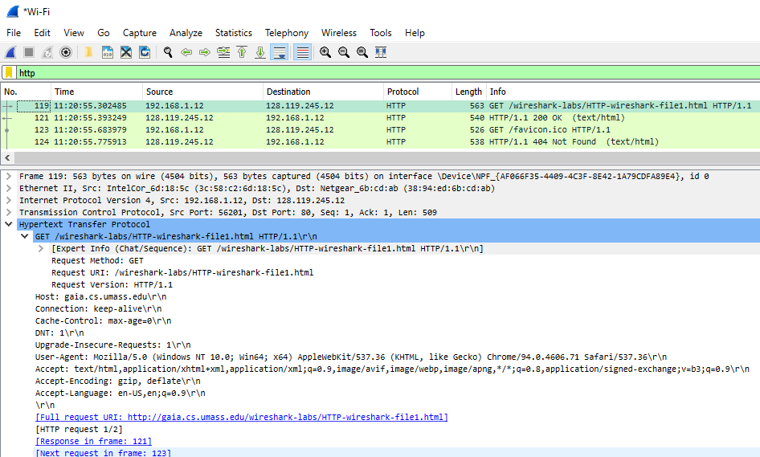

### 2. What languages (if any) does your browser indicate that it can accept to the server?

> The language that my browser indicates that it can accept to the server is:
> `US English`

```text
en-US,en;q=0.9
```

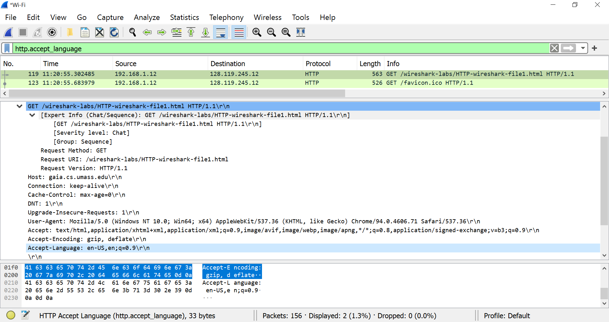

### 3. What is the IP address of your computer? Of the gaia.cs.umass.edu server?

> The IP address of my computer and of the gaia.cs.umass.edu server are respctively:
> `192.168.1.12` and `128.119.245.12`

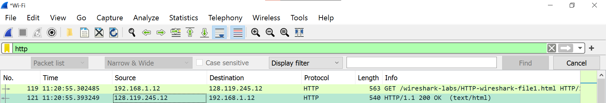

### 4. What is the status code returned from the server to your browser?

> The status code returned from the server to my browser is `200 OK`

```text
Hypertext Transfer Protocol
    HTTP/1.1 200 OK\r\n
        [Expert Info (Chat/Sequence): HTTP/1.1 200 OK\r\n]
            [HTTP/1.1 200 OK\r\n]
            [Severity level: Chat]
            [Group: Sequence]
        Response Version: HTTP/1.1
        Status Code: 200
        [Status Code Description: OK]
        Response Phrase: OK
```

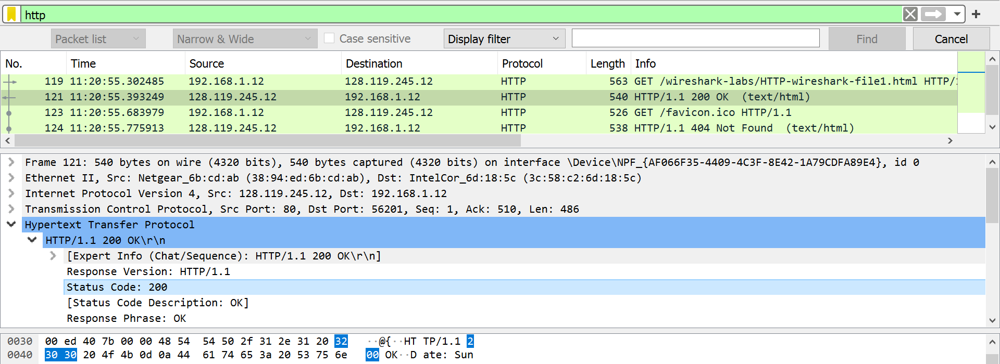

### 5. When was the HTML file that you are retrieving last modified at the server?

> According to the filter the HTML file retrieved was last modifed at the server on
> `October 10th, 2021`.

```text
Last-modified: Sun, 10 Oct 2021 05:59:02 GMT
```

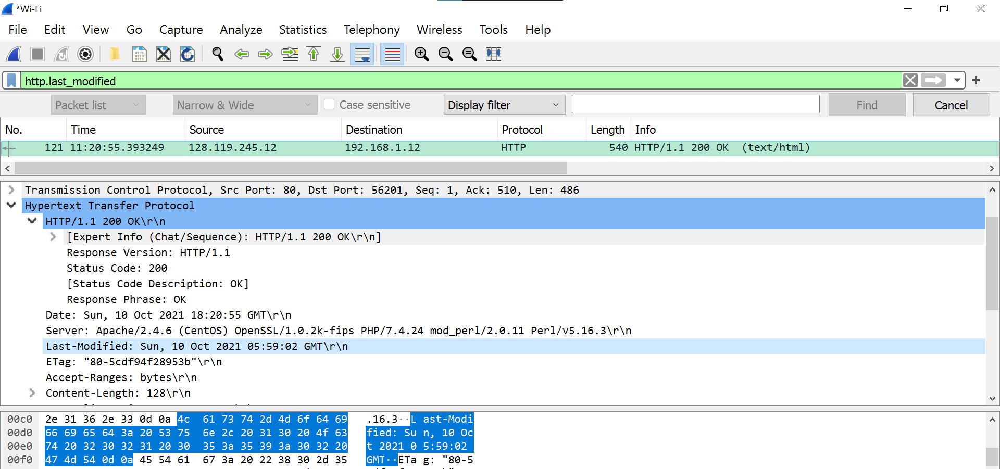

### 6. How many bytes of content are being returned to your browser?

> There were `128 bytes` of content returned to my browser.

```text
Content length: 128
```

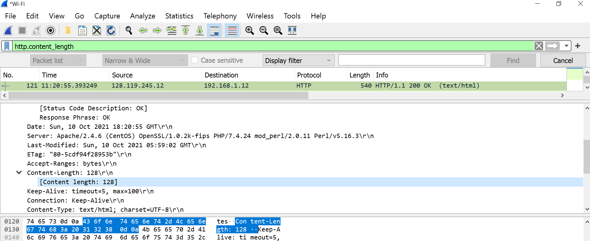

### 7. By inspecting the raw data in the packet content window, do you see any headers within the data that are not displayed in the packet-listing window? If so, name one

> No. I do not see any headers within the data that are not displayed in the
> packet-listing window.

## 2. The HTTP CONDITIONAL GET/response interaction

### 8. Inspect the contents of the first HTTP GET request from your browser to the server. Do you see an “IF-MODIFIED-SINCE” line in the HTTP GET?

> From the first HTTP GET request from my browser to the server.
> No, I do not see an “IF-MODIFIED-SINCE” line in the HTTP GET.

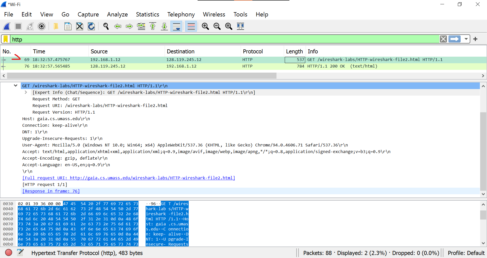

### 9. Inspect the contents of the server response. Did the server explicitly return the contents of the file? How can you tell?

> Yes. It responded with ten lines of text/html (screenshot provided)

```text
Line-based text data: text/html (10 lines)
    \n
    <html>\n
    \n
    Congratulations again!  Now you've downloaded the file lab2-2.html. <br>\n
    This file's last modification date will not change.  <p>\n
    Thus  if you download this multiple times on your browser, a complete copy <br>\n
    will only be sent once by the server due to the inclusion of the IN-MODIFIED-SINCE<br>\n
    field in your browser's HTTP GET request to the server.\n
    \n
    </html>\n

```

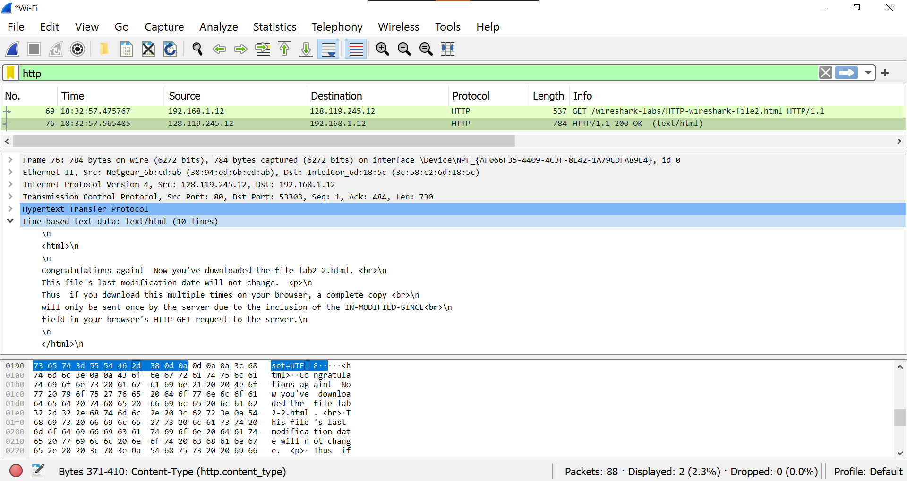

### 10. Now inspect the contents of the second HTTP GET request from your browser to the server. Do you see an “IF-MODIFIED-SINCE:” line in the HTTP GET? If so, what information follows the “IF-MODIFIED-SINCE:” header?

> From the second HTTP GET request from my browser to the server.
> No, I do not see an “IF-MODIFIED-SINCE” line in the HTTP GET.

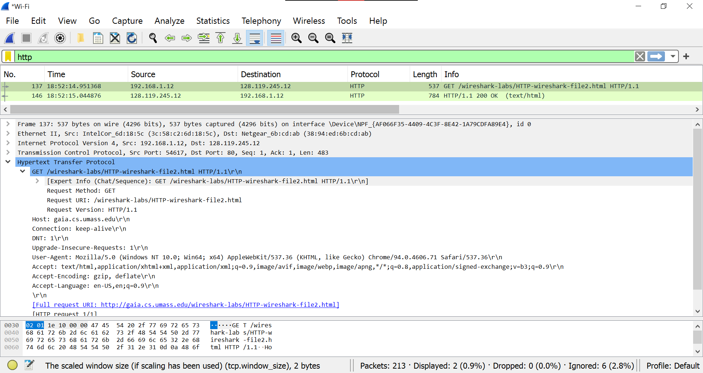

### 11. What is the HTTP status code and phrase returned from the server in response to this second HTTP GET? Did the server explicitly return the contents of the file? Explain

> The HTTP status code and phrase returned from the server in response to this
> second HTTP GET were `200` and `OK`
>
> The server did explicitly return the contents of the file and is longer than
> the previous output of the first HTTP GET.

```text
Hypertext Transfer Protocol
    HTTP/1.1 200 OK\r\n
        [Expert Info (Chat/Sequence): HTTP/1.1 200 OK\r\n]
        Response Version: HTTP/1.1
        Status Code: 200
        [Status Code Description: OK]
        Response Phrase: OK
    Date: Mon, 11 Oct 2021 01:52:14 GMT\r\n
    Server: Apache/2.4.6 (CentOS) OpenSSL/1.0.2k-fips PHP/7.4.24 mod_perl/2.0.11 Perl/v5.16.3\r\n
    Last-Modified: Sun, 10 Oct 2021 05:59:02 GMT\r\n
    ETag: "173-5cdf94f288983"\r\n
    Accept-Ranges: bytes\r\n
    Content-Length: 371\r\n
    Keep-Alive: timeout=5, max=100\r\n
    Connection: Keep-Alive\r\n
    Content-Type: text/html; charset=UTF-8\r\n
    \r\n
    [HTTP response 1/1]
    [Time since request: 0.093508000 seconds]
    [Request in frame: 137]
    [Request URI: http://gaia.cs.umass.edu/wireshark-labs/HTTP-wireshark-file2.html]
    File Data: 371 bytes
⋮
Line-based text data: text/html (10 lines)
    \n
    <html>\n
    \n
    Congratulations again!  Now you've downloaded the file lab2-2.html. <br>\n
    This file's last modification date will not change.  <p>\n
    Thus  if you download this multiple times on your browser, a complete copy <br>\n
    will only be sent once by the server due to the inclusion of the IN-MODIFIED-SINCE<br>\n
    field in your browser's HTTP GET request to the server.\n
    \n
    </html>\n
```

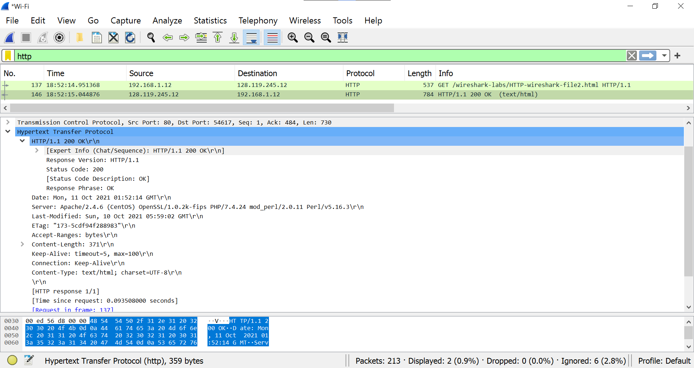

## 3. Retrieving Long Documents

### 12. How many HTTP GET request messages did your browser send?

> My browser only sent one HTTP GET request message.

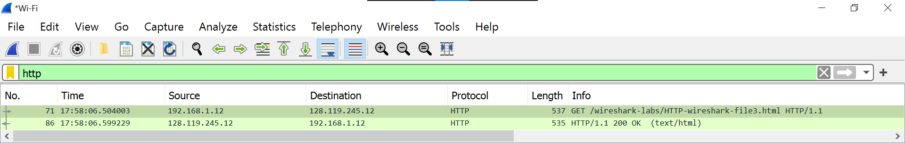

#### Which packet number in the trace contains the GET message for the Bill or Rights?

> In the trace packet number `71` contains the GET message for the Bill or Rights.

```text
"71","17:58:06.504003","192.168.1.12","128.119.245.12","HTTP","537","GET /wireshark-labs/HTTP-wireshark-file3.html HTTP/1.1 "
```

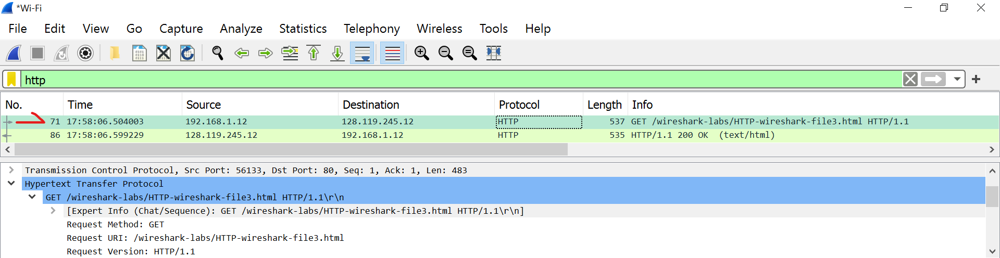

### 13. Which packet number in the trace contains the status code and phrase associated with the response to the HTTP GET request?

> In the trace packet number `86` contains the status code and phrase associated
> with the response to the HTTP GET request.

```text
"86","17:58:06.599229","128.119.245.12","192.168.1.12","HTTP","535","HTTP/1.1 200 OK  (text/html)"
```

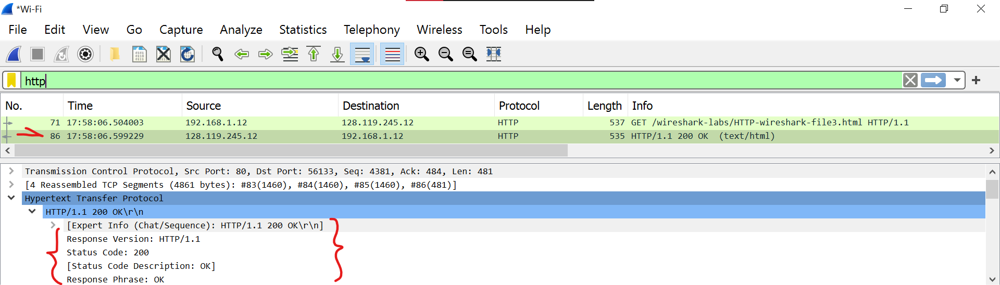

### 14. What is the status code and phrase in the response?

> The status code and phrase in the response were: `200` and `OK`.

```text
Hypertext Transfer Protocol
    HTTP/1.1 200 OK\r\n
        [Expert Info (Chat/Sequence): HTTP/1.1 200 OK\r\n]
        Response Version: HTTP/1.1
        Status Code: 200
        [Status Code Description: OK]
        Response Phrase: OK
```

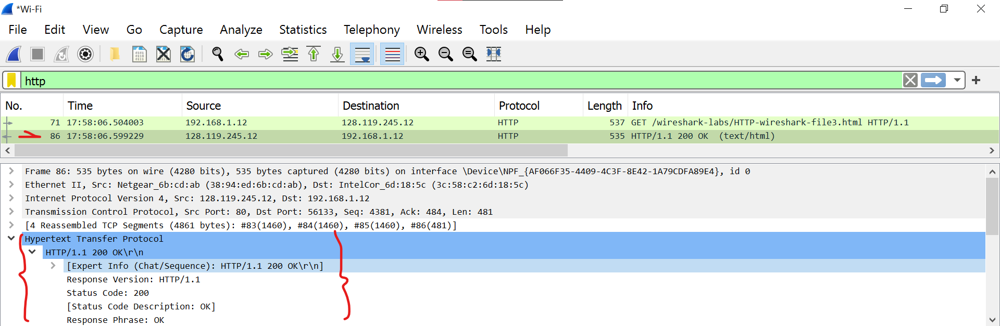

### 15. How many data-containing TCP segments were needed to carry the single HTTP response and the text of the Bill of Rights?

> The data was sent in `four TCP segments` to the brouser, then reassembled.

```text
[4 Reassembled TCP Segments (4861 bytes): #83(1460), #84(1460), #85(1460), #86(481)]
    [Frame: 83, payload: 0-1459 (1460 bytes)]
    [Frame: 84, payload: 1460-2919 (1460 bytes)]
    [Frame: 85, payload: 2920-4379 (1460 bytes)]
    [Frame: 86, payload: 4380-4860 (481 bytes)]
    [Segment count: 4]
    [Reassembled TCP length: 4861]
    [Reassembled TCP Data: 485454502f312e3120323030204f4b0d0a446174653a204d6f6e2c203131204f63742032…]
```

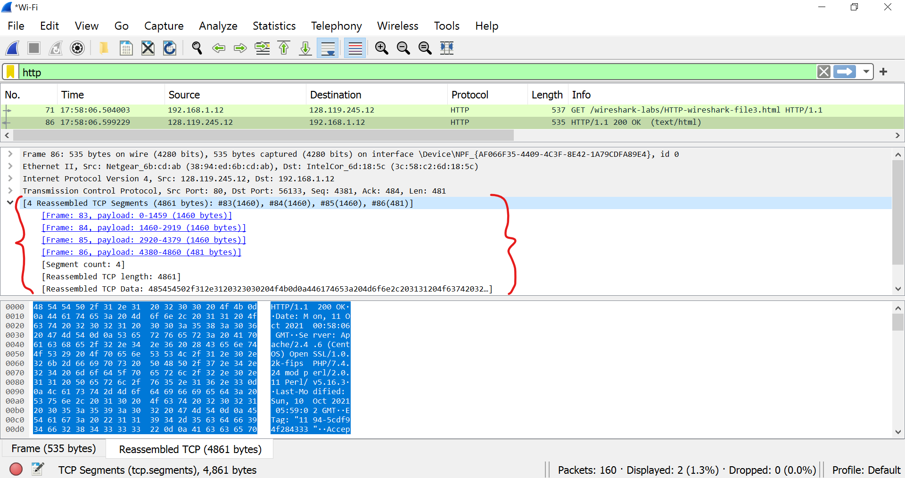

## 4. HTML Documents with Embedded Objects

### 16. How many HTTP GET request messages did your browser send?

> My browser only sent `one` HTTP GET request message.

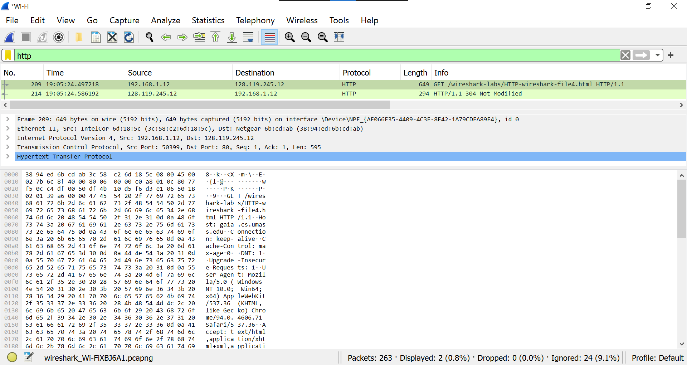

#### To which Internet addresses were these GET requests sent?

> The GET requests were sent to `128.119.245.12`
>
> 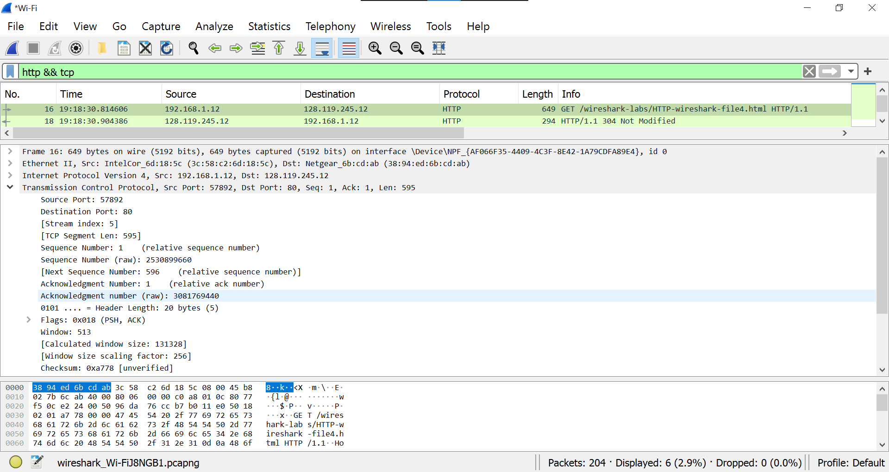

### 17. Can you tell whether your browser downloaded the two images serially, or whether they were downloaded from the two web sites in parallel? Explain

The assignment said there would be **two images**, but I only see one.

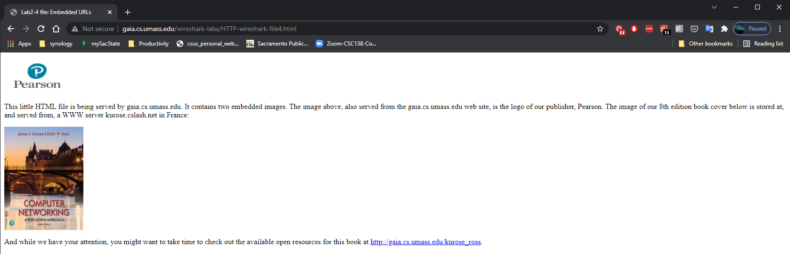

## 5. HTTP Authentication

**Username**: wireshark-students
**password**: network

### 18. What is the server’s response (status code and phrase) in response to the initial HTTP GET message from your browser?

> The status code and phrase in the response were: `401` and `Unauthorized`.

```text
Frame 48: 771 bytes on wire (6168 bits), 771 bytes captured (6168 bits) on interface \Device\NPF_{AF066F35-4409-4C3F-8E42-1A79CDFA89E4}, id 0
Ethernet II, Src: Netgear_6b:cd:ab (38:94:ed:6b:cd:ab), Dst: IntelCor_6d:18:5c (3c:58:c2:6d:18:5c)
Internet Protocol Version 4, Src: 128.119.245.12, Dst: 192.168.1.12
Transmission Control Protocol, Src Port: 80, Dst Port: 53686, Seq: 1, Ack: 500, Len: 717
Hypertext Transfer Protocol
    HTTP/1.1 401 Unauthorized\r\n
        [Expert Info (Chat/Sequence): HTTP/1.1 401 Unauthorized\r\n]
            [HTTP/1.1 401 Unauthorized\r\n]
            [Severity level: Chat]
            [Group: Sequence]
        Response Version: HTTP/1.1
        Status Code: 401
        [Status Code Description: Unauthorized]
        Response Phrase: Unauthorized
    Date: Mon, 11 Oct 2021 02:36:31 GMT\r\n
    Server: Apache/2.4.6 (CentOS) OpenSSL/1.0.2k-fips PHP/7.4.24 mod_perl/2.0.11 Perl/v5.16.3\r\n
    WWW-Authenticate: Basic realm="wireshark-students only"\r\n
    Content-Length: 381\r\n
        [Content length: 381]
    Keep-Alive: timeout=5, max=100\r\n
    Connection: Keep-Alive\r\n
    Content-Type: text/html; charset=iso-8859-1\r\n
    \r\n
    [HTTP response 1/1]
    [Time since request: 0.091317000 seconds]
    [Request in frame: 41]
    [Request URI: http://gaia.cs.umass.edu/wireshark-labs/protected_pages/HTTP-wireshark-file5.html]
    File Data: 381 bytes
Line-based text data: text/html (12 lines)
    <!DOCTYPE HTML PUBLIC "-//IETF//DTD HTML 2.0//EN">\n
    <html><head>\n
    <title>401 Unauthorized</title>\n
    </head><body>\n
    <h1>Unauthorized</h1>\n
    <p>This server could not verify that you\n
    are authorized to access the document\n
    requested.  Either you supplied the wrong\n
    credentials (e.g., bad password), or your\n
    browser doesn't understand how to supply\n
    the credentials required.</p>\n
    </body></html>\n
```

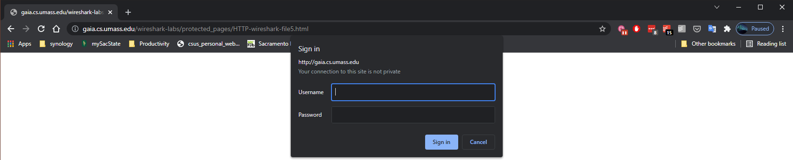
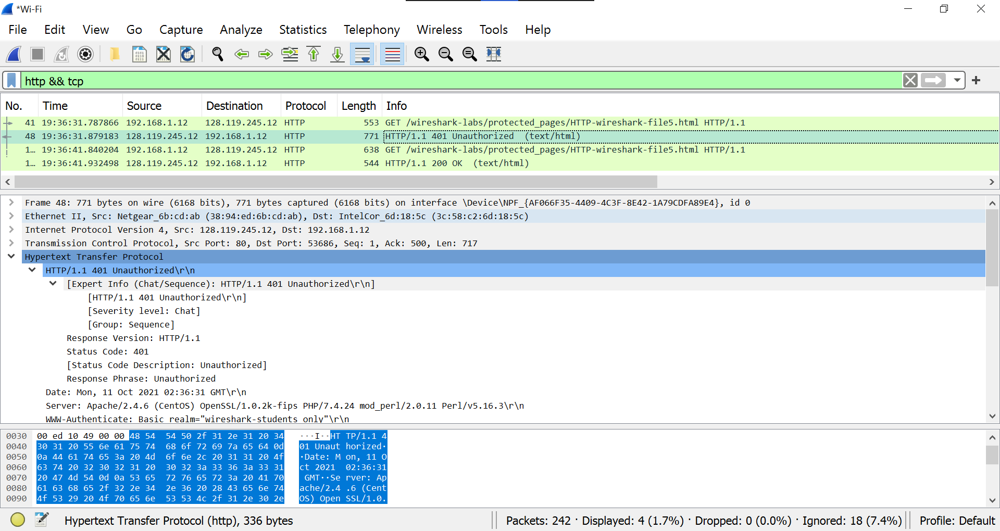

### 19. When your browser’s sends the HTTP GET message for the second time, what new field is included in the HTTP GET message?

> The status code and phrase in the response were: `200` and `OK`.

```text
Frame 178: 544 bytes on wire (4352 bits), 544 bytes captured (4352 bits) on interface \Device\NPF_{AF066F35-4409-4C3F-8E42-1A79CDFA89E4}, id 0
Ethernet II, Src: Netgear_6b:cd:ab (38:94:ed:6b:cd:ab), Dst: IntelCor_6d:18:5c (3c:58:c2:6d:18:5c)
Internet Protocol Version 4, Src: 128.119.245.12, Dst: 192.168.1.12
Transmission Control Protocol, Src Port: 80, Dst Port: 50060, Seq: 1, Ack: 585, Len: 490
Hypertext Transfer Protocol
    HTTP/1.1 200 OK\r\n
        [Expert Info (Chat/Sequence): HTTP/1.1 200 OK\r\n]
            [HTTP/1.1 200 OK\r\n]
            [Severity level: Chat]
            [Group: Sequence]
        Response Version: HTTP/1.1
        Status Code: 200
        [Status Code Description: OK]
        Response Phrase: OK
    Date: Mon, 11 Oct 2021 02:36:41 GMT\r\n
    Server: Apache/2.4.6 (CentOS) OpenSSL/1.0.2k-fips PHP/7.4.24 mod_perl/2.0.11 Perl/v5.16.3\r\n
    Last-Modified: Sun, 10 Oct 2021 05:59:02 GMT\r\n
    ETag: "84-5cdf94f28a0f3"\r\n
    Accept-Ranges: bytes\r\n
    Content-Length: 132\r\n
        [Content length: 132]
    Keep-Alive: timeout=5, max=100\r\n
    Connection: Keep-Alive\r\n
    Content-Type: text/html; charset=UTF-8\r\n
    \r\n
    [HTTP response 1/1]
    [Time since request: 0.092294000 seconds]
    [Request in frame: 174]
    [Request URI: http://gaia.cs.umass.edu/wireshark-labs/protected_pages/HTTP-wireshark-file5.html]
    File Data: 132 bytes
Line-based text data: text/html (6 lines)
    \n
    <html>\n
    \n
    This page is password protected!  If you're seeing this, you've downloaded the page correctly <br>\n
    Congratulations!\n
    </html>
```

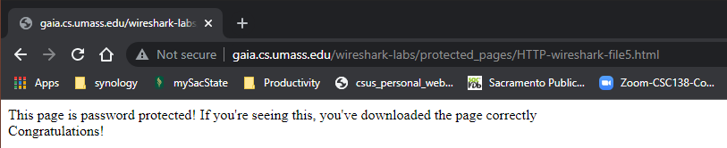
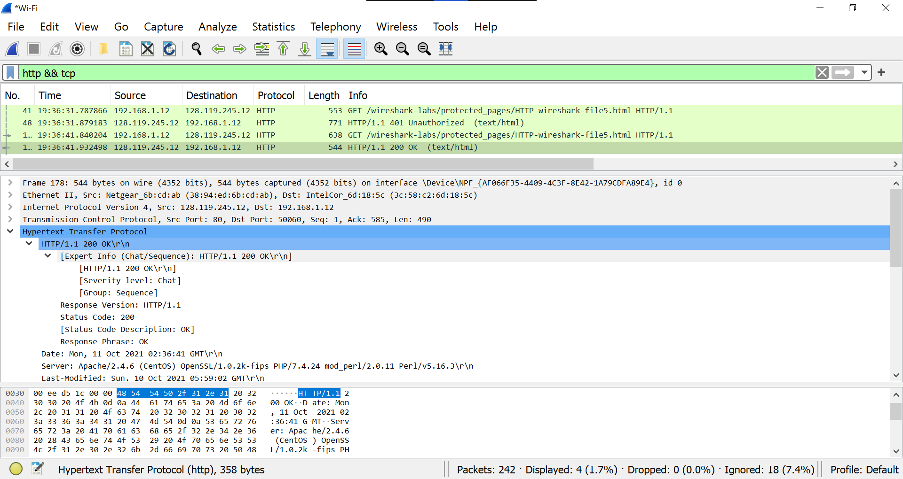
