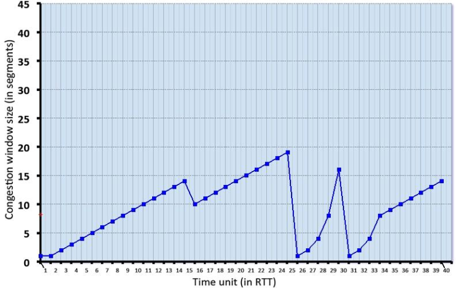

# CSC138_sec06_ASSIGNMENT5_Matthew_Mendoza - ASSIGNMENT 05: ASSIGNMENT_TOPIC

Author: Matthew Mendoza

Course: CSC 138

Section: 06

- [CSC138_sec06_ASSIGNMENT5_Matthew_Mendoza - ASSIGNMENT 05: ASSIGNMENT_TOPIC](#csc138_sec06_assignment5_matthew_mendoza---assignment-05-assignment_topic)
  - [Question 1: Computing an Internet checksum (1 point)](#question-1-computing-an-internet-checksum-1-point)
    - [SOLUTION 1: Computing an Internet checksum](#solution-1-computing-an-internet-checksum)
  - [Question 2 Prompt](#question-2-prompt)
    - [Question 2.1](#question-21)
      - [Solution 2.1](#solution-21)
    - [Question 2.2](#question-22)
      - [Solution 2.2](#solution-22)
  - [Question 3 Prompt: TCP in action: slow start, congestion avoidance, and fast retransmit. (2 points)](#question-3-prompt-tcp-in-action-slow-start-congestion-avoidance-and-fast-retransmit-2-points)
    - [Question 3.1](#question-31)
      - [Solution 3.1](#solution-31)
    - [Question 3.2](#question-32)
      - [Solution 3.2](#solution-32)
    - [Question 3.3](#question-33)
      - [Solution 3.3](#solution-33)
  - [Question 4: Computing TCP's RTT and timeout values](#question-4-computing-tcps-rtt-and-timeout-values)
    - [Solution 4](#solution-4)

---

## Question 1: Computing an Internet checksum (1 point)

Consider the two 16-bit words (shown in binary) below. Recall that to compute
the Internet checksum of a set of 16-bit words, we compute the one's complement
sum [1] of the two words. That is, we add the two numbers together, making sure
that any carry into the 17th bit of this initial sum is added back into the 1's
place of the resulting sum); we then take the one's complement of the result.

**Compute the Internet checksum value for these two 16-bit words**:

> 01100110 10011111 this binary number is 26271 decimal (base 10)
>
> 10101010 11010001 this binary number is 43729 decimal (base 10)

### SOLUTION 1: Computing an Internet checksum

|        bit placement        | 17th | 16th  | 15th  | 14th | 13th | 12th | 11th | 10th | 9th | 8th | 7th | 6th | 5th | 4th | 3rd | 2nd | 1st |  result |
| :-------------------------: | :--: | :---: | :---: | :--: | :--: | :--: | :--: | :--: | :-: | :-: | :-: | :-: | :-: | :-: | :-: | :-: | :-: | ------: |
|          bin value          |      | 32768 | 16384 | 8192 | 4096 | 2048 | 1024 | 512  | 256 | 128 | 64  | 32  | 16  |  8  |  4  |  2  |  1  |         |
| --------------------------- | ---  |  ---  | - --  | ---  | ---  | ---  | ---  | ---  | --- | --- | --- | --- | --- | --- | --- | --- | --- | ------- |
|                             |      |       |       |      |      |      |      |      |     |     |     |     |     |     |     |     |     |         |
|           result            |      |       |       |      |      |      |      |      |     |     |     |     |     |     |     |     |     |         |
|      #################      | ###  |  ###  |  ###  | ###  | ###  | ###  | ###  | ###  | ### | ### | ### | ### | ### | ### | ### | ### | ### |    #### |
|   **SOLUTION - CHECKSUM**   |      |       |       |      |      |      |      |      |     |     |     |     |     |     |     |     |     |         |

**SOLUTION - CHECKSUM**:

- DEC:
- Bin:

---

## Question 2 Prompt

Consider the figure below in which a TCP sender and receiver communicate over a
connection in which the sender-to-receiver segments may be lost The TCP sender
sends initial window of five segments at t=1,2,3,4,5, respectively. Suppose the
initial value of the sender-to-receiver sequence number is **110** and all
sender-to-receiver segments each contain **594** bytes. The delay between the
sender and the receiver is 7 time units, and so the first segment arrives at the
receiver at t=8, and a receiver-tosender ACK for this segment arrives at the TCP
sender at t=15. As shown in the figure, 2 of the five segments are lost between
the sender and the receiver, but none of the receiver-to-sender ACKs are lost.


Answer the following questions: (1 point)

### Question 2.1

Give the sequence number field value in the sender-to-receiver segments in the
first set of segments that are sent beginning at t=1, and the acknowledgement
number field value in the receiver-to-sender ACK segments that are sent from the
receiver back to the sender beginning at t=8.

#### Solution 2.1

> Give the sequence number field value in the sender-to-receiver segments in the
> first set of segments that are sent beginning at t=1

- Sequence number of the segment sent at t=1?

  -

- Sequence number of the segment sent at t=2?

  -

- Sequence number of the segment sent at t=3?

  -

- Sequence number of the segment sent at t=4?

  -

- Sequence number of the segment sent at t=5?

  -

> and the acknowledgement number field value in the receiver-to-sender ACK
> segments that are sent from the receiver back to the sender beginning at t=8

- The value of the ACK sent at t=8?

  -

- The value of the ACK sent at t=9?

  -

- The value of the ACK sent at t=10?

  -

- The value of the ACK sent at t=11?

  -

- The value of the ACK sent at t=12?

  -

### Question 2.2

Next consider the sender-to-receiver segments generated by the sender in
response to the ACKS that are received beginning at t=15. Give the sequence
number of the segments transmitted and a brief explanation of why a given
segment is transmitted, or not transmitted, on receipt of an ACK.

#### Solution 2.2

The sequence number of this segment is calculated the same way as the first\
five segments

- Sequence number of the segment sent at t = 15?

  -

- Sequence number of the segment sent at t = 16?

  -

- Sequence number of the segment sent at t = 17?

  -

- Sequence number of the segment sent at t = 18?

  -

## Question 3 Prompt: TCP in action: slow start, congestion avoidance, and fast retransmit. (2 points)

Consider the figure below, which plots the evolution of TCP's congestion window
at the beginning of each time unit (where the unit of time is equal to the RTT);
see Figure 3.53 in the text. In the abstract model for this problem, TCP sends a
"flight" of packets of size cwnd at the beginning of each time unit. The result
of sending that flight of packets is that either (i) all packets are ACKed at
the end of the time unit, (ii) there is a timeout for the first packet, or (iii)
there is a triple duplicate ACK for the first packet. In this problem, you are
asked to reconstruct the sequence of events (ACKs, losses) that resulted in the
evolution of TCP's cwnd shown below



Consider the evolution of TCP's congestion window in the example above and
answer the following questions. The initial value of cwnd is 1 and the initial
value of ssthresh (shown as a red +) is 8

### Question 3.1

Give the times at which TCP is in

1. slow start

2. congestion avoidance

3. fast recovery

at the start of a time slot, when the flight of packets is sent

#### Solution 3.1

1. **The times where TCP is in slow start are**:

2. **The times where TCP is in congestion avoidance are**:

3. **The times where TCP is in fast recovery**:

### Question 3.2

Give the times at which the first packet in the sent flight of packets is lost,
and indicate whether that packet loss is detected via timeout, or by triple
duplicate ACKs.

#### Solution 3.2

**The times where TCP has a loss by timeout are**:

**The times where TCP has a loss by triple duplicate ACK are**:

### Question 3.3

Give the times at which the value of `ssthresh` changes, and give the new value
of `ssthresh`.

#### Solution 3.3

**The times where the ssthresh changes are**:

**The times where the ssthresh changes are**:

## Question 4: Computing TCP's RTT and timeout values

Suppose that TCP's current estimated values for the round trip time
(estimatedRTT) and deviation in the RTT (DevRTT) are 260 msec and 36 msec,
respectively (see Section 3.5.3 for a discussion of these variables).

Suppose that the next three measured values of the RTT are 250 msec, 210 msec,
and 400 msec respectively.

Compute TCP's new value of DevRTT, estimatedRTT, and the TCP timeout value after
each of these three measured RTT values is obtained. Use the values of α = 0.125,
and β = 0.25. Round your answers to two decimal places after leading zeros.

### Solution 4

**DevRTT is calculated with the following equation**:

> DevRTT = (1-beta) \* DevRTT + beta \* |estimatedRTT - sampleRTT|

**estimatedRTT is calculated with the following equation**:

> estimatedRTT = (1-alpha) \* estimatedRTT + alpha \* sampleRTT

**TCP timeout is calculated with the following equation**:

> TCP timeout = estimatedRTT + (4 \* DevRTT)

```text
GIVEN:

estimatedRTT_prev = 260 msec

DevRTT_prev = 36 msec

SampleRTT1 = 250 msec

SampleRTT2 = 210 msec

SampleRTT3 = 400 msec

alpha (**α**) = 0.125 and beta (**β**) = 0.25

G = 80 msec
```

1. estimatedRTT after the first RTT?

   The estimatedRTT for RTT1 is xxx

2. RTT Deviation for the the first RTT?

   The DevRTT for RTT1 is xxx

3. TCP timeout for the first RTT?

   The TCP timeout for RTT1 is xxx

4. estimatedRTT after the second RTT?

   The estimatedRTT for RTT2 is xxx

5. RTT Deviation for the the second RTT?

   The DevRTT for RTT2 is xxx

6. TCP timeout for the second RTT?

   The TCP timeout for RTT2 is xxx

7. estimatedRTT after the third RTT?

   The estimatedRTT for RTT3 is xxx

8. RTT Deviation for the the third RTT?

   The DevRTT for RTT3 is xxx

9. TCP timeout for the third RTT?

   The TCP timeout for RTT3 is xxx
