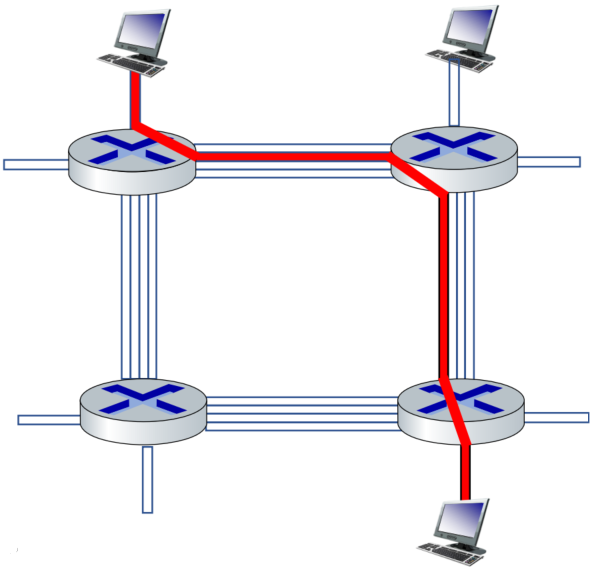
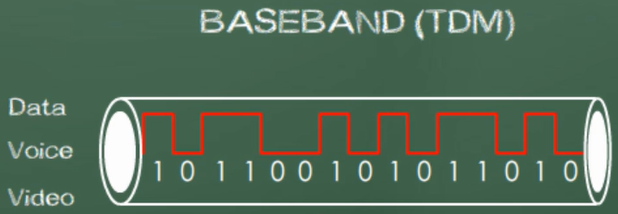
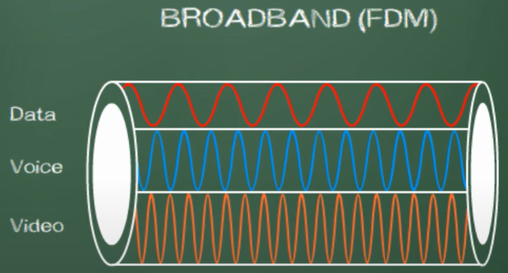
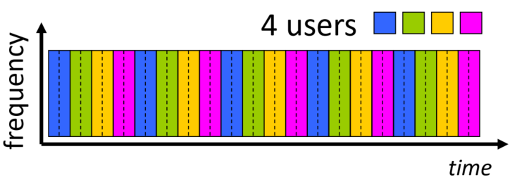
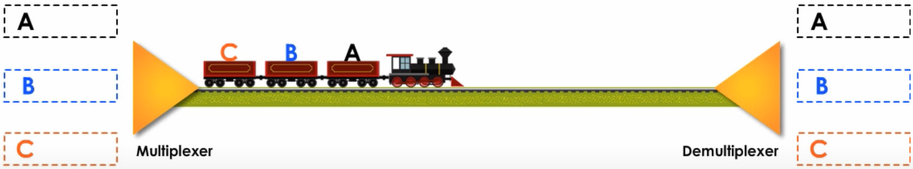
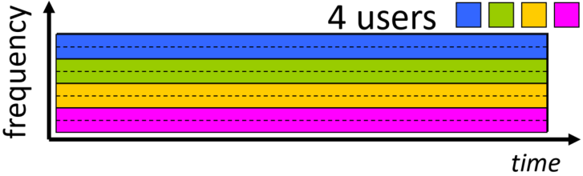
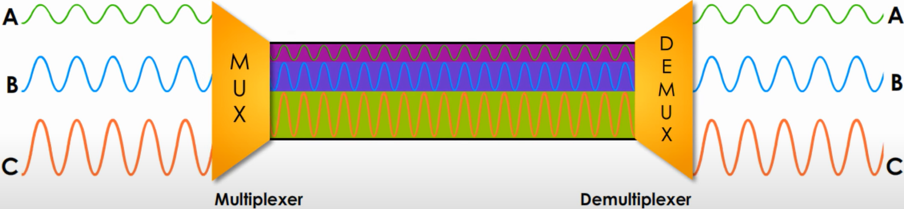

# Midterm 1 - Study Sheet

Author: Matthew Mendoza

Course: CSC 138

Section: 06

- [Midterm 1 - Study Sheet](#midterm-1---study-sheet)
  - [Chapter 1](#chapter-1)
    - [What’s Internet, protocol?](#whats-internet-protocol)
    - [Network Edge](#network-edge)
      - [Access networks, physical media](#access-networks-physical-media)
    - [Network Core](#network-core)
      - [Packet-switching](#packet-switching)
        - [Packet-switching - Store And Forward](#packet-switching---store-and-forward)
        - [Packet-switching - End-End Delay](#packet-switching---end-end-delay)
        - [Packet-switching - Queuing And Loss](#packet-switching---queuing-and-loss)
      - [Packet-switching - Circuit Switching](#packet-switching---circuit-switching)
      - [TDM vs FDM](#tdm-vs-fdm)
        - [Time Division Multiplexing (TDM)](#time-division-multiplexing-tdm)
          - [Main Feature Quality of TDM](#main-feature-quality-of-tdm)
          - [TDM Example](#tdm-example)
          - [TDM Summary](#tdm-summary)
        - [Frequency Division Multiplexing (FDM)](#frequency-division-multiplexing-fdm)
          - [FDM Example](#fdm-example)
          - [FDM Summary](#fdm-summary)
    - [Packet delay](#packet-delay)
      - [Four sources of packet delay](#four-sources-of-packet-delay)
    - [Packet loss](#packet-loss)
    - [Throughput](#throughput)
    - [Protocol layer](#protocol-layer)
      - [Internet protocol stack](#internet-protocol-stack)
    - [Encapsulation](#encapsulation)
    - [Network security](#network-security)
      - [DoS](#dos)
      - [Packet sniffing](#packet-sniffing)
      - [IP spoofing](#ip-spoofing)
  - [Chapter 2](#chapter-2)
    - [Application models](#application-models)
      - [Client-server](#client-server)
      - [peer-to-peer (P2P)](#peer-to-peer-p2p)
    - [Socket](#socket)
    - [Transport protocols](#transport-protocols)
      - [TCP](#tcp)
      - [UDP (Chapter 2)](#udp-chapter-2)
    - [Web and HTTP](#web-and-http)
      - [HTTP protocol](#http-protocol)
      - [Persistence and non-persistence HTTP](#persistence-and-non-persistence-http)
      - [RTT](#rtt)
      - [HTTP response time](#http-response-time)
      - [HTTP response message (see example)](#http-response-message-see-example)
      - [Cookies](#cookies)
      - [Web caches](#web-caches)
      - [Conditional GET](#conditional-get)
    - [Electronic mail](#electronic-mail)
      - [Three major components](#three-major-components)
      - [SMTP](#smtp)
      - [Mail access protocols (IMAP, HTTP)](#mail-access-protocols-imap-http)
      - [SMTP vs HTTP](#smtp-vs-http)
    - [DNS](#dns)
      - [Definition](#definition)
      - [Services](#services)
      - [Different Tiers of servers](#different-tiers-of-servers)
      - [DNS resolution example](#dns-resolution-example)
      - [DNS records (resource records (RR))](#dns-records-resource-records-rr)
    - [P2P](#p2p)
      - [Example about file distribution using CS vs P2P](#example-about-file-distribution-using-cs-vs-p2p)
      - [BitTorrent](#bittorrent)
    - [Video Streaming](#video-streaming)
      - [DASH: server and client](#dash-server-and-client)
      - [Content distribution networks](#content-distribution-networks)
    - [Socket programing](#socket-programing)
      - [UDP and TCP](#udp-and-tcp)
      - [Application example](#application-example)
  - [Chapter 3](#chapter-3)
    - [Transport-layer services](#transport-layer-services)
    - [Multiplexing and demultiplexing](#multiplexing-and-demultiplexing)
    - [UDP (Chapter 3)](#udp-chapter-3)
    - [Internet checksum](#internet-checksum)
    - [Rdt1.0 to 3.0](#rdt10-to-30)
    - [Pipelined protocols](#pipelined-protocols)
      - [Go-Back N](#go-back-n)
      - [Selective repeat](#selective-repeat)
  - [Part 1: 10 Short-answer questions (carefully, briefly and clearly.)](#part-1-10-short-answer-questions-carefully-briefly-and-clearly)
    - [What is the main reason that packet loss may occur in computer network?](#what-is-the-main-reason-that-packet-loss-may-occur-in-computer-network)
  - [Part 2: 10 True/False questions](#part-2-10-truefalse-questions)
    - [Packet switching is dedicated, while circuit switching is not](#packet-switching-is-dedicated-while-circuit-switching-is-not)
  - [Part 3: 10 Multiple-choice questions (Single answer)](#part-3-10-multiple-choice-questions-single-answer)
    - [Witch of the following about SMTP is false?](#witch-of-the-following-about-smtp-is-false)
  - [ADDITIONAL RESOURCES TO STUDY FROM](#additional-resources-to-study-from)

## Chapter 1

### What’s Internet, protocol?

### Network Edge

#### Access networks, physical media

### Network Core

**Circuit switching networks VS Packet-switching networks** have both
traditionally occupied different spaces within corporations.

- Circuit-switched networks are ideal for communications which require data to
  be transmitted in real-time
  - Are normally used for traditional telephones calls
- Packet-switched networks are more flexible and more efficient if some amount
  of delay is acceptable
  - Are normally used to handle digital data

HOWEVER, now-a-days, with **Voice Over IP** (VOIP) one can get phone service
delivered over the Internet just like digital data packets.

#### Packet-switching

Packet switching networks are connected through many routers, each serving
different segments of networks. Hosts break application-layer messages into
packets before it is transported. In packet switching, packets can travel any
path on the network to their destination because each packet contains an
IP address, an Internet Protocol address, and sequencing information. Therefore,
the packets do not need to follow each other, they can travel any network path,
and can find the fastest channel available at any instant. They don't need to
arrive in sequence, for they can reassemble together at the destination.

The internet is based on a packet-switching protocol, TCP/IP.

##### Packet-switching - Store And Forward

The entire packet must arrive at the router before it can be transmitted on to
the next link

##### Packet-switching - End-End Delay

##### Packet-switching - Queuing And Loss

#### Packet-switching - Circuit Switching

Circuit switching is a type of switching in which a dedicated channel or circuit
is established for the duration of communications. A method used by the old
traditional telephone call where the call/signal is carried over the **Public**
**Switched Telephone Network** (PSTN), or also known as the **Plain Old**
**Telephone Service** (POTS).

**In short**: An end-to-end resources allocated, reserved (not shared), for the
“call” between source and destination.

- _It works like a telephone switchboard._

#### TDM vs FDM

- When do we use Time Division Multiplexing (TDM)?
- When do we use Frequency Division Multiplexing (FDM)?

To answer the questions above, we need to know about **baseband** and **broadband**

**BASEBAND** (TDM)

Baseband deals with digital signals. Baseband systems can transmit only one
signal at a time. Digital signals occupy the entire bandwith, which means
baseband requires an exclusive use of the channel's capacity.

- When a user is sending a signal, no one else can use it at the same time.
  - For example: Ethernet

**broadband** (FDM)

Broadband transmissions deal with analog signals which are in the form of optical
or Radio Frequency, RF, waves. Broadband allows multiple transmissions at the
same time. They can share one channel by using different frequency range. Thus,
FDM, Frequency Division Multiplexing, is used in the broadband system.

##### Time Division Multiplexing (TDM)

TDM transmit different users' signals, the "call", over one link (the maximum
rate of the frequency band) by dividing time into slots or intervals and
assigning them equally among the users.

###### Main Feature Quality of TDM

Every user is allocated with the same amount of time, but equality is not
efficient in many situations.

###### TDM Example

**Ethernet** is an example of baseband system.

Some users may have more data or a higher priority than others. Giving the same
amount of time regardless of need or priority is not cost effective. As a result
Statistical Time Division Multiplexing, or Statistical Multiplexing,
is recommended.

###### TDM Summary

TDM, Time Division Multiplexing, is about time allocation. Every user is given
the same amount of time in a "call".

##### Frequency Division Multiplexing (FDM)

The optical electromagnetic frequencies, analog signals (not digital signals),
are divided (narrowed) into frequency bands; where, each call gets its own band,
and can only transmit at the max rate of the narrow band.

###### FDM Example

The broadband system is an example of Frequency Division Multiplexing (FDM)

###### FDM Summary

FDM, Frequency Division Multiplexing, is about frequency channel and each user
used their own non-overlapping frequency channel.

### Packet delay

#### Four sources of packet delay

### Packet loss

### Throughput

### Protocol layer

#### Internet protocol stack

### Encapsulation

### Network security

#### DoS

#### Packet sniffing

#### IP spoofing

## Chapter 2

### Application models

#### Client-server

#### peer-to-peer (P2P)

### Socket

### Transport protocols

#### TCP

#### UDP (Chapter 2)

### Web and HTTP

#### HTTP protocol

#### Persistence and non-persistence HTTP

#### RTT

#### HTTP response time

#### HTTP response message (see example)

#### Cookies

#### Web caches

#### Conditional GET

### Electronic mail

#### Three major components

#### SMTP

#### Mail access protocols (IMAP, HTTP)

#### SMTP vs HTTP

### DNS

#### Definition

#### Services

#### Different Tiers of servers

#### DNS resolution example

#### DNS records (resource records (RR))

### P2P

#### Example about file distribution using CS vs P2P

#### BitTorrent

### Video Streaming

#### DASH: server and client

#### Content distribution networks

### Socket programing

#### UDP and TCP

#### Application example

## Chapter 3

### Transport-layer services

### Multiplexing and demultiplexing

### UDP (Chapter 3)

### Internet checksum

### Rdt1.0 to 3.0

### Pipelined protocols

#### Go-Back N

#### Selective repeat

## Part 1: 10 Short-answer questions (carefully, briefly and clearly.)

Example below:

### What is the main reason that packet loss may occur in computer network?

## Part 2: 10 True/False questions

Example below:

### Packet switching is dedicated, while circuit switching is not

## Part 3: 10 Multiple-choice questions (Single answer)

Example below:

### Witch of the following about SMTP is false?

- [ ] It enables a small server to send email messages to another mail server
- [ ] User agent cannot use it to retrieve email
- [ ] It typically uses a connectionless protocol such as UDP
- [ ] Unlike FTP it uses a single port number

## ADDITIONAL RESOURCES TO STUDY FROM

- [Youtube: Sunny Classroom - TDM, Statistical TDM & FDM](https://www.youtube.com/watch?v=fIZhDl35_XY&ab_channel=SunnyClassroom)
