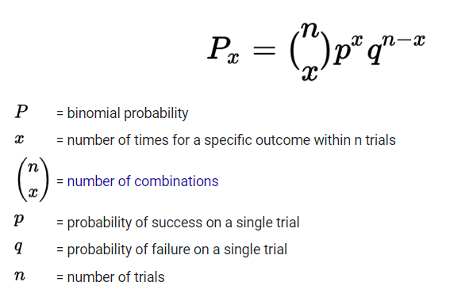
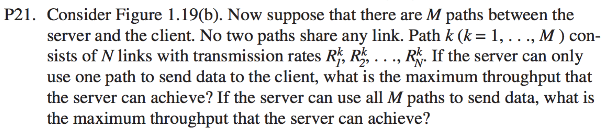

# CSC138_sec06_homework2_Matthew_Mendoza - Homework 2: Chapter #1 (Intro to Computer Networks)

**Author:** Matthew Mendoza

**Course:** CSC 138

**Section:** 06

- [CSC138_sec06_homework2_Matthew_Mendoza - Homework 2: Chapter #1 (Intro to Computer Networks)](#csc138_sec06_homework2_matthew_mendoza---homework-2-chapter-1-intro-to-computer-networks)
  - [Q1 (R4) List six access technologies. Classify each one as home access, enterprise Access, or wide-area wireless access](#q1-r4-list-six-access-technologies-classify-each-one-as-home-access-enterprise-access-or-wide-area-wireless-access)
  - [Q2 (R12) what advantage does a circuit-switched network have over a packet-switched network?](#q2-r12-what-advantage-does-a-circuit-switched-network-have-over-a-packet-switched-network)
  - [Q3 (R23). List the 5 layers in the Internet protocol stack? What are the principal responsibilities of each of these layers?](#q3-r23-list-the-5-layers-in-the-internet-protocol-stack-what-are-the-principal-responsibilities-of-each-of-these-layers)
  - [Q4 (P8) Suppose users share a 3 Mbps link. Also suppose each user requires 150 kbps when transmitting, but each user transmits only 10 percent of the time](#q4-p8-suppose-users-share-a-3-mbps-link-also-suppose-each-user-requires-150-kbps-when-transmitting-but-each-user-transmits-only-10-percent-of-the-time)
    - [a. When circuit switching is used, how many users can be supported?](#a-when-circuit-switching-is-used-how-many-users-can-be-supported)
    - [b. For the remainder of this problem, suppose packet switching is used. Find the probability that a given user is transmitting](#b-for-the-remainder-of-this-problem-suppose-packet-switching-is-used-find-the-probability-that-a-given-user-is-transmitting)
    - [c. Suppose there are 120 users. Find the probability that at any given time, exactly _n_ users are transmitting simultaneously](#c-suppose-there-are-120-users-find-the-probability-that-at-any-given-time-exactly-n-users-are-transmitting-simultaneously)
    - [d. Find the probability that there are 21 or more users transmitting simultaneously](#d-find-the-probability-that-there-are-21-or-more-users-transmitting-simultaneously)
  - [Q5 (P21)](#q5-p21)

## Q1 (R4) List six access technologies. Classify each one as home access, enterprise Access, or wide-area wireless access

| Access Technologies               | Classification             |
| --------------------------------- | -------------------------- |
| Dial-Up Modem Over Telephone Line | Home Access                |
| Hybrid Fiber-Coaxial Cable (Hfc)  | Home Access                |
| Digital Subscriber Line           | Home Access                |
| Ethernet and Wifi                 | Home and Enterprise Access |
| 100 Mbps Switched Ethernet        | Enterprise Access          |
| 3G and LTE 4G and 5G              | Wide-Area Wireless Access  |

## Q2 (R12) what advantage does a circuit-switched network have over a packet-switched network?

Circuit switched network is suited for voice/video calls, it pre-allocates use of the transmission link regardless of demand, it packets are always delivered in the correct order; as a result, so this network enables a steady bandwidth, dedicated channel, and consistent data rate.

In contrast, packet-switched networks is not ideal for applications that are in constant
use, such as high volume voice calls, lose data packets during high-traffic times, and
those data packets cannot be recovered or resent during transmission.

## Q3 (R23). List the 5 layers in the Internet protocol stack? What are the principal responsibilities of each of these layers?

The 5 layers in the Internet protocol stack are:

1. Application Layer
2. Transport Layer
3. Network Layer
4. Data Link Layer
5. Physical Layer

The principal responsibilities of each of these layers

1. **Application Layer**: is where network applications and their application-layer protocols reside. The Internet’s application layer includes many protocols, such as the
   HTTP protocol (which provides for Web document request and transfer), SMTP
   (which provides for the transfer of e-mail messages), and FTP (which provides for
   the transfer of files between two end systems); in addition, an application-layer
   protocol is distributed over multiple end systems, with the
   application in one end system using the protocol to exchange packets of information
   with the application in another end system

2. **Transport Layer**: transports application-layer messages between application
   endpoints via provides a connection-oriented service to its applications (TCP) and a
   connectionless service to its applications (UDP)

3. **Network Layer**: is responsible for moving network-layer packets known
   as datagrams, a basic transfer unit associated with a packet-switched network, from one
   host to another that is often a mixed implementation of hardware and software.

4. **Data Link Layer**: are responsible for handling communication over a specific link,
   they are typically implemented in a network interface
   card (for example, Ethernet or WiFi interface cards) associated with a given link.

5. **Physical Layer**: is to move the individual
   bits within the frame from one node to the next. The protocols in this layer are again
   link dependent and further depend on the actual transmission medium of the link (for
   example, twisted-pair copper wire, single-mode fiber optics)

## Q4 (P8) Suppose users share a 3 Mbps link. Also suppose each user requires 150 kbps when transmitting, but each user transmits only 10 percent of the time

(See the discussion of packet switching versus circuit switching in Section 1.3.)

### a. When circuit switching is used, how many users can be supported?

Number of users = Transmission rate of the link used by the user / Transmission rate required by each user

Number of users = 3 Mbps / 150 kbps

- _1 Mbps = 106 bps_

Number of users = 3,000 Kbps / 150 Kbps

Number of users = 20 users

Therefore, when circuit switching is used 20 users can be supported

### b. For the remainder of this problem, suppose packet switching is used. Find the probability that a given user is transmitting

Transmission Rate = 10%

Probability = 1 / 10

Probability = 0.1

### c. Suppose there are 120 users. Find the probability that at any given time, exactly _n_ users are transmitting simultaneously

(_Hint_: Use the binomial distribution)


```text
P = binomial probability
x = number of times for a specific outcome within n trials

(n) = number of combinations
(x) = number of combinations

p = probability of success on a single trial
q = probability of failure on a single trial
n = number of trials
```

### d. Find the probability that there are 21 or more users transmitting simultaneously

So, P (21 or more users) = 1 - 0.999

Probability 0.001

## Q5 (P21)


