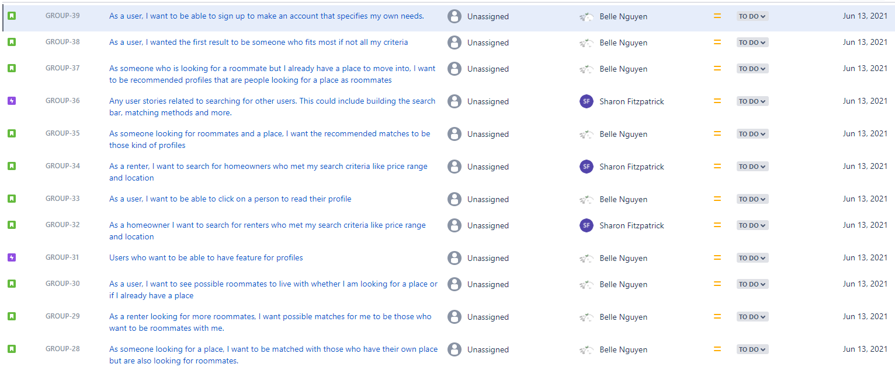
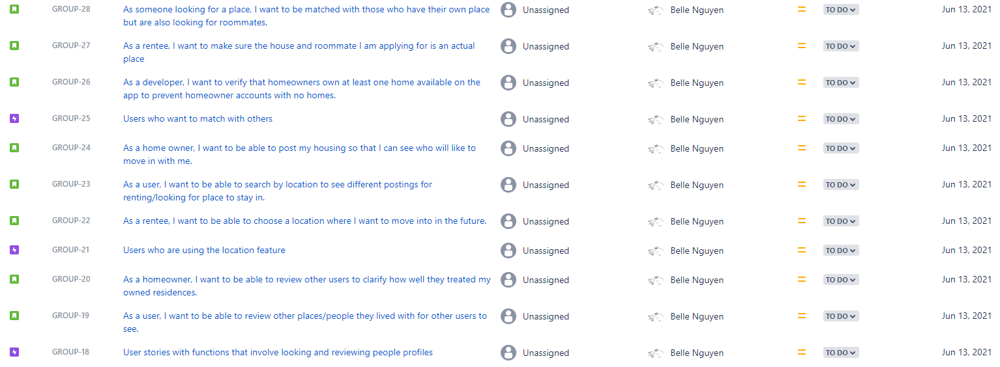
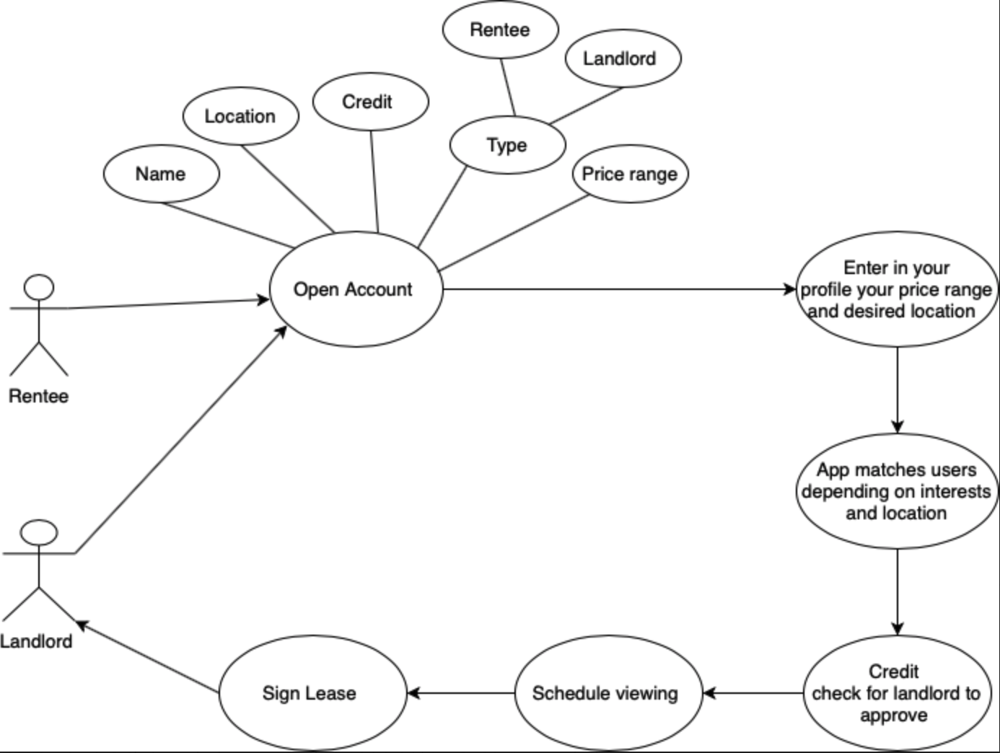
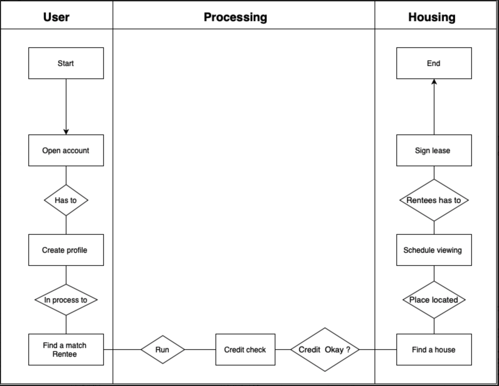

# assignment02: Create your project concept

|                           |                                                         |                                 |
| ------------------------- | ------------------------------------------------------- | ------------------------------- |
| **Due** Jun 14 at 11:59pm | **Points** 100                                          | **Submitting** a file upload    |
| **File Types** pdf        | **Available** Jun 1 at 12am - Jun 16 at 11:59pm 16 days | **Grade** 80 (100 pts possible) |

- **Jarod Castillo:** Question 5
- **Sharon Fitzpatrick:** Question 10
- **Daisy Le:** Question 2
- **Matthew Mendoza:** Question 6
- **Mohammed Msallam:** Question 11
- **Dominic Nance:** Question 7
- **Belle Nguyen:** Question 4
- **Yared Engida:** Question 3

- [assignment02: Create your project concept](#assignment02-create-your-project-concept)
  - [Assignment](#assignment)
    - [1. Read all the artifacts in the Files--->Model Project folder and refer to the slides in the first two chapters. (Your project is your own idea. It need not be on the project in this folder)](#1-read-all-the-artifacts-in-the-files---model-project-folder-and-refer-to-the-slides-in-the-first-two-chapters-your-project-is-your-own-idea-it-need-not-be-on-the-project-in-this-folder)
    - [2. Create your project problem statement. Understand the difference between the goal and the objective and prepare your goal and objective. (10 + 5 + 5 points)](#2-create-your-project-problem-statement-understand-the-difference-between-the-goal-and-the-objective-and-prepare-your-goal-and-objective-10--5--5-points)
    - [3. Create a list of TWO users and TWO stakeholders. (5 + 5 points)](#3-create-a-list-of-two-users-and-two-stakeholders-5--5-points)
    - [4. Create TWO actions per user, which you expect the user to perform. Understand difference between output and outcome and list the outputs and the outcomes from each action. Add the User Stories in JIRA (or equivalent). (5 + 5 points)](#4-create-two-actions-per-user-which-you-expect-the-user-to-perform-understand-difference-between-output-and-outcome-and-list-the-outputs-and-the-outcomes-from-each-action-add-the-user-stories-in-jira-or-equivalent-5--5-points)
      - [Two user actions](#two-user-actions)
      - [Two Stakeholder actions](#two-stakeholder-actions)
    - [5. Create a list of TWO assumptions on scope, cost and schedule that will prevent you from doing things that are not needed and prevent you from following a risky path. Scope, cost and schedule form the traditional constraint triangle. (5+5 points)](#5-create-a-list-of-two-assumptions-on-scope-cost-and-schedule-that-will-prevent-you-from-doing-things-that-are-not-needed-and-prevent-you-from-following-a-risky-path-scope-cost-and-schedule-form-the-traditional-constraint-triangle-55-points)
      - [Scope](#scope)
      - [Cost](#cost)
      - [Schedule](#schedule)
    - [6. Create a list of TWO assumptions on people, process and product that will help prevent you from doing things that are not needed and prevent you from following a risky path. (5+5 points)](#6-create-a-list-of-two-assumptions-on-people-process-and-product-that-will-help-prevent-you-from-doing-things-that-are-not-needed-and-prevent-you-from-following-a-risky-path-55-points)
      - [People](#people)
      - [Process](#process)
      - [Product](#product)
    - [7. Come up with TWO simple techniques how you will adapt the new Agile triangle (Value, Quality and traditional constraints) instead of the scope, cost, traditional constraint triangle alone. Give ONE specific example each of what you will focus on for Value and Quality and also the traditional constraint triangle. Give ONE example for Value and ONE example for Quality. (5+5 points)](#7-come-up-with-two-simple-techniques-how-you-will-adapt-the-new-agile-triangle-value-quality-and-traditional-constraints-instead-of-the-scope-cost-traditional-constraint-triangle-alone-give-one-specific-example-each-of-what-you-will-focus-on-for-value-and-quality-and-also-the-traditional-constraint-triangle-give-one-example-for-value-and-one-example-for-quality-55-points)
      - [Two simple techniques](#two-simple-techniques)
      - [Example for Value](#example-for-value)
      - [Example for Quality](#example-for-quality)
    - [8. Read about the User Stories INVEST principle (features of a good user story)](#8-read-about-the-user-stories-invest-principle-features-of-a-good-user-story)
    - [9. Read about the MoSCoW principle](#9-read-about-the-moscow-principle)
    - [10. Validate TWO of your actions for users if they meet the INVEST and MoSCoW principle. Describe why and why not? (5 + 5 + 5 + 5 points)](#10-validate-two-of-your-actions-for-users-if-they-meet-the-invest-and-moscow-principle-describe-why-and-why-not-5--5--5--5-points)
      - [User Actions](#user-actions)
      - [Search](#search)
        - [Search: MoSCoW](#search-moscow)
        - [Search: INVEST](#search-invest)
      - [Make Profile](#make-profile)
        - [Make Profile: MoSCoW](#make-profile-moscow)
          - [Make Profile: INVEST](#make-profile-invest)
    - [11. Draw Use Case diagram and Swimlane diagram for any one user action. (10 points)](#11-draw-use-case-diagram-and-swimlane-diagram-for-any-one-user-action-10-points)
      - [Use Case Diagram](#use-case-diagram)
      - [Swimlane Diagram](#swimlane-diagram)

## Assignment

### 1. Read all the artifacts in the Files--->Model Project folder and refer to the slides in the first two chapters. (Your project is your own idea. It need not be on the project in this folder)

### 2. Create your project problem statement. Understand the difference between the goal and the objective and prepare your goal and objective. (10 + 5 + 5 points)

### 3. Create a list of TWO users and TWO stakeholders. (5 + 5 points)

User 1: Potential roommate (renter)
User 2: House owner
Stakeholder 1: Young Adults
Stakeholder 2: Homeowners

### 4. Create TWO actions per user, which you expect the user to perform. Understand difference between output and outcome and list the outputs and the outcomes from each action. Add the User Stories in JIRA (or equivalent). (5 + 5 points)

#### Two user actions

1. creating a profile
   1. Output: Display information
   2. Outcome: People can see if they want to rent with that person or not.
2. looking for homes to rent/rent out in certain locations.
   1. Output: Display houses in desire location
   2. Outcome: Allows people to see if they want to rent in the area of the location

#### Two Stakeholder actions

1. Make sure people are being matched properly
   1. Output: matching people looking for roommates with people who have a place.
   2. Outcome: Lets people see available spots they could live in.
2. confirm if postings are actual places that are available.
   1. Output: Check to see if places are actually available to rent/move in too.
   2. Outcome: Prevent confusion for users and situations that would deter users from using the app.

### 5. Create a list of TWO assumptions on scope, cost and schedule that will prevent you from doing things that are not needed and prevent you from following a risky path. Scope, cost and schedule form the traditional constraint triangle. (5+5 points)

#### Scope

1. We assume that there is an uneven split of rentee to renters.
2. Assume users are homeowners or are looking to split rent with others.

#### Cost

1. Revenue will be generated by tailored advertisements.
2. Homeowners are allowed to boost their house on the app by online payment.

#### Schedule

1. For bare minimum through the agile process, it could take a week to a month. Assuming we have the minimal amount of skill set required to complete the app, it should only take a week to complete using easy and available frameworks.
2. For more features to be implemented, it depends on the feature. It could take months based on the skillset.

### 6. Create a list of TWO assumptions on people, process and product that will help prevent you from doing things that are not needed and prevent you from following a risky path. (5+5 points)

#### People

1. Are creating an account for themselves
2. Are owners of email accounts they input
3. Our users will follow and use our service as described in our end-user license agreement (EULA)

#### Process

1. The process from account creation to profile setup is straightforward and intuitive
2. After account creation the user is able to logout and log back in with the same information they’ve provided

#### Product

1. The product can run on multiple devices under one account
2. Third party APIs, licences, and software used to run our product won’t be obsolete, removed, or invite vulnerabilities like viruses, hackers, or leak of user/company data

### 7. Come up with TWO simple techniques how you will adapt the new Agile triangle (Value, Quality and traditional constraints) instead of the scope, cost, traditional constraint triangle alone. Give ONE specific example each of what you will focus on for Value and Quality and also the traditional constraint triangle. Give ONE example for Value and ONE example for Quality. (5+5 points)

#### Two simple techniques

1. Interview potential users & developers, then develop personas & user stories to reflect user needs.
2. Practice weekly meetings among developers to assess member’s work & see if features developed meet objectives and provide user value.

#### Example for Value

Obtain value for tailored ads. For example, getting location specific ad data for revenue. This allows for stakeholders to get money while customers keep using the app for “free.”

#### Example for Quality

Ensure that users have accessible connections to local and further areas open for housing, connecting people who are leasing and people who are needing housing by allowing users to search for other accounts.

### 8. Read about the User Stories INVEST principle (features of a good user story)

[Slides from Files---->Ch2B_User stories](chapter_2b_user_stories.pdf)

### 9. Read about the MoSCoW principle

[Slides from Files---->Ch2B_User stories](chapter_2b_user_stories.pdf)

### 10. Validate TWO of your actions for users if they meet the INVEST and MoSCoW principle. Describe why and why not? (5 + 5 + 5 + 5 points)

#### User Actions

- Search
- Make profile

#### Search

##### Search: MoSCoW

(Must Have, Should Have, Could Have, Won't Have this time)

- **Must have:** Search is necessary because users need to quickly network with other users who meet their search criteria. Otherwise matching homeowners and renters could not find each other.
- **Should have:** The search results should show the closest matches to the search criteria first, with less close matches following in descending order.
- **Could have:** It would be nice to be able to optimize searches with pre defined user tags such as location, price range, etc.
- **Wouldn’t have:** No results should be shown that are not relevant to the search criteria.

##### Search: INVEST

- **Independent:** Users enter their search criteria and results depend on user type (homeowner or renter)
- **Negotiable:** Users specify the search parameters and get desired results
- **Value:** Makes it easier for users to find each other by filtering in only the users that meet the search criteria
- **Estimable:** We as developers know how long it takes to make a dropdown menu for the search bar and the time it takes to develop a search algorithm like Binary Search.
- **Small:** Drop down menu for search bar and binary search
- **Testable:** This can be tested by checking if users’ can see other users’ profiles that match their search criteria.

#### Make Profile

##### Make Profile: MoSCoW

(Must Have, Should Have, Could Have, Won't Have this time)

- **Must have:** The ability to create a profile to allow users to represent themselves and have their own criteria,so they can be matched with other desired homeowners/renters. Otherwise, there is no way for users to match based on the information in their profiles like location type and price range.
- **Should have:** When a user is making a profile they _should have_ a way to enter in their information.
- **Could have:** A way to verify if users are real with a photo id
- **Wouldn’t have:** The profile cannot have any irrelevant information in it.

###### Make Profile: INVEST

- **Independent:** User enters data into relevant sections in the appropriate field and making the profile does not depend on any other process.
- **Negotiable:** users must be able to capture the essential details about themselves like their price range, location,and type.
- **Value:** Shows the user’s availability and needs to other users
- **Estimable:** Can be estimated in the number of hours it takes to build the profile in html, css, and js.
- **Small:** Building the profile is a small task that consists of displaying the user information and a button for submitting the user’s information.
- **Testable:** To test this we would submit sample user information into the appropriate fields, click the submit button, and see if the sample user information we created displays.

### 11. Draw Use Case diagram and Swimlane diagram for any one user action. (10 points)

#### Use Case Diagram

#### Swimlane Diagram

