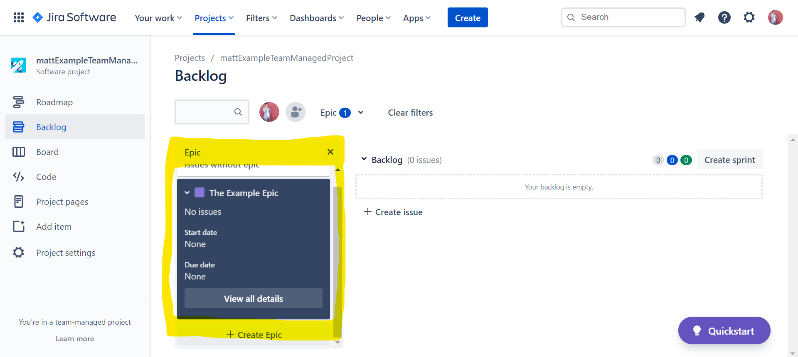

# Assignment03: Sample JIRA Exercises

|                                                       |                     |                                |
| ----------------------------------------------------- | ------------------- | ------------------------------ |
| **Due** Jun 7 at 11:59pm                              | **Points** 25       | **Questions** 16               |
| **Available** Jun 1 at 12am - Jun 9 at 11:59pm 9 days | **Time Limit** None | **Allowed Attempts** Unlimited |

This exercise is for you to warm up with playing with JIRA hands-on. You can mock things up as you go. You can do this on JIRA cloud

Please go to the following folder location:

[File](https://csus.instructure.com/courses/78779/files) **→** [Model Project](https://csus.instructure.com/courses/78779/files/folder/Model%20Project) **→** [JIRA-tutorial](https://csus.instructure.com/courses/78779/files/folder/Model%20Project/JIRA-tutorial)

## 1. Make up any project, Epic, User stories, Issues and Tasks; also, Make up any mock Release plan

### Project

### Epic

After enabling `Backlog` via `Project settings` → `Features` → `Backlog`

### User Stories

### Issues

### Tasks

### Release Plan

After enabling `Release` via `Project settings` → `Features` → `Release`

You can do this on JIRA cloud

## 2. Go to <training.atlassian.com> and do the first two in the FREE trainings. The Free trainings is the last section on the page (scroll down all the way to the bottom of the page):

### (a) [Learn JIRA Basics](https://training.atlassian.com/jira-basics)

### (b) [Go Agile with JIRA](https://training.atlassian.com/agile-with-jira)

