# Assignment 10 - Discussion Material submission

|                                                            |                    |                              |
| ---------------------------------------------------------- | ------------------ | ---------------------------- |
| **Due** Sunday by 11:59pm                                  | **Points** 25      | **Submitting** a file upload |
| **Available** Jun 30 at 12am - Jul 11 at 11:59pm _12 days_ | **File Types** pdf |                              |

- [Assignment 10 - Discussion Material submission](#assignment-10---discussion-material-submission)
  - [Information](#information)
  - [Discussion screenshots](#discussion-screenshots)
  - [Group Meeting: Sunday (2021/06/06) 1:45pm - 3:20pm](#group-meeting-sunday-20210606-145pm---320pm)
    - [Next Meeting (2021/06/13)](#next-meeting-20210613)
    - [The Agenda (2021/06/06)](#the-agenda-20210606)
    - [Meeting Notes (2021/06/06)](#meeting-notes-20210606)
      - [Introductions](#introductions)
        - [Matt M](#matt-m)
        - [Dominic Nance](#dominic-nance)
        - [Belle Nguyen](#belle-nguyen)
        - [Sharon Fitzpatrick](#sharon-fitzpatrick)
        - [Jarod Castillo](#jarod-castillo)
        - [Mohammed Msallam](#mohammed-msallam)
        - [Yared [yar-ed]](#yared-yar-ed)
        - [Daisy Le](#daisy-le)
      - [Establish a workflow](#establish-a-workflow)
      - [Establish roles or how to "manage" our team](#establish-roles-or-how-to-manage-our-team)
      - [Group Project Ideas](#group-project-ideas)
        - [Belle Project Idea](#belle-project-idea)
        - [Dominic Project Idea](#dominic-project-idea)
        - [Sharon Project Idea](#sharon-project-idea)
      - [Matt Project Idea](#matt-project-idea)
  - [Group Laugh Touch Point Meeting: Wednesday (2021/06/09) 7:40pm - 9:00pm](#group-laugh-touch-point-meeting-wednesday-20210609-740pm---900pm)
    - [Meeting attendees](#meeting-attendees)
    - [Agenda](#agenda)
    - [Roomate Finder](#roomate-finder)
      - [Problem Statment](#problem-statment)
      - [User Story](#user-story)
      - [Users and stakeholders](#users-and-stakeholders)
        - [Actions](#actions)
      - [Assumptions](#assumptions)
      - [6 Create a list of TWO assumptions on scope, cost and schedule that will prevent you from doing things that are not needed and prevent you from following a risky path. Scope, cost and schedule form the traditional constraint triangle. (5+5 points)](#6-create-a-list-of-two-assumptions-on-scope-cost-and-schedule-that-will-prevent-you-from-doing-things-that-are-not-needed-and-prevent-you-from-following-a-risky-path-scope-cost-and-schedule-form-the-traditional-constraint-triangle-55-points)
      - [7 Come up with TWO simple techniques how you will adapt the new Agile triangle (Value, Quality and traditional constraints) instead of the scope, cost, traditional constraint triangle alone. Give ONE specific example each of what you will focus on for Value and Quality and also the traditional constraint triangle. Give ONE example for Value and ONE example for Quality. (5+5 points)](#7-come-up-with-two-simple-techniques-how-you-will-adapt-the-new-agile-triangle-value-quality-and-traditional-constraints-instead-of-the-scope-cost-traditional-constraint-triangle-alone-give-one-specific-example-each-of-what-you-will-focus-on-for-value-and-quality-and-also-the-traditional-constraint-triangle-give-one-example-for-value-and-one-example-for-quality-55-points)
      - [Minimum Viable Product](#minimum-viable-product)
      - [What are must haves](#what-are-must-haves)
      - [Goals and objectives](#goals-and-objectives)

## Information

Dear students,

You can provide any material related to your discussions.
It may be screen shots of discussions and such. Please turn in a PDF file.

Best wishes,

Jagan

## Discussion screenshots

There are a lot, so here are a few.

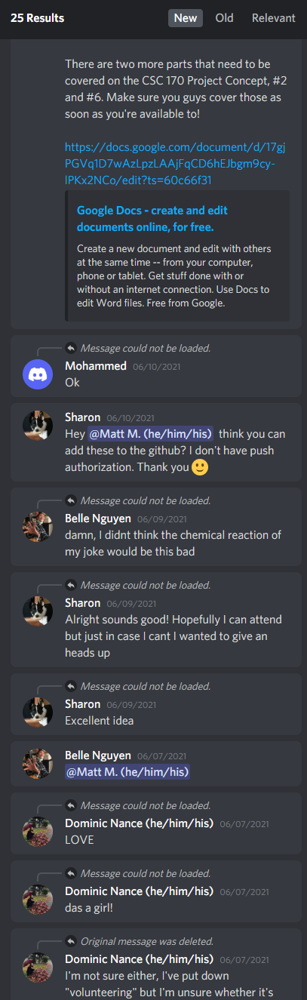
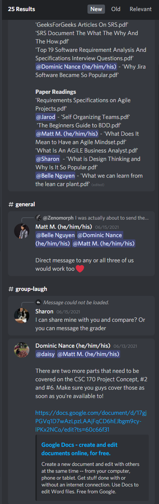
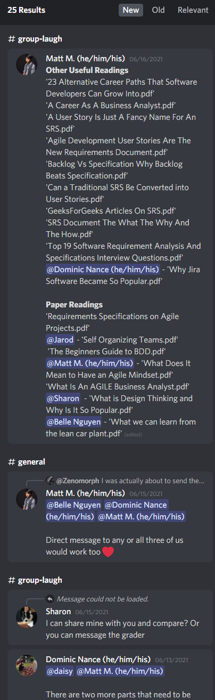
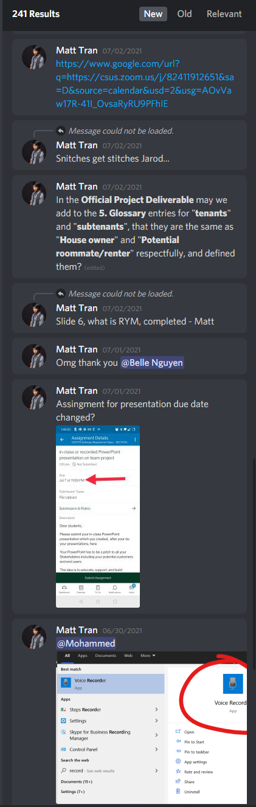
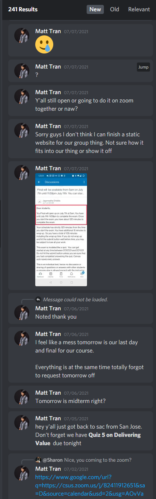
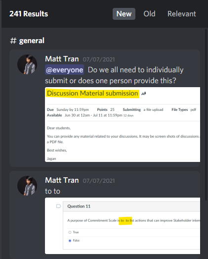
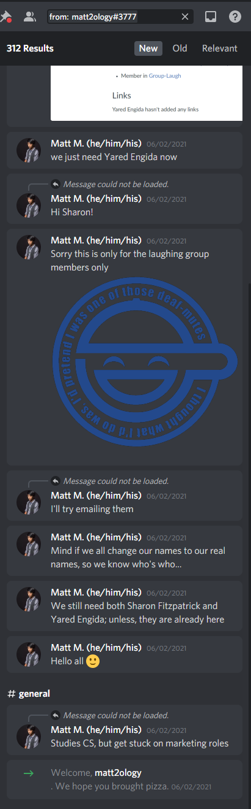
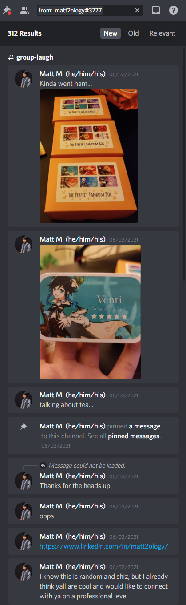
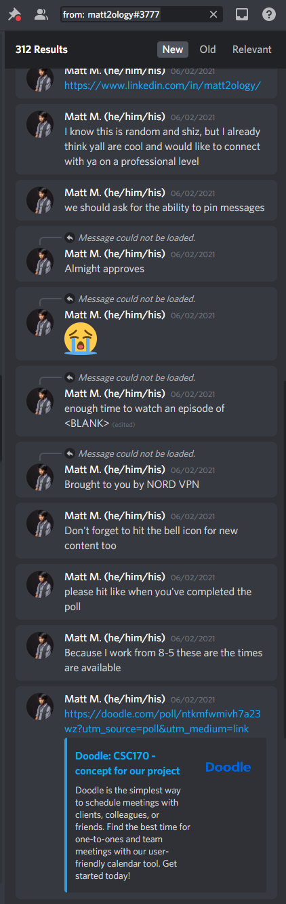
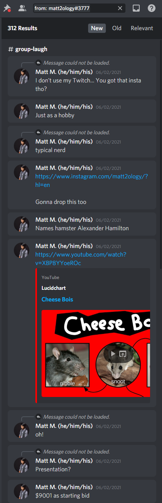
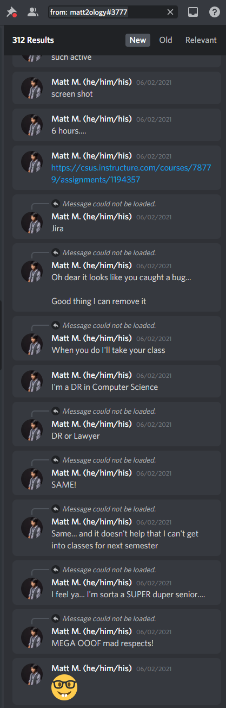
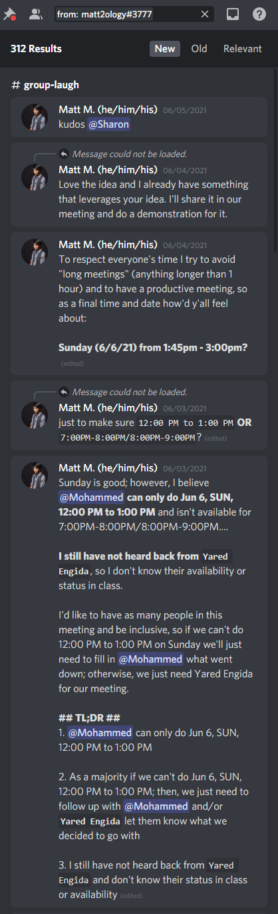
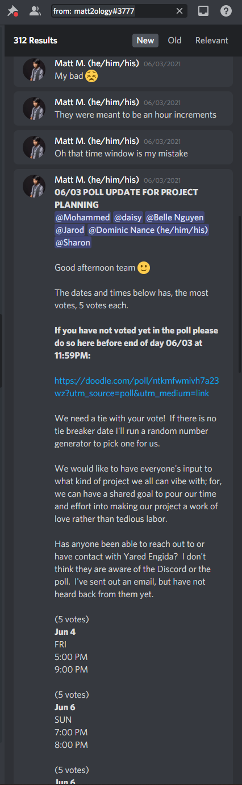
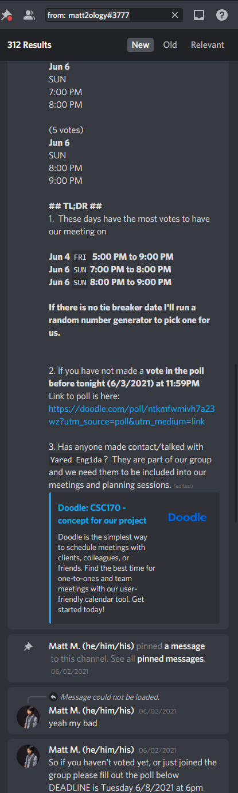
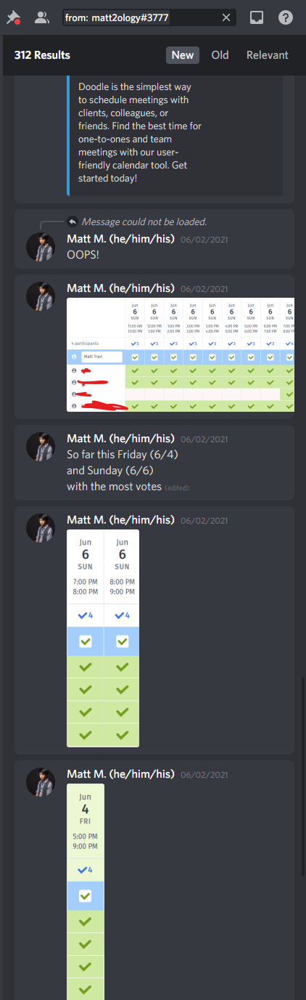
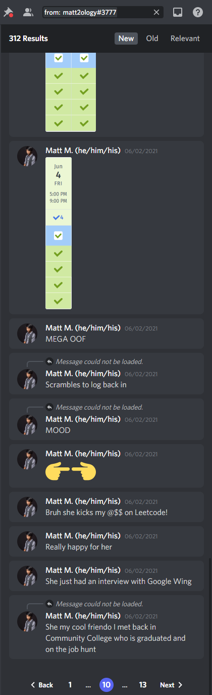

## Group Meeting: Sunday (2021/06/06) 1:45pm - 3:20pm

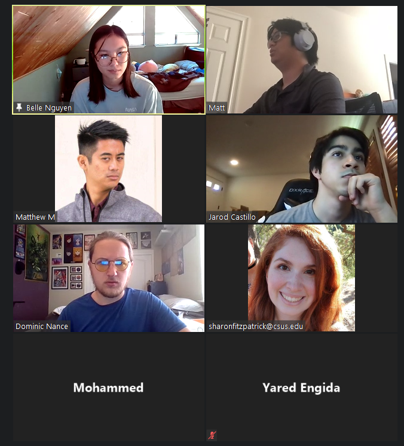

### Next Meeting (2021/06/13)

1. Decide our product (Project Idea)
2. Case Studies
3. Finalize meeting times

### The Agenda (2021/06/06)

For today's meeting

1. Do a quick formal introduction

   - Name
   - Technical skills (programming languages or framework)
   - Your general availability 🕑
   - Your favorite pass time 📺
   - Favorite fruit 🍎

2. Establish a workflow

   - Preferred means of contact (Discord/email/text/smoke signals)
   - How do we report work accomplished, work assigned, where is the work held/saved on
   - Share email for shared Google Calendar

3. Establish roles or how to "manage" our team

4. Set up an agreed reoccurring meeting schedule or make a workflow so have "dynamic" meetings

5. Assign some ARs (Action Ready) AKA tasks for next meeting/assignment

6. end of meeting

### Meeting Notes (2021/06/06)

#### Introductions

##### Matt M

- Technical skills (programming languages or framework)
- Your general availability 🕑
- Watching anime, playing with Raspberry Pi, playing board/card games
- Durian

##### Dominic Nance

- Scrum, Java, C
- Monday, Wed after 5; generally free
- Like some anime and do some programming on the side
- Strawberries

##### Belle Nguyen

- Python, Java, HTML :)
- Generally available
- Card game tor (Digimon)
- Tangeries

##### Sharon Fitzpatrick

- Python, CPP, Java, JS, React, Node
- After 5PM
- Watercolor, hiking
- Watermelon

##### Jarod Castillo

- JS, Dart, CPP, Python, and yeah
- Friday, Sat, Sun, afternoon, tues and thurs
- Gaming, Composes music
- The Orange honeydew (cantaloupe)

##### Mohammed Msallam

- Java, C, Swift
- Sunday (morning 12-3)
- News, trading
- Blueberries

##### Yared [yar-ed]

- Java, C, HTML
- Monday - Friday (after 5:30)
- The NAPPING KING :)
- Oranges

##### Daisy Le

- Web dev (HTML, CSS, Javascript)
- Friday to Sunday (11am-4pm)
  - Tues (4pm - 9pm)
- Love sleep, games
- Mango, advocados, bannanas

#### Establish a workflow

- Preferred means of contact (Discord/email/text/smoke signals)
  - Discord, Email
  - Meetings done via Zoom
- How do we report work accomplished, work assigned, where is the work held/saved on
  - Atlassian JIRA (as the means to do work)
- Share email for shared Google Calendar

#### Establish roles or how to "manage" our team

Dynamic team roles

#### Group Project Ideas

- WHAT DO YOU WANT?! (the app for hungry gal-pals)
- Roomate Finder
- Budget tracker

##### Belle Project Idea

1. Software: Roomate Finder
2. Software: Pen-pal gift exchanger
3. Software: Product-scraper (in-stock, price match, make and model)
4. Software: Damage output calculator (BIGGGUST NHUMMMBUHHHH)
   1. Team composition
5. ~~Software: WHAT DO YOU WANT?! (the app for hungry gal-pals)~~
6. Anime suggestion/recommendation (myAnime list?)

##### Dominic Project Idea

1. Password Manager
2. Food expiration app (database)
3. Budget tracker
4. Movie Showings app
5. Kids Coding (block coding: like Scratch)

##### Sharon Project Idea

1. Food/cooking/recipe sharing/social app
2. Calorie counter app
3. Availability app

#### Matt Project Idea

1. Tom Nooks Store
2. Pokedex (Python image recognition)

## Group Laugh Touch Point Meeting: Wednesday (2021/06/09) 7:40pm - 9:00pm

### Meeting attendees

- [x] Belle Nguyen
- [x] Daisy Le
- [x] Dominic Nance
- [x] Jarod Castillo
- [x] Matthew Mendoza
- [ ] Mohammed Msallam
- [x] Sharon Fitzpatrick
- [ ] Yared Engida

### Agenda

- Opens (agenda topics/AR's completed/blocks/holds/questions/status updates)
  - Belle Nguyen
  - Daisy Le
  - Dominic Nance
  - Jarod Castillo
  - Matthew Mendoza
  - Mohammed Msallam
  - Sharon Fitzpatrick
  - Yared Engida

### Roomate Finder

#### Problem Statment

People need a way to find roomates in a certain location and price range

#### User Story

#### Users and stakeholders

| Users                       | Steakholders     |
| --------------------------- | ---------------- |
| Potential roomates (renter) | Real estate      |
|                             | College students |
|                             | Homeowners       |
| homeowner                   | Young adults     |

##### Actions

1. Create profile (all users) 2x
   1. One for house
   2. House to rent
2. Search for house → roommate
   1. Search for rentee

#### Assumptions

1. Assume users enters correct info: location, name, ect.
2. Assume there are "enough" users
3. Assume age
4. Assume homeowner
5. Assume they are following the End-user license agreement (EULA)
6. Assume user remembers username and password

#### 6 Create a list of TWO assumptions on scope, cost and schedule that will prevent you from doing things that are not needed and prevent you from following a risky path. Scope, cost and schedule form the traditional constraint triangle. (5+5 points)

| Scope                  | Cost                     | Schedule |
| ---------------------- | ------------------------ | -------- |
| Uneven split of rentee | No user sign-up cost     |          |
|                        | Revenue generaged by ADs |          |
|                        | Boost! (for money)       |          |
| Assume Users           |                          |          |

#### 7 Come up with TWO simple techniques how you will adapt the new Agile triangle (Value, Quality and traditional constraints) instead of the scope, cost, traditional constraint triangle alone. Give ONE specific example each of what you will focus on for Value and Quality and also the traditional constraint triangle. Give ONE example for Value and ONE example for Quality. (5+5 points)

| Value                  | Quality                  | Constraints |
| ---------------------- | ------------------------ | ----------- |
| Uneven split of rentee | No user sign-up cost     |             |
|                        | Revenue generaged by ADs |             |
|                        | Boost! (for money)       |             |
| Assume Users           |                          |             |

#### Minimum Viable Product

Mobile app

- Location
- Profile
- Search for profile, location, price range
  - Search location shows people in location
- Login
  - Username
  - Password

#### What are must haves

- Location
- Profile
  - Destination Location
  - Name
  - Interest?
  - Bio?
  - Price range
  - Picture of indoor/floor plan
  - Credit rating
  - Swipe left/right
- Chat (like to have)
- Push notification (like to have)
- Security
  - Block feature
  - Share general location not specific location
  - Pevent bots
  - verification (Send ID pic + real photo)
- Credit history feature (like to have)
- Rate yo'mate® (like to have)

#### Goals and objectives

| Goal (Long Term) | Objective (How)                                                                |
| ---------------- | ------------------------------------------------------------------------------ |
| Connect roomates | create app to match viable roomates together based on location and price range |
|                  |                                                                                |
