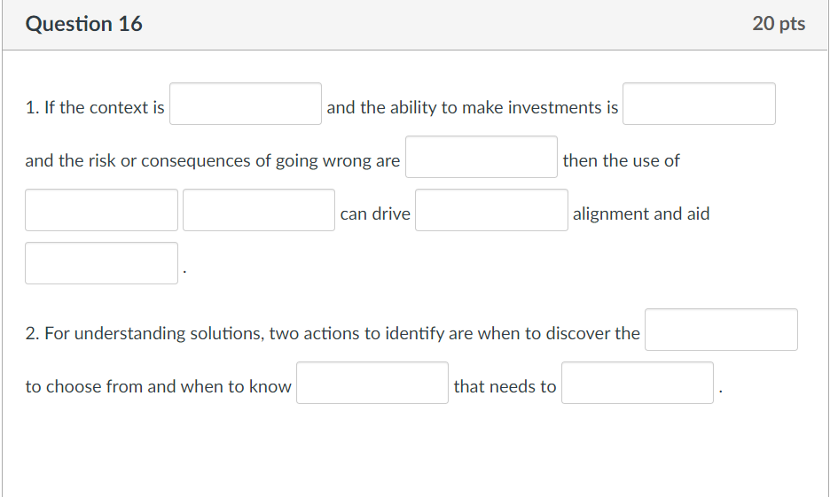

# Final Exam

|                                                         |                            |                  |
| ------------------------------------------------------- | -------------------------- | ---------------- |
| **Due** Jul 11 at 11:59pm                               | **Points** 100             | **Questions** 19 |
| **Available** Jul 7 at 5am - Jul 12 at 11:59pm _6 days_ | **Time Limit** 135 Minutes |                  |

- [Final Exam](#final-exam)
  - [Instructions](#instructions)
  - [Final Exam Questions](#final-exam-questions)
  - [Question 1 (4 pts) What is a stakeholder map?](#question-1-4-pts-what-is-a-stakeholder-map)
  - [Question 2 (4 pts) What is a commitment scale?](#question-2-4-pts-what-is-a-commitment-scale)
  - [Question 3 (4 pts) Propose and use any technique you think appropriate, to explain your approach to help the startup](#question-3-4-pts-propose-and-use-any-technique-you-think-appropriate-to-explain-your-approach-to-help-the-startup)
  - [Question 4 (4 pts) Propose and use any technique you think appropriate to explain your approach to help a large AI company which develops products for this purpose](#question-4-4-pts-propose-and-use-any-technique-you-think-appropriate-to-explain-your-approach-to-help-a-large-ai-company-which-develops-products-for-this-purpose)
  - [Question 5 (4 pts) In the Project Opportunity Assessment, describe why answering the tenth question ("Is this problem worth solving?") is our ultimate aim. Explain how some or all of the remaining nine questions can help you answer the tenth question in your own simple words. Keep it simple](#question-5-4-pts-in-the-project-opportunity-assessment-describe-why-answering-the-tenth-question-is-this-problem-worth-solving-is-our-ultimate-aim-explain-how-some-or-all-of-the-remaining-nine-questions-can-help-you-answer-the-tenth-question-in-your-own-simple-words-keep-it-simple)
  - [Question 6 (2 pts) Story maps are not useful when there is a lot of user interaction](#question-6-2-pts-story-maps-are-not-useful-when-there-is-a-lot-of-user-interaction)
  - [Question 7 (2 pts) In the Project Opportunity Assessment, the first question is the aim of all questions](#question-7-2-pts-in-the-project-opportunity-assessment-the-first-question-is-the-aim-of-all-questions)
  - [Question 8 (2 pts) A project opportunity assessment is an assessment that consists of ten questions to ask when examining a product opportunity to elicit more information](#question-8-2-pts-a-project-opportunity-assessment-is-an-assessment-that-consists-of-ten-questions-to-ask-when-examining-a-product-opportunity-to-elicit-more-information)
  - [Question 9 (2 pts) The context leadership model is not a tool for determining the appropriate project leadership style given a project’s uncertainty and complexity](#question-9-2-pts-the-context-leadership-model-is-not-a-tool-for-determining-the-appropriate-project-leadership-style-given-a-projects-uncertainty-and-complexity)
  - [Question 10 (2 pts) A problem statement is an unstructured set of statements that describes the purpose of an effort in terms of what problem it’s trying to solve](#question-10-2-pts-a-problem-statement-is-an-unstructured-set-of-statements-that-describes-the-purpose-of-an-effort-in-terms-of-what-problem-its-trying-to-solve)
  - [Question 11 (2 pts) A purpose of Commitment Scale is to to list actions that can improve Stakeholder interest](#question-11-2-pts-a-purpose-of-commitment-scale-is-to-to-list-actions-that-can-improve-stakeholder-interest)
  - [Question 12 (2 pts) User Modeling may be used to discover missing user stories](#question-12-2-pts-user-modeling-may-be-used-to-discover-missing-user-stories)
  - [Question 13 (2 pts) Decision Filters help in judiciously avoiding incorrect action plans](#question-13-2-pts-decision-filters-help-in-judiciously-avoiding-incorrect-action-plans)
  - [Question 14 (2 pts) When designing your story map it is best to take the help of personas and how or what they do](#question-14-2-pts-when-designing-your-story-map-it-is-best-to-take-the-help-of-personas-and-how-or-what-they-do)
  - [Question 15 (2 pts) The Project Opportunity Assessment may be used to analyze if the project is worth doing or worth doing later or doing in a different context](#question-15-2-pts-the-project-opportunity-assessment-may-be-used-to-analyze-if-the-project-is-worth-doing-or-worth-doing-later-or-doing-in-a-different-context)
  - [Question 16 (20 pts)](#question-16-20-pts)
  - [Question 17](#question-17)
    - [17a) What is a definition of ready?](#17a-what-is-a-definition-of-ready)
    - [17b) What is a delivery board?](#17b-what-is-a-delivery-board)
    - [17b) What is a definition of done?](#17b-what-is-a-definition-of-done)
    - [17c) What are discovery boards?](#17c-what-are-discovery-boards)
    - [17d) What is system documentation?](#17d-what-is-system-documentation)
  - [Question 18 (20 pts)](#question-18-20-pts)
  - [Question 19 (10 pts) Name and describe implementing TWO techniques that are associated with your class project only as a summary (all details are not required)](#question-19-10-pts-name-and-describe-implementing-two-techniques-that-are-associated-with-your-class-project-only-as-a-summary-all-details-are-not-required)

## Instructions

Dear students,

Your schedule has strictly 120 minutes from the time you start the exam. You have additional 15 minutes to wrap up. So you have a total of 135 minutes including the wrap-up time. If you do not wrap up and hit the submit button well before time, you may be subject to lose all your work.

This exam is modeled like a quiz. You can get started at any time between 07/07/21 and 07/11/21. Do not hit the submit button unless you are sure that you had completed answering the quiz. Canvas auto-saves every answer.

This is an individual test, hence no discussion or sharing of questions or answers with other students or anyone else is allowed except with the instructor for the course.

Hint: To be successful in managing your time well, make sure you plan your time according to the number of points allocated. So if a question has 4 points do not exceed more than 4 minutes. If a question has 2 points do not exceed 2 minutes! You should be able to complete the True/False and Match-the-following questions in less than 15 minutes instead of 30 minutes. So you should be able to complete the test in less than 1 hour 30 minutes. If you are stuck anywhere move on and come back later to the question you are not sure of your answer.

There are:

- 5 simple 4 point essay questions (please do your best not to exceed 3 to 4 line answers per question or you may use the help of a simple graph or diagram if appropriate to explain),

- 10 True/False (2 points each),

- 10 Fill-in-the-blanks (2 points each),

- 5 match-the-following (2 points each), and

- 2 medium size questions with parts (for each part please do your best not to exceed 4 lines for an answer or you may use the help of a simple graph or diagram to explain) (5 points each part).

When filling in the blanks, please do not use more than two words per blank and use only all lower case letters. While grading we will be checking your fill-in-the-blanks answers manually as well.

Best wishes and cheers,

:)

Jagan

## Final Exam Questions

## Question 1 (4 pts) What is a stakeholder map?

## Question 2 (4 pts) What is a commitment scale?

## Question 3 (4 pts) Propose and use any technique you think appropriate, to explain your approach to help the startup

```text
A for-profit educational startup intended to start a physical building based brick-and-mortar school to supplement standard education model with holistic topics for health and inner emotional development. However, it was unable to take off due to the stay-at-home lockdown orders. So the startup proposes to quickly use online methods to provide a learning model and reach out to possible target groups.  Propose and use any technique you think appropriate, to explain your approach to help the startup.
```

## Question 4 (4 pts) Propose and use any technique you think appropriate to explain your approach to help a large AI company which develops products for this purpose

```text
As fake news spreads, people are misinformed. New internet software based on Artificial Intelligence techniques were introduced to discover and identify fake news. However, the uncertainty of the success of these techniques has proliferated fake news. The fake news identification process is becoming increasingly complex.

Propose and use any technique you think appropriate to explain your approach to help a large AI company which develops products for this purpose.
```

## Question 5 (4 pts) In the Project Opportunity Assessment, describe why answering the tenth question ("Is this problem worth solving?") is our ultimate aim. Explain how some or all of the remaining nine questions can help you answer the tenth question in your own simple words. Keep it simple

## Question 6 (2 pts) Story maps are not useful when there is a lot of user interaction

- [ ] True
- [ ] False

## Question 7 (2 pts) In the Project Opportunity Assessment, the first question is the aim of all questions

- [ ] True
- [ ] False

## Question 8 (2 pts) A project opportunity assessment is an assessment that consists of ten questions to ask when examining a product opportunity to elicit more information

- [ ] True
- [ ] False

## Question 9 (2 pts) The context leadership model is not a tool for determining the appropriate project leadership style given a project’s uncertainty and complexity

- [ ] True
- [ ] False

## Question 10 (2 pts) A problem statement is an unstructured set of statements that describes the purpose of an effort in terms of what problem it’s trying to solve

- [ ] True
- [ ] False

## Question 11 (2 pts) A purpose of Commitment Scale is to to list actions that can improve Stakeholder interest

- [ ] True
- [ ] False

## Question 12 (2 pts) User Modeling may be used to discover missing user stories

- [ ] True
- [ ] False

## Question 13 (2 pts) Decision Filters help in judiciously avoiding incorrect action plans

- [ ] True
- [ ] False

## Question 14 (2 pts) When designing your story map it is best to take the help of personas and how or what they do

- [ ] True
- [ ] False

## Question 15 (2 pts) The Project Opportunity Assessment may be used to analyze if the project is worth doing or worth doing later or doing in a different context

- [ ] True
- [ ] False

## Question 16 (20 pts)



```text
1. If the context is [BLANK] and the ability to make investments is [BLANK] and the risk or consequences of going wrong are [BLANK] then the use of [BLANK] [BLANK] can drive [BLANK] alignment and aid [BLANK]

2. For understanding solutions, two actions to identify are when to discover the [BLANK] to choose from and when to know [BLANK] that needs to [BLANK]
```

## Question 17

### 17a) What is a definition of ready?

- [ ] An agreement on the set of conditions that need to be true in order to consider a backlog item ready to be included in an iteration for delivery.
- [ ] A way for a team to visualize their process for delivering functionality in a sprint.
- [ ] Ways for teams to visualize their backlog refinement process.
- [ ] Information about an as-built solution and acts as a reference for future maintenance or update efforts.
- [ ] An agreement on the set of conditions that need to be true in order to be consider a backlog item done and at a point where it can be deliver value to stakeholders.

### 17b) What is a delivery board?

- [ ] An agreement on the set of conditions that need to be true in order to consider a backlog item ready to be included in an iteration for delivery.
- [ ] A way for a team to visualize their process for delivering functionality in a sprint.
- [ ] Ways for teams to visualize their backlog refinement process.
- [ ] Information about an as-built solution and acts as a reference for future maintenance or update efforts.
- [ ] An agreement on the set of conditions that need to be true in order to be consider a backlog item done and at a point where it can be deliver value to stakeholders.

### 17b) What is a definition of done?

- [ ] An agreement on the set of conditions that need to be true in order to consider a backlog item ready to be included in an iteration for delivery.
- [ ] A way for a team to visualize their process for delivering functionality in a sprint.
- [ ] Ways for teams to visualize their backlog refinement process.
- [ ] Information about an as-built solution and acts as a reference for future maintenance or update efforts.
- [ ] An agreement on the set of conditions that need to be true in order to be consider a backlog item done and at a point where it can be deliver value to stakeholders.

### 17c) What are discovery boards?

- [ ] An agreement on the set of conditions that need to be true in order to consider a backlog item ready to be included in an iteration for delivery.
- [ ] A way for a team to visualize their process for delivering functionality in a sprint.
- [ ] Ways for teams to visualize their backlog refinement process.
- [ ] Information about an as-built solution and acts as a reference for future maintenance or update efforts.
- [ ] An agreement on the set of conditions that need to be true in order to be consider a backlog item done and at a point where it can be deliver value to stakeholders.

### 17d) What is system documentation?

- [ ] An agreement on the set of conditions that need to be true in order to consider a backlog item ready to be included in an iteration for delivery.
- [ ] A way for a team to visualize their process for delivering functionality in a sprint.
- [ ] Ways for teams to visualize their backlog refinement process.
- [ ] Information about an as-built solution and acts as a reference for future maintenance or update efforts.
- [ ] An agreement on the set of conditions that need to be true in order to be consider a backlog item done and at a point where it can be deliver value to stakeholders.

## Question 18 (20 pts)

```text
The purpose of this assignment is to describe your CSC170 project to a prospective employer. You are to assume that you are applying for employment with a major software development company. You have been asked to write a description (with at most 750 words) of your project experience prior to the interview. This employer is familiar with the Computer Science Program at CSUS and regularly hires our graduates. The employer has requested that the description addresses the following **topics (questions)**:

1. Give an overview of the project and describe what the project was about. What was your role in the project?
2. Rather than discuss the process you used, identify what you consider to be essential to ensure that the process produces a successful outcome (i.e., the product is delivered on time, within budget, and more than meets the needs of our clients).
3. Were there any aspects of the project that have caused problems? If so, explain how these were dealt with – or not.

Discuss what you have learned from your development experience in that project that would influence your work as a member in our organization.
```

## Question 19 (10 pts) Name and describe implementing TWO techniques that are associated with your class project only as a summary (all details are not required)
