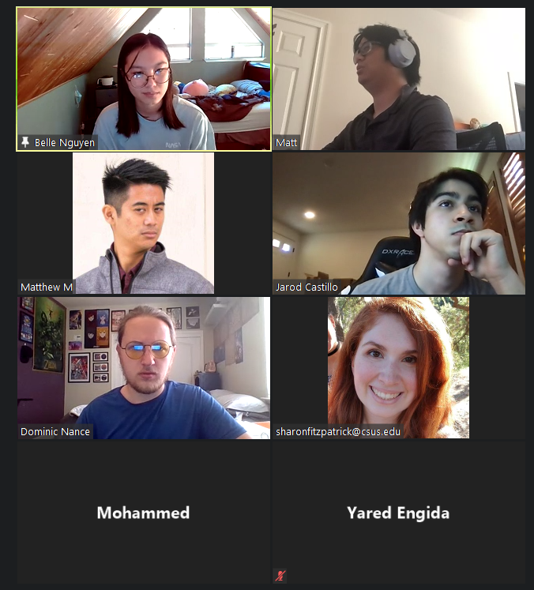

# Group Meeting: Sunday (2021/06/06) 1:45pm - 3:20pm

- [Group Meeting: Sunday (2021/06/06) 1:45pm - 3:20pm](#group-meeting-sunday-20210606-145pm---320pm)
  - [Next Meeting (2021/06/13)](#next-meeting-20210613)
  - [The Agenda (2021/06/06)](#the-agenda-20210606)
  - [Meeting Notes (2021/06/06)](#meeting-notes-20210606)
    - [Introductions](#introductions)
      - [Matt M](#matt-m)
      - [Dominic Nance](#dominic-nance)
      - [Belle Nguyen](#belle-nguyen)
      - [Sharon Fitzpatrick](#sharon-fitzpatrick)
      - [Jarod Castillo](#jarod-castillo)
      - [Mohammed Msallam](#mohammed-msallam)
      - [Yared [yar-ed]](#yared-yar-ed)
      - [Daisy Le](#daisy-le)
    - [Establish a workflow](#establish-a-workflow)
    - [Establish roles or how to "manage" our team](#establish-roles-or-how-to-manage-our-team)
    - [Group Project Ideas](#group-project-ideas)
      - [Belle Project Idea](#belle-project-idea)
      - [Dominic Project Idea](#dominic-project-idea)
      - [Sharon Project Idea](#sharon-project-idea)
      - [Matt Project Idea](#matt-project-idea)

## Next Meeting (2021/06/13)

1. Decide our product (Project Idea)
2. Case Studies
3. Finalize meeting times

## The Agenda (2021/06/06)

For today's meeting

1. Do a quick formal introduction

   - Name
   - Technical skills (programming languages or framework)
   - Your general availability 🕑
   - Your favorite pass time 📺
   - Favorite fruit 🍎

2. Establish a workflow

   - Preferred means of contact (Discord/email/text/smoke signals)
   - How do we report work accomplished, work assigned, where is the work held/saved on
   - Share email for shared Google Calendar

3. Establish roles or how to "manage" our team

4. Set up an agreed reoccurring meeting schedule or make a workflow so have "dynamic" meetings

5. Assign some ARs (Action Ready) AKA tasks for next meeting/assignment

6. end of meeting

## Meeting Notes (2021/06/06)

### Introductions

#### Matt M

- Technical skills (programming languages or framework)
- Your general availability 🕑
- Watching anime, playing with Raspberry Pi, playing board/card games
- Durian

#### Dominic Nance

- Scrum, Java, C
- Monday, Wed after 5; generally free
- Like some anime and do some programming on the side
- Strawberries

#### Belle Nguyen

- Python, Java, HTML :)
- Generally available
- Card game tor (Digimon)
- Tangeries

#### Sharon Fitzpatrick

- Python, CPP, Java, JS, React, Node
- After 5PM
- Watercolor, hiking
- Watermelon

#### Jarod Castillo

- JS, Dart, CPP, Python, and yeah
- Friday, Sat, Sun, afternoon, tues and thurs
- Gaming, Composes music
- The Orange honeydew (cantaloupe)

#### Mohammed Msallam

- Java, C, Swift
- Sunday (morning 12-3)
- News, trading
- Blueberries

#### Yared [yar-ed]

- Java, C, HTML
- Monday - Friday (after 5:30)
- The NAPPING KING :)
- Oranges

#### Daisy Le

- Web dev (HTML, CSS, Javascript)
- Friday to Sunday (11am-4pm)
  - Tues (4pm - 9pm)
- Love sleep, games
- Mango, advocados, bannanas

### Establish a workflow

- Preferred means of contact (Discord/email/text/smoke signals)
  - Discord, Email
  - Meetings done via Zoom
- How do we report work accomplished, work assigned, where is the work held/saved on
  - Atlassian JIRA (as the means to do work)
- Share email for shared Google Calendar

### Establish roles or how to "manage" our team

Dynamic team roles

### Group Project Ideas

- WHAT DO YOU WANT?! (the app for hungry gal-pals)
- Roomate Finder
- Budget tracker

#### Belle Project Idea

1. Software: Roomate Finder
2. Software: Pen-pal gift exchanger
3. Software: Product-scraper (in-stock, price match, make and model)
4. Software: Damage output calculator (BIGGGUST NHUMMMBUHHHH)
   1. Team composition
5. ~~Software: WHAT DO YOU WANT?! (the app for hungry gal-pals)~~
6. Anime suggestion/recommendation (myAnime list?)

#### Dominic Project Idea

1. Password Manager
2. Food expiration app (database)
3. Budget tracker
4. Movie Showings app
5. Kids Coding (block coding: like Scratch)

#### Sharon Project Idea

1. Food/cooking/recipe sharing/social app
2. Calorie counter app
3. Availability app

#### Matt Project Idea

1. Tom Nooks Store
2. Pokedex (Python image recognition)
