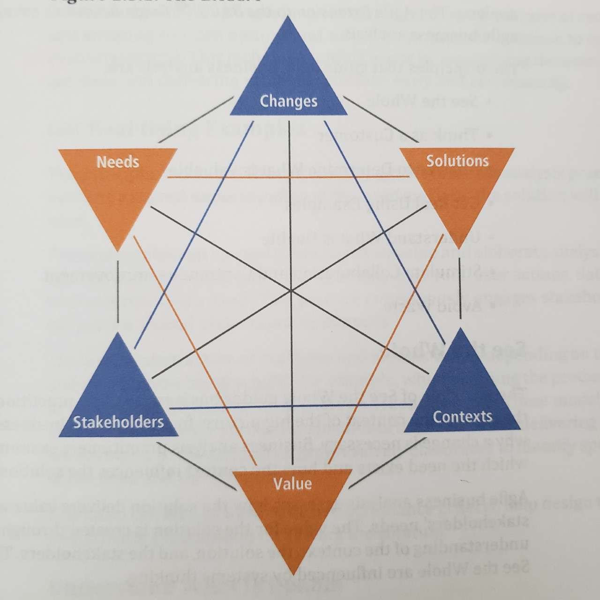
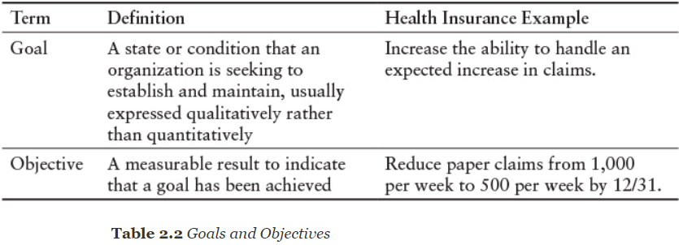

# Midterm

- [Midterm](#midterm)
  - [Question 1 (15 pts)](#question-1-15-pts)
    - [(a) What are the guiding principles of agile? Define them](#a-what-are-the-guiding-principles-of-agile-define-them)
    - [(b) Please give a real-life example of each principle](#b-please-give-a-real-life-example-of-each-principle)
    - [(c) Describe any one favorite agile principle from the perspective of the risk from bad assumptions and what can happen if the assumptions are incorrect and how agile methods can help avoid these pitfalls](#c-describe-any-one-favorite-agile-principle-from-the-perspective-of-the-risk-from-bad-assumptions-and-what-can-happen-if-the-assumptions-are-incorrect-and-how-agile-methods-can-help-avoid-these-pitfalls)
  - [Question 2 (15 pts)](#question-2-15-pts)
    - [(a) Please define and explain the Business Analysis Core Concepts (BACCM) Model](#a-please-define-and-explain-the-business-analysis-core-concepts-baccm-model)
    - [(b) Provide a real-life example for each concept](#b-provide-a-real-life-example-for-each-concept)
    - [(c) Give real-life examples of interactions within two pairs of concepts and describe the scenario. Example of one pair is: interaction between Needs and Context. (see picture below)](#c-give-real-life-examples-of-interactions-within-two-pairs-of-concepts-and-describe-the-scenario-example-of-one-pair-is-interaction-between-needs-and-context-see-picture-below)
  - [Question 3 (15 pts)](#question-3-15-pts)
    - [(a) What is a user story? Please do not just give a definition but explain it as if you are teaching a software engineer what it is](#a-what-is-a-user-story-please-do-not-just-give-a-definition-but-explain-it-as-if-you-are-teaching-a-software-engineer-what-it-is)
    - [(b) Describe the user story from two INVEST principles and two MOSCOW principles](#b-describe-the-user-story-from-two-invest-principles-and-two-moscow-principles)
      - [Make Profile](#make-profile)
        - [Make Profile: MoSCoW](#make-profile-moscow)
          - [Make Profile: INVEST](#make-profile-invest)
      - [Search](#search)
        - [Search: MoSCoW](#search-moscow)
        - [Search: INVEST](#search-invest)
    - [(c) Explain how or why the two INVEST and two MOSCOW principles can help achieve realistic goals and objectives](#c-explain-how-or-why-the-two-invest-and-two-moscow-principles-can-help-achieve-realistic-goals-and-objectives)
  - [Question 4 (15 pts)](#question-4-15-pts)
    - [(a) What are the three ideas that are useful in effective analysis of IT projects. Why is each idea important? Provide a real-life example for each idea](#a-what-are-the-three-ideas-that-are-useful-in-effective-analysis-of-it-projects-why-is-each-idea-important-provide-a-real-life-example-for-each-idea)
    - [(b) Why is a feedback loop cycle between Needs and Solutions necessary and useful?](#b-why-is-a-feedback-loop-cycle-between-needs-and-solutions-necessary-and-useful)
    - [(c) Describe the interaction between Discovery and Delivery in your own words with two examples](#c-describe-the-interaction-between-discovery-and-delivery-in-your-own-words-with-two-examples)
  - [Question 5 (15 pts)](#question-5-15-pts)
  - [Question 6 (2 pts) “Increase the ability to handle an expected increase in claims” is an example of a goal?](#question-6-2-pts-increase-the-ability-to-handle-an-expected-increase-in-claims-is-an-example-of-a-goal)
  - [Question 7 (2 pts) All objectives are important](#question-7-2-pts-all-objectives-are-important)
  - [Question 8 (2 bonus points) Jira is a tool where you can create, estimate, track and manage user stories](#question-8-2-bonus-points-jira-is-a-tool-where-you-can-create-estimate-track-and-manage-user-stories)
  - [Question 9 (2 pts) Which is an example of outcome?](#question-9-2-pts-which-is-an-example-of-outcome)
  - [Question 10 (2 pts) What is a user story?](#question-10-2-pts-what-is-a-user-story)
  - [Question 11 (2 pts) An example trigger for Reflect and Adapt is](#question-11-2-pts-an-example-trigger-for-reflect-and-adapt-is)
  - [Question 12 (5 pts) What is the difference between `user stories`, `epics`, and `themes`?](#question-12-5-pts-what-is-the-difference-between-user-stories-epics-and-themes)
  - [Question 13 (5 pts) Give two examples of maximizing outcome with minimal output](#question-13-5-pts-give-two-examples-of-maximizing-outcome-with-minimal-output)
  - [Question 14 (5 pts) Make an example of a user story map for your class project with two categories and two releases](#question-14-5-pts-make-an-example-of-a-user-story-map-for-your-class-project-with-two-categories-and-two-releases)
  - [Question 15 (5 bonus points) Explain the process and conditions for "Simplify" Guiding Principle with two good examples](#question-15-5-bonus-points-explain-the-process-and-conditions-for-simplify-guiding-principle-with-two-good-examples)
    - [Define](#define)
    - [Example](#example)
      - [A text messaging app](#a-text-messaging-app)
      - [restaurant App](#restaurant-app)
  - [Question 16 (0 pts)](#question-16-0-pts)

## Question 1 (15 pts)

### (a) What are the guiding principles of agile? Define them

- **Deliver value:** That you or the team outputs satisfies the respective stakeholder's
  needs while making reasonable and proper decisions and measuring success in the project/product
  life cycle; all the while, paying attention to the triple constraints of cost, time, and scope.

- **Collaborate:** Has two aspects - one the ability of the team members to work
  together as effectively as possible and two team members who are actually doing the
  core work of the project are the ones doing the planning and status reporting.
  As an illustration, the first aspect means that barriers prohibiting effective communication,
  for example jargon, are removed from the team environment and there are team members
  who can effectively facilitate the group interactions, and the second aspect team members
  should volunteer to work on various items, as opposed to getting assignments from someone else.

- **Iterate:** An iterative approach is getting some actionable feedback on the output of the iteration so that you know if you are on the right course toward the desired outcome.

- **Simplify:** To `simplify` is to maximize the amount of work not done; to emphasize, you want to deliver the minimum output that will maximize outcome and do it using only processes that are absolutely necessary.

- **Consider context:** This articulates a team's situational awareness; in general, teams need to consider context when choosing which processes, practices, and techniques they use so they can be sure they are doing the things that will make them successful and are not doing the things that don’t need to be done.

- **Decide wisely:** is to depend on well-informed, timely decisions.

- **Reflect and adapt:** is to argue that your team should continuously learn from its experiences to improve your approach and the outcome of the project.

### (b) Please give a real-life example of each principle

- **Deliver value:** Doing our project for CSC 170 Software We keep in mind our team's
  situation in terms of resource management, time constrictions, abilities, time of each member,
  and current status of our project assignment in CSC 170 Software Requirement and Specification and Specification

- **Collaborate:** Working with our group members for project in CSC 170 Software Requirement and Specification

- **Iterate:** Having a group meeting, sharing ideas, building on or changing
  course on a decision for project in CSC 170 Software We keep in mind our team's
  situation in terms of resource management, time constrictions, abilities, time of
  each member, and current status of our project assignment in CSC 170 Software Requirement and Specification and Specification

- **Simplify:** Planning out, think critically, and agreeing on what is our project's
  minimum viable product. Seeing what are the most minimal amount of features and
  complexity for us to have a simple working product.

- **Consider context:** We keep in mind our team's situation in terms of resource
  management, time constrictions, abilities, time of each member, and current status
  of our project assignment in CSC 170 Software Requirement and Specification

- **Decide wisely:** Due to time restraints we as a team need to make quick
  decisions on which members will be assigned which part of an assignment,
  when we need to have it done by, and who will submit the assignment.

- **Reflect and adapt:** Based on everyone's input and output we reflect on the
  outcomes and course correct (adapt) to the outcomes we desire.

### (c) Describe any one favorite agile principle from the perspective of the risk from bad assumptions and what can happen if the assumptions are incorrect and how agile methods can help avoid these pitfalls

**Simplify:** the product was too simple, basic, and other product the same if not
better than what we offered. To avoid this pitfall we must `deliver value` to our customers.
The complaint was that our product "is too simple" and that "other products"
can do the same if not better; so, by leveraging our resources better (technology, staff, time)
we can produce a better product and iterate on features that makes our product unique.

## Question 2 (15 pts)

### (a) Please define and explain the Business Analysis Core Concepts (BACCM) Model

The `Business Analysis Core Concept Model` (BACCM) defines six core concepts one
a `change` the act of transformation in response to a need; two the `need` is a problem
or opportunity to be addressed; three a `solution`- a specific way of satisfying one
or more needs in a context; four the `stakeholder` is a group or individual with
a relationship to the change, the need, or the solution; five `value` is the worth,
importance, or usefulness of something to a stakeholder within a context; and six the
`context` is the circumstances that influences, are influenced by, and provide
understanding of the change.

### (b) Provide a real-life example for each concept

Using DoorDash as the real-life example

1. **Change:** The food industry doesn't have the staffing or resources to provide
food delivery for prospective customers.

2. **Need:** The infrastructure to handle order request, payment, and have people
to provide door-to-door food delivery service.

3. **Solution:** Build out a platform where any participating restaurants can have
customers at their leisure, order food, pay, and have a independent contractor deliver
the food from the restraint to the customer's location.

4. **Stakeholder:** Are the restaurants, customer, delivery contractors, and DoorDash.

5. **Value:** Having this solution/service restaurants are able to offer food delivery without much infrastructure overhead and need to excessively over staffing for potential fluctuating and irregular delivery request.

6. **Context:** Not all restaurants can offer food delivery and now they can with the built platform.

### (c) Give real-life examples of interactions within two pairs of concepts and describe the scenario. Example of one pair is: interaction between Needs and Context. (see picture below)



Using Covid-19 as the context in relation to the need of video conferencing  software

Context: A world wide pandemic has restricted both large group and multiple single point interaction.
Need: Enable individuals to safely communicate and hold meetings from the safety of their homes.

## Question 3 (15 pts)

### (a) What is a user story? Please do not just give a definition but explain it as if you are teaching a software engineer what it is

A `user story`, or simply "story," are short requirements or requests written from the perspective of an end user.

For example, a computer component manufacturing company has two divisions CPU and
SSD storage division. Of those two divisions, the CPU and SSD storage division,
will have their own `themes` to a body of `epics` that are handed by a group in
those divisions and a particular user stories are carried out and worked on via
a team in the group or a member of a particular team.

### (b) Describe the user story from two INVEST principles and two MOSCOW principles

User story, in context to a social media site, the user needs to have an ability
to make a profile and the ability to search people.

#### Make Profile

##### Make Profile: MoSCoW

(Must Have, Should Have, Could Have, Won't Have this time)

- **Must have:** The ability to create a profile to allow users to represent themselves
  and have their own criteria,so they can be matched with other desired homeowners/renters.
  Otherwise, there is no way for users to match based on the information in their profiles
  like location type and price range.
- **Should have:** When a user is making a profile they _should have_ a way to enter in their information.
- **Could have:** A way to verify if users are real with a photo id
- **Wouldn’t have:** The profile cannot have any irrelevant information in it.

###### Make Profile: INVEST

(Independent, Negotiable, Value, Estimable, Small, Testable)

- **Independent:** User enters data into relevant sections in the appropriate
  field and making the profile does not depend on any other process.
- **Negotiable:** users must be able to capture the essential details about
  themselves like their price range, location,and type.
- **Value:** Shows the user’s availability and needs to other users
- **Estimable:** Can be estimated in the number of hours it takes to build the
  profile in html, css, and js.
- **Small:** Building the profile is a small task that consists of displaying the
  user information and a button for submitting the user’s information.
- **Testable:** To test this we would submit sample user information into the
  appropriate fields, click the submit button, and see if the sample user information we created displays.

#### Search

##### Search: MoSCoW

(Must Have, Should Have, Could Have, Won't Have this time)

- **Must have:** Search is necessary because users need to quickly network with
  other users who meet their search criteria. Otherwise matching homeowners and
  renters could not find each other.
- **Should have:** The search results should show the closest matches to the
  search criteria first, with less close matches following in descending order.
- **Could have:** It would be nice to be able to optimize searches with pre defined
  user tags such as location, price range, etc.
- **Wouldn’t have:** No results should be shown that are not relevant to the search criteria.

##### Search: INVEST

(Independent, Negotiable, Value, Estimable, Small, Testable)

- **Independent:** Users enter their search criteria and results depend on user type (homeowner or renter)
- **Negotiable:** Users specify the search parameters and get desired results
- **Value:** Makes it easier for users to find each other by filtering in only the users that meet the search criteria
- **Estimable:** We as developers know how long it takes to make a dropdown menu for the search bar and the time it takes to develop a search algorithm like Binary Search.
- **Small:** Drop down menu for search bar and binary search
- **Testable:** This can be tested by checking if users’ can see other users’ profiles that match their search criteria.

### (c) Explain how or why the two INVEST and two MOSCOW principles can help achieve realistic goals and objectives

## Question 4 (15 pts)

### (a) What are the three ideas that are useful in effective analysis of IT projects. Why is each idea important? Provide a real-life example for each idea

1.  **Customer development:** is helpful when we don’t know the problem.
    When the problem isn't know it's important that we develop a framework to discover:

    1. `Validate` that we have identified the market for our product
    2. `Build` the right product features that actually solve the customer's needs
    3. `Tested` the correct methods for acquiring and converting customers
    4. `Deployed` the right resources to scale business

    ```text
    For example: The advertising agency Goodby Silverstein & Partners for the
    California Milk Processor Board in 1993.

    The dairy industry tried for 20 years to convince their customers that milk
    was good for you and sales were falling (Validate); and then, they built a
    marketing campaign about the lack of the product "Got Milk?" (build) which were
    tested in probably in some board rooms and selected users (tested).
    After testing were done they then made the decicion to fully launch (deploy) with the marketing campaign.
    ```

2.  **Build-Measure-Learn:** The Build-Measure-Learn Loop is important for:

    1. `Build` step makes you pick a specific solution to deliver (the output)
    2. `Measure` step defines the output of the product
    3. `Learn` step examine the data and decide if the change you delivered made
       the impact you wanted. If not, try something else and start the whole cycle
       all over using your remaining options

    ```text
    This is important; for, it is a loop that allows for continual iterative development.

     In a quick example this is used in game development from the first iteration
     of a game to the next installment. First a team develops the story and game
     play (build), then have people play test the game to obtain levels of engagement
     and enjoyment (measure), and finally examine the collected data to decide if their
     original ideas are inline with the desired impact else they have to course correct
     and start the cycle over again using the remaining time, skill and resources available
    ```

3.  **Metrics:** Enables one to gauge success. Having the right kind of metrics
    help you indicate whether he or she is achieving the desired outcome(s).
    Characteristics of Good Metrics are:

        Example: Measuring comparative application launch speeds with two SSD storage devices

        1. `Comparative`
            1. It's comparative in the number of IOPS both drives are able to handle
        2. `Understandable`
            1. It's understandable that a faster drive can launch an application sooner
        3. Is a `ratio` or `rate`
            1. The rate of IOPS a drive is able to handle may help articulate why that
            drive can open an application faster
        4. Highlights `change behavior`
            1. User's who have a faster storage, able to launch an application faster
            than others, can measure their satisfaction

### (b) Why is a feedback loop cycle between Needs and Solutions necessary and useful?

A constant and continuous feedback loop cycle between `Needs` and `Solutions` is
necessary and useful because as the user's needs change so does the solution in context.

### (c) Describe the interaction between Discovery and Delivery in your own words with two examples

- **Discovery:** work that explores, evaluates, and confirms product options for
  potential delivery
- **Delivery:** work that transforms one or more allocated candidate solutions
  into a releasable portion or version of the product

1. Customer receives two new computer arrive, everything is installed properly;
   however, computer-A doesn't perform as well as computer-A. Customer support request
   the user to turn off and turn back on the computer, make sure the plug is fully seated,
   and all vent's are clear of debris.  Customer support request that the user send
   system specification log and later found that computer-A has an outdated driver,
   so they provided (delivered) the customer the latest driver for them to install.

2. An analysis notices a trend in sales that customers in a store in a college town
   sell higher volumes during the summer, but drops during the spring and fall.
   They concluded it is a result of summer break versus the time spent during normal
   spring and fall semesters, so they leveraged this discovery by providing that store
   more SKU and frequent inventory shipments during the summer months and limit the
   number of items and inventory shipments during both the spring and fall semesters.

## Question 5 (15 pts)

In a modernization project bank CBA decides to allow for electronic signatures
on documents submitted for home loan approvals. Hence bank CBA initiates a project
to analyze, design and succeed in delivering a high quality, high value product
for its customers. You are the manager of CBA and wish to bring new changes in
the organization. You also just graduated with a modern agile Business Analyst Certification.

Fill the table with goals and objectives. For the objectives you may use some
attributes such as number of documents. Include these attributes in the Attribute column.
Make sure to use numerical data in your objectives.

- **Type of Attributes used in Objective:** Type of metric
- **Project Goal:** State or condition to establish and maintain
- **Project Objective:** A measurable result to indiacate that the goal has been achived

| Type of Attributes used in Objective | Project Goal                                      | Project Objective                                          |
| :----------------------------------- | :------------------------------------------------ | :--------------------------------------------------------- |
| 1. Duration of time                  | Quickly submit home loans                         | Reduce time elapsed to submit home loans                   |
| 2. Duration of time                  | Quickly review home loan for approval or rejected | Reduce wait time for home loan review                      |
| 3. Efficiency                        | Reduce cost                                       | Ratio of home loan agents to number of home loans reviewed |

## Question 6 (2 pts) “Increase the ability to handle an expected increase in claims” is an example of a goal?

> - [x] True
>
> > 

- [ ] False

## Question 7 (2 pts) All objectives are important

- [ ] True

> - [x] False

## Question 8 (2 bonus points) Jira is a tool where you can create, estimate, track and manage user stories

> - [x] True

- [ ] False

## Question 9 (2 pts) Which is an example of outcome?

- [ ] All of the choices
- [ ] Five new Features were added.

> - [x] Win additional new Customers

- [ ] Ten Receipts are printed in 20 seconds.

## Question 10 (2 pts) What is a user story?

- [ ] User’s need
- [ ] Client’s need
- [ ] Both A and B

> - [x] All of the above

## Question 11 (2 pts) An example trigger for Reflect and Adapt is

> - [x] all of the choices

- [ ] more customers want sports cars than family cars
- [ ] the manager requested to submit leave form.
- [ ] the home is out of stock on sugar.

## Question 12 (5 pts) What is the difference between `user stories`, `epics`, and `themes`?

The difference between `user stories`, `epics`, and `themes` is that `user stories`,
or simply "stories," are short requirements or requests written from the perspective of an end user,
`epics` are large bodies of work that can be broken down into a number of smaller tasks,
and `themes` are large focus areas that span the organization.

## Question 13 (5 pts) Give two examples of maximizing outcome with minimal output

An example would be simply by providing the minimum viable product (MVP); for example,
a text messaging app that simply have the app send raw, unformatted, Ascii characters
and a restaurant app where a static website that features the restaurant's hours,
menu, prices, location, and the restaurant's phone number.

## Question 14 (5 pts) Make an example of a user story map for your class project with two categories and two releases

| Locate Roommate Candidates                           | User Profile Info                |               |
| ---------------------------------------------------- | -------------------------------- | ------------- |
| A list of roommate candidates in area                | Ability to enter basic user info | **Release 1** |
| Map functionality to show available apartments/homes | Add profile picture              | **Release 2** |

## Question 15 (5 bonus points) Explain the process and conditions for "Simplify" Guiding Principle with two good examples

### Define

The process and conditions for "Simplify" Guiding Principle is to start with a
barely sufficient approach, the absolutely essential abilities/features to the product/service,
and with a small set of activates focuses allows oneself or one's team to maintain a streamlined process.

### Example

#### A text messaging app

**The essential ability/feature:** Simply have the app send raw, unformatted, Ascii characters.

This most straight forward approach ignores "complex" features like end-to-end encryption,
formatted text, support for emojis, and sending attachments. Simply having the means of
sending simple Ascii characters archives the minimum viable product goals and provides the
fundamental foundation to what a text messaging app needs.

#### restaurant App

**The essential ability/feature:** A static website that features the restaurant's
hours, menu, prices, location, and contact information.

This ignores the arguably "non-essential" features that lengthens product development,
increased resource allocation, and skill acquisition.  Although it is more leg work for
the end user the minimum viable product still serves it's purpose and function.

## Question 16 (0 pts)

You may upload a single document with answers to all the 15 point and 5 point essay style questions.
Please number your questions and include the question in your document.

[Midterm PDF document](20210524_matthew_midterm.pdf)
