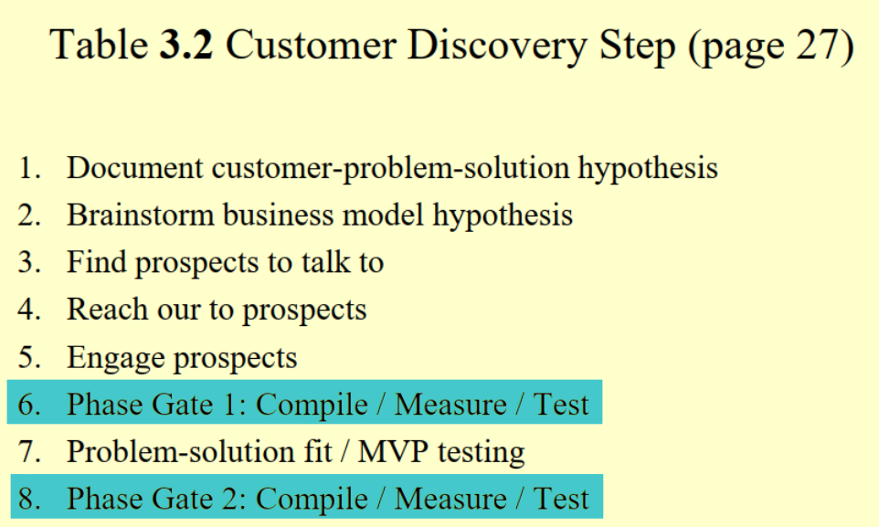
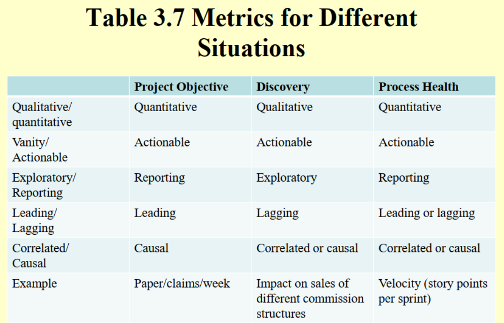

# Quiz 3 on Influence of Lean Startup

|                                                           |                     |                  |
| --------------------------------------------------------- | ------------------- | ---------------- |
| **Due** Jun 21 at 11:59pm                                 | **Points** 25       | **Questions** 18 |
| **Available** Jun 7 at 12am - Jun 23 at 11:59pm _17 days_ | **Time Limit** None |                  |

- [Quiz 3 on Influence of Lean Startup](#quiz-3-on-influence-of-lean-startup)
  - [Question 1 (1 pt): Company Creation for IT Projects is verifying if the customer base is scalable to satisfy all of the stakeholder need](#question-1-1-pt-company-creation-for-it-projects-is-verifying-if-the-customer-base-is-scalable-to-satisfy-all-of-the-stakeholder-need)
  - [Question 2 (1 pt): To assess the Process Health an Exploratory Metric is used in general](#question-2-1-pt-to-assess-the-process-health-an-exploratory-metric-is-used-in-general)
  - [Question 3 (1 pt): Customer Validation for IT Projects is about understanding whether any of the proposed solutions are worthwhile](#question-3-1-pt-customer-validation-for-it-projects-is-about-understanding-whether-any-of-the-proposed-solutions-are-worthwhile)
  - [Question 4 (1 pt): In the Build-Measure-Learn six step cycle, the `Build` step is about building at least more than one solution so that the customer can provide quick feedback on](#question-4-1-pt-in-the-build-measure-learn-six-step-cycle-the-build-step-is-about-building-at-least-more-than-one-solution-so-that-the-customer-can-provide-quick-feedback-on)
  - [Question 5 (1 pt): In Customer Discovery for IT Projects, the step "Start Delivering" is about delivering a user friendly feature](#question-5-1-pt-in-customer-discovery-for-it-projects-the-step-start-delivering-is-about-delivering-a-user-friendly-feature)
  - [Question 6 (5 pts): Match the following](#question-6-5-pts-match-the-following)
    - [6.1 Metric (1 pt)](#61-metric-1-pt)
    - [6.2 Compile/Measure/Test (1 pt)](#62-compilemeasuretest-1-pt)
    - [6.3 Learn Step (1 pt)](#63-learn-step-1-pt)
    - [6.4 Vanity Metric (1 pt)](#64-vanity-metric-1-pt)
    - [6.5 Project Objective (1 pt)](#65-project-objective-1-pt)
  - [Question 7 (1 pt): These two metric types are often mistaken one for the other: [BLANK] and [BLANK]](#question-7-1-pt-these-two-metric-types-are-often-mistaken-one-for-the-other-blank-and-blank)
  - [Question 8 (1 pt): Customer Development is useful when we don't know the [BLANK]](#question-8-1-pt-customer-development-is-useful-when-we-dont-know-the-blank)
  - [Question 9 (1 pt): Agile Development is useful when we do not know the [BLANK]](#question-9-1-pt-agile-development-is-useful-when-we-do-not-know-the-blank)
  - [Question 10 (1 pt): The step "Identifying Assumptions" for IT projects, implies asking the question: "What must be true for this solution to be [BLANK]?"](#question-10-1-pt-the-step-identifying-assumptions-for-it-projects-implies-asking-the-question-what-must-be-true-for-this-solution-to-be-blank)
  - [Question 11 (1 pt): What are the six steps in the Build-Measure-Learn cycle?](#question-11-1-pt-what-are-the-six-steps-in-the-build-measure-learn-cycle)
  - [Question 12 (1 pt): Name the four steps to Customer Development](#question-12-1-pt-name-the-four-steps-to-customer-development)
  - [Question 13 (1 pt): Explain in simple words the difference between the `Causal` and `Correlated` metric types](#question-13-1-pt-explain-in-simple-words-the-difference-between-the-causal-and-correlated-metric-types)
  - [Question 14 (1 pt): Name the three main ideas useful in effective analysis of IT Projects](#question-14-1-pt-name-the-three-main-ideas-useful-in-effective-analysis-of-it-projects)
  - [Question 15 (1 pt): Name the three parts of the Idea step in the Build-Measure-Learn six step cycle](#question-15-1-pt-name-the-three-parts-of-the-idea-step-in-the-build-measure-learn-six-step-cycle)
  - [Question 16 (2 pts): What are the essential differences in `customer discovery` for lean startups and IT Projects?](#question-16-2-pts-what-are-the-essential-differences-in-customer-discovery-for-lean-startups-and-it-projects)
  - [Question 17 (2 pts): In the Build-Measure-Learn six step cycle, for the step "Measure", explain what does "see its impact on the outcome free from any other influences" mean in your own words. (it is okay if you come up with your own ideas)](#question-17-2-pts-in-the-build-measure-learn-six-step-cycle-for-the-step-measure-explain-what-does-see-its-impact-on-the-outcome-free-from-any-other-influences-mean-in-your-own-words-it-is-okay-if-you-come-up-with-your-own-ideas)
  - [Question 18 (2 pts): Explain the difference between `Leading metric` and `Lagging metric` and which one is used for Project Objective, Discovery and Process Health and why](#question-18-2-pts-explain-the-difference-between-leading-metric-and-lagging-metric-and-which-one-is-used-for-project-objective-discovery-and-process-health-and-why)

## Question 1 (1 pt): Company Creation for IT Projects is verifying if the customer base is scalable to satisfy all of the stakeholder need

- [ ] True
- [ ] False

> - [x] False

## Question 2 (1 pt): To assess the Process Health an Exploratory Metric is used in general

- [ ] True
- [ ] False

> - [x] False

## Question 3 (1 pt): Customer Validation for IT Projects is about understanding whether any of the proposed solutions are worthwhile

- [ ] True
- [ ] False

> - [x] True

## Question 4 (1 pt): In the Build-Measure-Learn six step cycle, the `Build` step is about building at least more than one solution so that the customer can provide quick feedback on

- [ ] True
- [ ] False

> - [x] False

## Question 5 (1 pt): In Customer Discovery for IT Projects, the step "Start Delivering" is about delivering a user friendly feature

- [ ] True
- [ ] False

> - [x] False

## Question 6 (5 pts): Match the following

### 6.1 Metric (1 pt)

- [ ] Phase Gate I and II
- [ ] Never use
- [ ] Perhaps try alternate paths
- [ ] Indicates you are achieving the desired outcome
- [ ] Leading Metric

> - [x] Indicates you are achieving the desired outcome
>
> > Use metrics to help you determine whether you are on the path to delivering your desired outcome

### 6.2 Compile/Measure/Test (1 pt)

- [ ] Phase Gate I and II
- [ ] Never use
- [ ] Perhaps try alternate paths
- [ ] Indicates you are achieving the desired outcome
- [ ] Leading Metric

> - [x] Phase Gate I and II
>
> > 

### 6.3 Learn Step (1 pt)

- [ ] Phase Gate I and II
- [ ] Never use
- [ ] Perhaps try alternate paths
- [ ] Indicates you are achieving the desired outcome
- [ ] Leading Metric

> - [x] Perhaps try alternate paths
>
> > Examine the data and decide if the change you delivered made the
> > impact you wanted. If not, try something else… and start the whole
> > cycle all over using your remaining options.

### 6.4 Vanity Metric (1 pt)

- [ ] Phase Gate I and II
- [ ] Never use
- [ ] Perhaps try alternate paths
- [ ] Indicates you are achieving the desired outcome
- [ ] Leading Metric

> - [x] Never use
>
> > Vanity metrics “make you feel good” … not useful

### 6.5 Project Objective (1 pt)

- [ ] Phase Gate I and II
- [ ] Never use
- [ ] Perhaps try alternate paths
- [ ] Indicates you are achieving the desired outcome
- [ ] Leading Metric

> - [x] Leading Metric
>
> > 

## Question 7 (1 pt): These two metric types are often mistaken one for the other: [BLANK] and [BLANK]

> `Qualitative` and `Quantitative`
>
> These two metric types are often mistaken one for the other: `Qualitative` and `Quantitative`

## Question 8 (1 pt): Customer Development is useful when we don't know the [BLANK]

> `problem`
>
> Customer Development is useful when we don't know the `problem`

## Question 9 (1 pt): Agile Development is useful when we do not know the [BLANK]

> `solution`
>
> Agile Development is useful when we do not know the `solution`

## Question 10 (1 pt): The step "Identifying Assumptions" for IT projects, implies asking the question: "What must be true for this solution to be [BLANK]?"

> `effective`
>
> The step "Identifying Assumptions" for IT projects, implies asking the question: "What must be true for this solution to be `effective`?".

## Question 11 (1 pt): What are the six steps in the Build-Measure-Learn cycle?

> Customer Discovery Applied to IT Projects
>
> 1. Identify the need
> 2. Hypothesize potential solutions
> 3. Identify assumptions
> 4. Validate assumptions
> 5. Start delivering
> 6. Constantly reevaluate your solution

## Question 12 (1 pt): Name the four steps to Customer Development

> 1. Customer Discovery
> 2. Customer Validation
> 3. Company creation
> 4. Company building

## Question 13 (1 pt): Explain in simple words the difference between the `Causal` and `Correlated` metric types

> An easy way to remember the difference between `Causal` and `Correlated` metric types is that
> when "Metric-A" has a change, like the name implies, causes "Metric-B" to change as well and
> so it is a `Causal` metric type; in contrast, `Correlated` metric types are more "fluid" in that
> if a change happens in "Metric-Z" a change in "Metric-Y" happens too in lock step with "Matric-Z"

## Question 14 (1 pt): Name the three main ideas useful in effective analysis of IT Projects

> 1. Customer development
> 2. Build-Measure-Learn
> 3. Metrics

## Question 15 (1 pt): Name the three parts of the Idea step in the Build-Measure-Learn six step cycle

> 1. Stakeholder need
> 2. A desired outcome is based on a bunch of assumptions that you should validate
> 3. A need to identify some form of metric based on your overall goal that you can use later on as a measuring stick to tell whether you are successful

## Question 16 (2 pts): What are the essential differences in `customer discovery` for lean startups and IT Projects?

> The difference lies in understanding the stakeholders and their needs

## Question 17 (2 pts): In the Build-Measure-Learn six step cycle, for the step "Measure", explain what does "see its impact on the outcome free from any other influences" mean in your own words. (it is okay if you come up with your own ideas)

> It is to emulate a casual and effect in your mind where the situation and environment is a reflection of your actions with reasonable responses and reactions, and not having to quickly respond to unexpected and unpredictable externalities.

## Question 18 (2 pts): Explain the difference between `Leading metric` and `Lagging metric` and which one is used for Project Objective, Discovery and Process Health and why

> Leading metrics are predictor indicators that help in identifying how likely you are to reach a
> desired outcome; in contrast, Lagging metrics describe what happened in the past.
>
> - **Project Objective**: `Leading` is used because they establish the _project objectives_ with the given resources and capabilities it is a good measure to see if the desired outcome is reachable
> - **Discovery**: `Lagging` is used here, for as progress is made, thorough hindsight, we become more informed of more situations, cause and effects, outcomes of previous endeavors.
> - **Process Health**: `Leading` or `lagging` is used for we can use the lagging metrics to help inform and feed into the leading metrics; this is to say, we use the past experiences to guide future decisions.
>
> > 
