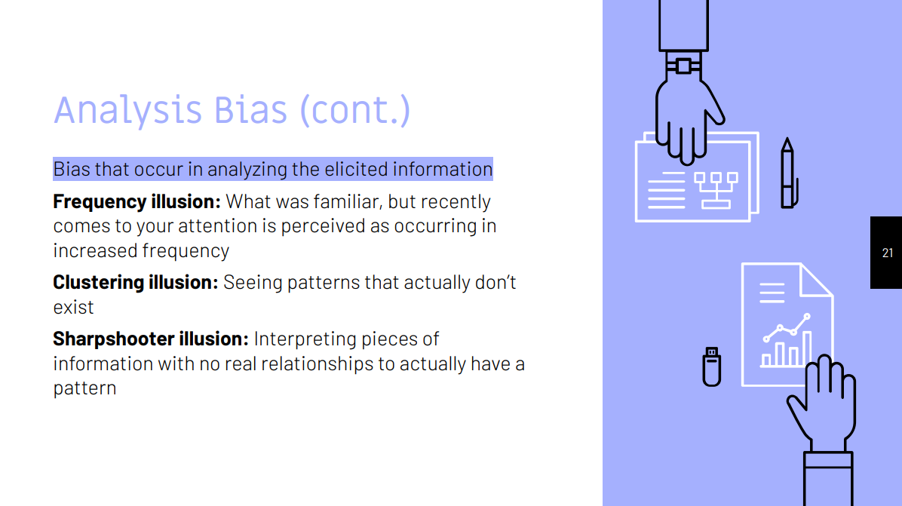

# Quiz 4 on Decision Making

|                                                           |                     |                  |
| --------------------------------------------------------- | ------------------- | ---------------- |
| **Due** Jun 28 at 11:59pm                                 | **Points** 50       | **Questions** 21 |
| **Available** Jun 7 at 12am - Jun 30 at 11:59pm _24 days_ | **Time Limit** None |                  |

- [Quiz 4 on Decision Making](#quiz-4-on-decision-making)
  - [Question 1 (5 pts): List all parts of the decision-making structure](#question-1-5-pts-list-all-parts-of-the-decision-making-structure)
  - [Question 2 (5 pts): Describe responsibilities of the product owner in the context of decision making (where organization "determines the decision maker" and also as part of "selecting a decision mechanism"). Refer to Text book for details](#question-2-5-pts-describe-responsibilities-of-the-product-owner-in-the-context-of-decision-making-where-organization-determines-the-decision-maker-and-also-as-part-of-selecting-a-decision-mechanism-refer-to-text-book-for-details)
  - [Question 3 (5 pts): Name all the decision-making mechanisms](#question-3-5-pts-name-all-the-decision-making-mechanisms)
  - [Question 4 (5 pts): What are the different types of biases affecting stakeholders?](#question-4-5-pts-what-are-the-different-types-of-biases-affecting-stakeholders)
  - [Question 5 (5 pts): What are the different types of biases affecting analysis?](#question-5-5-pts-what-are-the-different-types-of-biases-affecting-analysis)
  - [Question 6 (1 pts): There is a fine (blank) point between gathering enough information and spending too much time trying to gather information](#question-6-1-pts-there-is-a-fine-blank-point-between-gathering-enough-information-and-spending-too-much-time-trying-to-gather-information)
  - [Question 7 (1 pts): (blank) typically focus on the stakeholders paying for the solution and not the actual users](#question-7-1-pts-blank-typically-focus-on-the-stakeholders-paying-for-the-solution-and-not-the-actual-users)
  - [Question 8 (1 pts): Experts in (blank) pay attention to those that will actually use the solution](#question-8-1-pts-experts-in-blank-pay-attention-to-those-that-will-actually-use-the-solution)
  - [Question 9 (1 pts): (blank) are patterns of deviation in judgment that occur in particular situations](#question-9-1-pts-blank-are-patterns-of-deviation-in-judgment-that-occur-in-particular-situations)
  - [Question 10 (1 pts): (blank) who is going to make the decision impacts the mechanism used to make the decision](#question-10-1-pts-blank-who-is-going-to-make-the-decision-impacts-the-mechanism-used-to-make-the-decision)
  - [Question 11 (5 pts): Match the following keywords with its meaning](#question-11-5-pts-match-the-following-keywords-with-its-meaning)
    - [Anchoring effect](#anchoring-effect)
    - [Survivorship bias](#survivorship-bias)
    - [Availability heuristic](#availability-heuristic)
    - [Observation selection bias](#observation-selection-bias)
  - [Question 12 (1 pts): Which is part of analysis bias?](#question-12-1-pts-which-is-part-of-analysis-bias)
  - [Question 13 (1 pts): What is the framing affect?](#question-13-1-pts-what-is-the-framing-affect)
  - [Question 14 (1 pts): What is response bias?](#question-14-1-pts-what-is-response-bias)
  - [Question 15 (1 pts): What is an example of an arbitrary decision?](#question-15-1-pts-what-is-an-example-of-an-arbitrary-decision)
  - [Question 16 (1 pts): A decision leader cannot delegate decisions to someone else as a decider](#question-16-1-pts-a-decision-leader-cannot-delegate-decisions-to-someone-else-as-a-decider)
  - [Question 17 (1 pts): Deciding too quickly may mean overlooking critical information needed to make the best decision](#question-17-1-pts-deciding-too-quickly-may-mean-overlooking-critical-information-needed-to-make-the-best-decision)
  - [Question 18 (1 pts): Confirmation bias is the tendency to search for, interpret, and remember information that confirms your own preconceptions](#question-18-1-pts-confirmation-bias-is-the-tendency-to-search-for-interpret-and-remember-information-that-confirms-your-own-preconceptions)
  - [Question 19 (1 pts): Observer-expectancy effect is when the analyst is not expecting a certain result, subconsciously manipulates or misinterprets data in order to validate that “certain result”](#question-19-1-pts-observer-expectancy-effect-is-when-the-analyst-is-not-expecting-a-certain-result-subconsciously-manipulates-or-misinterprets-data-in-order-to-validate-that-certain-result)
  - [Question 20 (1 pts): Framing effect is where you draw different conclusions from the same information depending on how it is presented](#question-20-1-pts-framing-effect-is-where-you-draw-different-conclusions-from-the-same-information-depending-on-how-it-is-presented)
  - [Question 21 (6 pts): Select the clearly best matches](#question-21-6-pts-select-the-clearly-best-matches)

## Question 1 (5 pts): List all parts of the decision-making structure

> 1. Determine the decision maker
> 2. Select a decision mechanism
> 3. Make a timely decision
> 4. Build support with peers/stakeholders
> 5. Communicate the decision
> 6. Enact the decision
>
> > 

## Question 2 (5 pts): Describe responsibilities of the product owner in the context of decision making (where organization "determines the decision maker" and also as part of "selecting a decision mechanism"). Refer to Text book for details

## Question 3 (5 pts): Name all the decision-making mechanisms

Decision Mechanism Decide How to Decide

> - `Spontaneous agreement`: Rare... can be a sign of GroupThink
> - `Delegation`: Primary decision maker identifies someone to decide
> - `Majority vote`: Downside is that losers and winners are identified
> - `Decider decides with discussion`: This is the Product Owner approach
> - `Arbitrary`: Can be a coin flip, not usually the best approach
> - `Decider decides without discussion`: This is a Dictator Model approach
> - `Negotiation`: Team attempts to find solution everyone agrees with
> - `Consensus`: This is a collaborative approach
>
> > 

## Question 4 (5 pts): What are the different types of biases affecting stakeholders?

Elicitation (collecting information) - Biases affecting Stakeholders

> - `Response Bias`: answering a question based on what the stakeholder thinks the analyst wants
> - `Groupthink`: stakeholders all convey the same information whether or not they believe it
> - `Bandwagon Effect`: go along to get along
> - `Curse of Knowledge`: stakeholders being unable to consider a less informed and more neutral perspective
> >
> > 

## Question 5 (5 pts): What are the different types of biases affecting analysis?

Biases Affecting Analysis - The curse of knowledge, the analyst’s bias

> - `Confirmation Bias`: Tendency to search for, interpret, and remember information that confirms your own preconceptions
> - `Observer-Expectancy Effect`: The analyst expecting a certain result, subconsciously manipulate or misinterprets data in order validate that “certain result”
> - `Framing Effect`: where you draw different conclusions from the same information depending on how it is presented16Biases Affecting Analysis
> >
> > 

## Question 6 (1 pts): There is a fine (blank) point between gathering enough information and spending too much time trying to gather information

> `Balance`
>
> > There is a fine `balance` between gathering enough information and spending too much time trying to gather information
> > 

## Question 7 (1 pts): (blank) typically focus on the stakeholders paying for the solution and not the actual users

> `Analysts`
>
> > `Analysts` typically focus on the stakeholders paying for the solution and not the actual users
> >
> > 

## Question 8 (1 pts): Experts in (blank) pay attention to those that will actually use the solution

> `UX design`
>
> > `UX experts` pay attention to those that will actually use the solution
> >
> > 

## Question 9 (1 pts): (blank) are patterns of deviation in judgment that occur in particular situations

> `Cognitive Bias`
>
> > `Cognitive Bias` are patterns of deviation in judgment that occur in particular situations
> >
> > 

## Question 10 (1 pts): (blank) who is going to make the decision impacts the mechanism used to make the decision

> Knowing
>
> > “Knowing who is going to make the decision impacts the mechanism used to make the decision.”
> >
> > 

## Question 11 (5 pts): Match the following keywords with its meaning

### Anchoring effect

- [ ] Overestimate the likelihood of an event because of its recent occurrence
- [ ] Focus on those that had a successful interaction and not considering those that did not
- [x] Too much emphasis on a particular piece of information
- [ ] A new occurrence of what was not previously noticed, but assuming the frequency of its occurrence has increased

> - [x] Too much emphasis on a particular piece of information
>
> > Analysis Bias - Bias that occur in analyzing the elicited information
> > 

### Survivorship bias

- [ ] Overestimate the likelihood of an event because of its recent occurrence
- [x] Focus on those that had a successful interaction and not considering those that did not
- [ ] Too much emphasis on a particular piece of information
- [ ] A new occurrence of what was not previously noticed, but assuming the frequency of its occurrence has increased

> - [x] Focus on those that had a successful interaction and not considering those that did not
>
> > Analysis Bias - Bias that occur in analyzing the elicited information
> > 

### Availability heuristic

- [x] Overestimate the likelihood of an event because of its recent occurrence
- [ ] Focus on those that had a successful interaction and not considering those that did not
- [ ] Too much emphasis on a particular piece of information
- [ ] A new occurrence of what was not previously noticed, but assuming the frequency of its occurrence has increased

> - [x] Overestimate the likelihood of an event because of its recent occurrence
>
> > Analysis Bias - Bias that occur in analyzing the elicited information
> > 

### Observation selection bias

- [ ] Overestimate the likelihood of an event because of its recent occurrence
- [ ] Focus on those that had a successful interaction and not considering those that did not
- [ ] Too much emphasis on a particular piece of information
- [x] A new occurrence of what was not previously noticed, but assuming the frequency of its occurrence has increased

> - [x] A new occurrence of what was not previously noticed, but assuming the frequency of its occurrence has increased
>
> > Analysis Bias - Bias that occur in analyzing the elicited information
> > 

## Question 12 (1 pts): Which is part of analysis bias?

- [ ] Frequency illusion
- [ ] Clustering illusion
- [x] All of the choices
- [ ] Sharpshooter illusion

> - [x] All of the choices
>
> > Bias that occur in analyzing the elicited information
> > 

## Question 13 (1 pts): What is the framing affect?

- [ ] The principle that our choices are influenced by the way they are framed through different wordings, settings, and situations
- [ ] None of the choices
- [ ] A cognitive bias where people decide on options based on whether the options are presented with positive or negative connotations
- [x] Where you draw different conclusions from the same information depending on how it is presented

> - [x] Where you draw different conclusions from the same information depending on how it is presented
>
> > The curse of knowledge, the analyst’s bias
> > 

## Question 14 (1 pts): What is response bias?

- [ ] Stakeholders being unable to consider a less informed and more neutral perspective
- [x] Answering a question based on what the stakeholder thinks the analyst wants
- [ ] Stakeholders all convey the same information whether or not they believe it
- [ ] None of the choices

> - [x] Where you draw different conclusions from the same information depending on how it is presented
>
> > Biases affecting Stakeholders
> > 

## Question 15 (1 pts): What is an example of an arbitrary decision?

- [ ] Coin flip
- [ ] Up or down
- [ ] Heads or tails
- [x] All of the choices

> - [x] All of the choices
>
> > 

## Question 16 (1 pts): A decision leader cannot delegate decisions to someone else as a decider

- [ ] True
- [ ] False

## Question 17 (1 pts): Deciding too quickly may mean overlooking critical information needed to make the best decision

- [ ] True
- [ ] False

## Question 18 (1 pts): Confirmation bias is the tendency to search for, interpret, and remember information that confirms your own preconceptions

- [ ] True
- [ ] False

## Question 19 (1 pts): Observer-expectancy effect is when the analyst is not expecting a certain result, subconsciously manipulates or misinterprets data in order to validate that “certain result”

- [ ] True
- [ ] False

## Question 20 (1 pts): Framing effect is where you draw different conclusions from the same information depending on how it is presented

- [ ] True
- [ ] False

## Question 21 (6 pts): Select the clearly best matches

- [ ] no longer can exercise option
- [ ] you are not trapped into having to make a particular decision
- [ ] unless you know why
