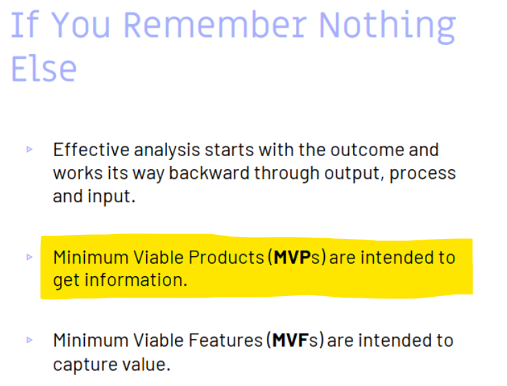

# Quiz 5 on Delivering Value

|                                                                |                     |                  |
| -------------------------------------------------------------- | ------------------- | ---------------- |
| **Due** Jul 5 at 11:59pm                                       | **Points** 50       | **Questions** 17 |
| **Available** Jun 7 at 12am - Jul 7 at 11:59pm _about 1 month_ | **Time Limit** None |                  |

- [Quiz 5 on Delivering Value](#quiz-5-on-delivering-value)
  - [Question 1 (1 pts) Which of the following is not a key concept of deliver value?](#question-1-1-pts-which-of-the-following-is-not-a-key-concept-of-deliver-value)
  - [Question 2 (1 pts) What does IRACIS stand for?](#question-2-1-pts-what-does-iracis-stand-for)
  - [Question 3 (1 pts) What does MVP stand for?](#question-3-1-pts-what-does-mvp-stand-for)
  - [Question 4 (1 pts) What does MMF stand?](#question-4-1-pts-what-does-mmf-stand)
  - [Question 5 (1 pts) How many definitions does business value have?](#question-5-1-pts-how-many-definitions-does-business-value-have)
  - [Question 6 (5 pts) What is feature injection?](#question-6-5-pts-what-is-feature-injection)
  - [Question 7 (5 pts) What is the first definition of business value?](#question-7-5-pts-what-is-the-first-definition-of-business-value)
  - [Question 8 (5 pts) What is the second definition of business value?](#question-8-5-pts-what-is-the-second-definition-of-business-value)
  - [Question 9 (5 pts) What is the business value model used for?](#question-9-5-pts-what-is-the-business-value-model-used-for)
  - [Question 10 (1 pts) An MVP is designed not just to test a business (blank)](#question-10-1-pts-an-mvp-is-designed-not-just-to-test-a-business-blank)
  - [Question 11 (1 pts) Minimum Viable Products (MVPs) are intended to get information](#question-11-1-pts-minimum-viable-products-mvps-are-intended-to-get-information)
  - [Question 12 (1 pts) Minimum Viable Features (MVFs) are intended to capture value](#question-12-1-pts-minimum-viable-features-mvfs-are-intended-to-capture-value)
  - [Question 13 (1 pts) Business value should be focused on profit or shareholders and not on delighting customers](#question-13-1-pts-business-value-should-be-focused-on-profit-or-shareholders-and-not-on-delighting-customers)
  - [Question 14 (1 pts) Measuring value should be at the feature level](#question-14-1-pts-measuring-value-should-be-at-the-feature-level)
  - [Question 15 (1 pts) The business value model provides a test for what happens to the objectives if the underlying assumptions change](#question-15-1-pts-the-business-value-model-provides-a-test-for-what-happens-to-the-objectives-if-the-underlying-assumptions-change)
  - [Question 16 (5 pts) Match the following](#question-16-5-pts-match-the-following)
    - [Minimum](#minimum)
    - [Marketable](#marketable)
    - [Feature](#feature)
    - [MVP](#mvp)
    - [MMF](#mmf)
  - [Question 17 (14 pts) Explain the main concepts of this chapter](#question-17-14-pts-explain-the-main-concepts-of-this-chapter)

## Question 1 (1 pts) Which of the following is not a key concept of deliver value?

- [ ] Feature Injection
- [ ] MVP
- [x] MFF
- [ ] All of the above

> - [x] MFF
>
> MFF is not a key concept of deliver value
>
> > 

## Question 2 (1 pts) What does IRACIS stand for?

- [x] Increase Revenue Avoid Costs Improve Service
- [ ] Increase Risk Acceptance Costs Idea Success
- [ ] Innovate Revenue Avoid Costs Improve Serve
- [ ] Implement Risk All Circumstances Improve Success

> - [x] Increase Revenue Avoid Costs Improve Service
>
> 

## Question 3 (1 pts) What does MVP stand for?

- [x] Minimum Viable Product
- [ ] Maximum Viable Product
- [ ] None of the above
- [ ] All of the above

> - [x] Minimum Viable Product
>
> 

## Question 4 (1 pts) What does MMF stand?

- [ ] Minimum Marketable Feature
- [x] Minimum Maximum Feature
- [ ] Both A and C
- [ ] All of the above

> - [x] Minimum Maximum Feature
>
> 

## Question 5 (1 pts) How many definitions does business value have?

- [ ] 1
- [x] 2
- [ ] 3
- [ ] None of the above

> - [x] 2
>
> 

## Question 6 (5 pts) What is feature injection?

> Feature injection, as the name implies, inject features that represent the work
> the team outputs, so to create that value or outcome. In doing so the key is
> knowing the value that the value initiative intends to deliver by
> one - delivering the features that provide value, two - communicating information
> about the features through examples, and three - lean Metaphor.
>
> > 

## Question 7 (5 pts) What is the first definition of business value?

> Business value has two definitions one of them is a, any, project that delivers
> value when it increases or protects revenue or reduces cost in alignment with
> organizational strategy
>
> 

## Question 8 (5 pts) What is the second definition of business value?

> The other definition of business value is that it follows the acronym IRACIS
> Where each letter stands for Increase Revenue (IR), Avoid Costs (AC), and
> Improve Service (IS).
>
> > 

## Question 9 (5 pts) What is the business value model used for?

> The business value model is used to assess the impact of decisions on revenue objectives;
> in short, is to evaluate or estimate the effect of decisions made on our financial goals.
>
> > 

## Question 10 (1 pts) An MVP is designed not just to test a business (blank)

> An MVP is designed not just to test a business `hypothesis`
>
> > 

## Question 11 (1 pts) Minimum Viable Products (MVPs) are intended to get information

- [x] True
- [ ] False

> - [x] True
>
> > 

## Question 12 (1 pts) Minimum Viable Features (MVFs) are intended to capture value

- [x] True
- [ ] False

> - [x] True
>
> > 

## Question 13 (1 pts) Business value should be focused on profit or shareholders and not on delighting customers

- [ ] True
- [x] False

> - [x] False
>
>       “... value should not be focused on profit or shareholders, but on delighting customers.”
>
> > 

## Question 14 (1 pts) Measuring value should be at the feature level

- [x] True
- [ ] False

> - [x] True
>
> > 

## Question 15 (1 pts) The business value model provides a test for what happens to the objectives if the underlying assumptions change

- [x] True
- [ ] False

> - [x] True
>
> > 

## Question 16 (5 pts) Match the following

### Minimum

- [x] the smallest possible group of features that deliver significant value to the user
- [ ] provides significant value to the customer
- [ ] the version of the product that lets the team complete the Build-Measure-Learn loop as quickly as possible with least amount of effort
- [ ] something that is observable to the user
- [ ] is a small, self-contained feature that can be developed quickly and provides significant value to the user

> - [x] the smallest possible group of features that deliver significant value to the user
>
> 

### Marketable

- [ ] the smallest possible group of features that deliver significant value to the user
- [x] provides significant value to the customer
- [ ] the version of the product that lets the team complete the Build-Measure-Learn loop as quickly as possible with least amount of effort
- [ ] something that is observable to the user
- [ ] is a small, self-contained feature that can be developed quickly and provides significant value to the user

> - [x] provides significant value to the customer
>
> > 

### Feature

- [ ] the smallest possible group of features that deliver significant value to the user
- [ ] provides significant value to the customer
- [ ] the version of the product that lets the team complete the Build-Measure-Learn loop as quickly as possible with least amount of effort
- [x] something that is observable to the user
- [ ] is a small, self-contained feature that can be developed quickly and provides significant value to the user

> - [x] something that is observable to the user
>
> > 

### MVP

- [ ] the smallest possible group of features that deliver significant value to the user
- [ ] provides significant value to the customer
- [x] the version of the product that lets the team complete the Build-Measure-Learn loop as quickly as possible with least amount of effort
- [ ] something that is observable to the user
- [ ] is a small, self-contained feature that can be developed quickly and provides significant value to the user

- [x] the version of the product that lets the team complete the Build-Measure-Learn loop as quickly as possible with least amount of effort

> - [x] the version of the product that lets the team complete the Build-Measure-Learn loop as quickly as possible with least amount of effort
>
> > 

### MMF

- [ ] the smallest possible group of features that deliver significant value to the user
- [ ] provides significant value to the customer
- [ ] the version of the product that lets the team complete the Build-Measure-Learn loop as quickly as possible with least amount of effort
- [ ] something that is observable to the user
- [x] is a small, self-contained feature that can be developed quickly and provides significant value to the user

> - [x] is a small, self-contained feature that can be developed quickly and provides significant value to the user
>
> > 

## Question 17 (14 pts) Explain the main concepts of this chapter

> The key concepts surrounding value delivery are one - Feature Injection, two - Minimum Viable Product, and three - Minimum Marketable Feature.
>
> Feature Injection , as the name implies, inject features that represent the work the team outputs, so to create that value or outcome. In doing so the key is knowing the value that the value initiative intends to deliver by one - delivering the features that provide value, two - communicating information about the features through examples, and three - lean Metaphor.
> The Minimum Viable Product's goal is to begin the process of learning it helps entrepreneurs start the process of learning as quickly as possible.
>
> And last the Minimum Viable Product is is a small, self-contained feature that can be developed quickly that delivers significant value to the user (stakeholder)
>
> > 
