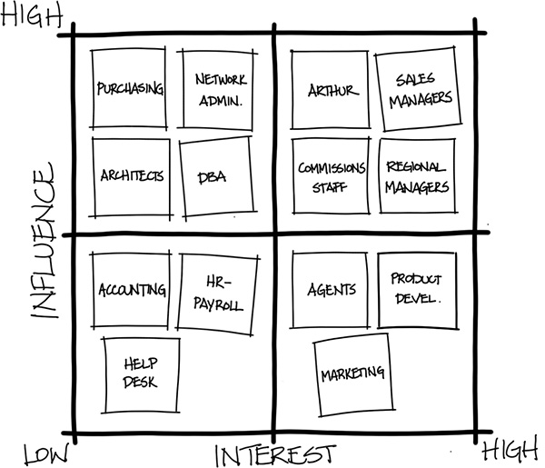

# Quiz 6 on Techniques

|                                                                |                     |                                |
| -------------------------------------------------------------- | ------------------- | ------------------------------ |
| **Due** Jun 28 at 11:59pm                                      | **Points** 50       | **Questions** 7                |
| **Available** Jun 1 at 12am - Jul 5 at 11:59pm _about 1 month_ | **Time Limit** None | **Allowed Attempts** Unlimited |

- [Quiz 6 on Techniques](#quiz-6-on-techniques)
  - [Question 1 (5 pts): Describe in your own words what you like about the Purpose Based Alignment Model?](#question-1-5-pts-describe-in-your-own-words-what-you-like-about-the-purpose-based-alignment-model)
  - [Question 2 (5 pts): Describe in your own words which one do you prefer to use: Stakeholder Map or Commitment Scale for understanding stakeholders and why?](#question-2-5-pts-describe-in-your-own-words-which-one-do-you-prefer-to-use-stakeholder-map-or-commitment-scale-for-understanding-stakeholders-and-why)
  - [Question 3 (10 pts): Describe in your own words when (under what conditions) you prefer to use the Six Questions (technique or the)Context Leadership model for understanding context and why?](#question-3-10-pts-describe-in-your-own-words-when-under-what-conditions-you-prefer-to-use-the-six-questions-technique-or-thecontext-leadership-model-for-understanding-context-and-why)
  - [Question 4 (10 pts): List the six purposes for which Decision Filters may be used for understanding the need. Choose two of your favorite purposes and explain why. (refer to text book chapter on understanding need)](#question-4-10-pts-list-the-six-purposes-for-which-decision-filters-may-be-used-for-understanding-the-need-choose-two-of-your-favorite-purposes-and-explain-why-refer-to-text-book-chapter-on-understanding-need)
  - [Question 5 (5 pts): Explain what you like about the above definition and usefulness of Impact Mapping. (refer to text book for details on Impact Mapping)](#question-5-5-pts-explain-what-you-like-about-the-above-definition-and-usefulness-of-impact-mapping-refer-to-text-book-for-details-on-impact-mapping)
  - [Question 6 (5 pts): If you are given the opportunity to create a new graph with an X and Y axes. What are the two most important attributes you will like to use for characterizing Persona? and why?](#question-6-5-pts-if-you-are-given-the-opportunity-to-create-a-new-graph-with-an-x-and-y-axes-what-are-the-two-most-important-attributes-you-will-like-to-use-for-characterizing-persona-and-why)
  - [Question 7 (10 pts): Provide any two items in Definition of Ready and Definition of Done you prefer to rank high as among the top two in your opinion. In your opinion is Definition of Ready more important or Definition of Done? or do you think both are equally important? and why? Explain from the perspective of the top two items in each](#question-7-10-pts-provide-any-two-items-in-definition-of-ready-and-definition-of-done-you-prefer-to-rank-high-as-among-the-top-two-in-your-opinion-in-your-opinion-is-definition-of-ready-more-important-or-definition-of-done-or-do-you-think-both-are-equally-important-and-why-explain-from-the-perspective-of-the-top-two-items-in-each)

## Question 1 (5 pts): Describe in your own words what you like about the Purpose Based Alignment Model?

> I like the Purpose Based Alignment Model, for it provides a way to take immeasurable data into categorical data and thus can be assigned an arbitrary number for a team to attach value to in context to a set of activities that can be worked on; for this reason, a team an rank and visualize items in priority buckets on a chart (zero to one along both the x and y axis).
> Items with a paired value of less than .4 would be in the "who cares" bucket, items with a pair value in the range of (0, .5) to (.4,1), high market differentiation and low mission critical,  would be of the "partner" category, items with a pair value in the range of (.5,.4) to (.5,1), low market differentiation and high mission critical, would be of the "parity" category, and items with a paired value of .5 or greater would be in the "differentiating" bucket.
> Activities can now be assigned priorities, because its now measured and categorized, so in each respective bucket priority one items are of the "differentiating" bucket, priority two items are of the "parity" bucket, and priority three are of the "partner" bucket.
> This provides a means of focused driven development while taking care of the most important tasks in their respective buckets of activity.

## Question 2 (5 pts): Describe in your own words which one do you prefer to use: Stakeholder Map or Commitment Scale for understanding stakeholders and why?

> I prefer the Six Questions technique, for performs the same function as Journalism's "5W1H," a tool that produce answers to gather basic information gathering or problem solving. As a result answering the Six Questions builds out a foundation, a structure, and can be used as the team's stepwise refinement to a solution for a particular problem or situation.

## Question 3 (10 pts): Describe in your own words when (under what conditions) you prefer to use the Six Questions (technique or the)Context Leadership model for understanding context and why?

> I prefer the Six Questions technique, for performs the same function as Journalism's "5W1H," a tool that produce answers to gather basic information gathering or problem solving. As a result answering the Six Questions builds out a foundation, a structure, and can be used as the team's stepwise refinement to a solution for a particular problem or situation.

## Question 4 (10 pts): List the six purposes for which Decision Filters may be used for understanding the need. Choose two of your favorite purposes and explain why. (refer to text book chapter on understanding need)

> 1. Determine the decision maker
> 2. Select a decision mechanism
> 3. Make a timely decision
> 4. Build support with peers/stakeholders
> 5. Communicate the decision
> 6. Enact the decision
>
> I prefer both (3) making a timely decision and (5) communicating the decision; for, there is a fine balance between gathering enough information and spending too much time trying to gather information, so making a decision reduces being subsumed to "decision fatigue," and falls in line with "The 37-percent rule" (aka "the secretary problem") where you'll have the highest chance of picking the very best option if you look at and reject the first 37 percent of your total group of options.
>
> As long as one can explain and elaborate (communicate the decision) why that decision of all other is best then it's with reason that we go with the best decision even if some may not agree.

## Question 5 (5 pts): Explain what you like about the above definition and usefulness of Impact Mapping. (refer to text book for details on Impact Mapping)

- [Impact mapping](http://impactmapping.org/about.php) combines mind mapping and
  strategic planning to help a team explore what behaviors they should try to
  influence in order to reach a particular objective. (from understanding solutions chapter)

- Impact mapping [Chapter 14](chapter14_understanding_the_solutions.pdf) can be
  very helpful (useful) in identifying what solution(s) you should work on and in
  what order. (from the analysis with an agile mindset chapter)

> I like that the definition of Impact Mapping, for it articulates and illustrate that it is a combination of both mind mapping, a diagram used to visually organize information, and an organization's process of defining its strategy, or direction, and making decisions on allocating its resources to pursue this strategy; as a result, combining the two, mind mapping and strategic planning, helps a team explore what behaviors they should try to influence in order to reach a particular objective.

## Question 6 (5 pts): If you are given the opportunity to create a new graph with an X and Y axes. What are the two most important attributes you will like to use for characterizing Persona? and why?

> AnswerResponse

## Question 7 (10 pts): Provide any two items in Definition of Ready and Definition of Done you prefer to rank high as among the top two in your opinion. In your opinion is Definition of Ready more important or Definition of Done? or do you think both are equally important? and why? Explain from the perspective of the top two items in each

> AnswerResponse
