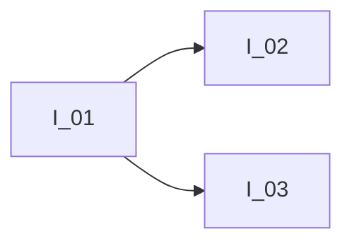

course: [[PHYS 5B LEC-DIS - Gen Phys lgt-elec-mag-mod-phy]]

instructor: [[Watters, Kyle|Kyle Watters]]

related_notes: [[2022-02-25]]

# CH 23 Circuits

W08.5 | Friday, February 25, 2022 | 12:07 PM

## Announcements

1. Watch the three new video solutions
2. [[2022-02-27]]
	1. Watch the rest of CH 23 lecture video
	2. [[2022-02-28]] Group work on chapter 23
	3. [[2022-03-01]] CH 23 Homework due
	4. [[2022-03-02]] Exam Review
	5. Exam 1 is [[2022-03-04]]

## Notes

Current is constant, only voltage change as it goes though a resistor; however, at a two way junction it becomes three currents $I_1$, $I_2$, $I_3$

### Light bulbs

- Current must flow though

### Back to resistors: in series

- Resistors are connected in series when they are connected end-to-end with no junction between them
	- $R_{tot} = R_1 + R_2 + R_3 + ...$
- All current flows the same it's not "used up"
- The total voltage drop will be the sum of the individual drops

### Resistors in parallel 

- Resistors are connected in parallel when they are on separate branches that start and end at the same location
- In this case, the areas of the resistors effectively add, reducing the total resistance
	- $\LARGE R_{tot} = \left(\frac{1}{R_1}+\frac{1}{R_2}+\frac{1}{R_3}+\:...\right)^{-1}$
- Voltage is the same and the current is shared

## Cues/Questions

- Question_one
- Question_two
- Question_three

## Summary

Highlight ==What's Important!==

When finished with each page, write a **2-3 sentence** summary of your notes at
the bottom of the page.
