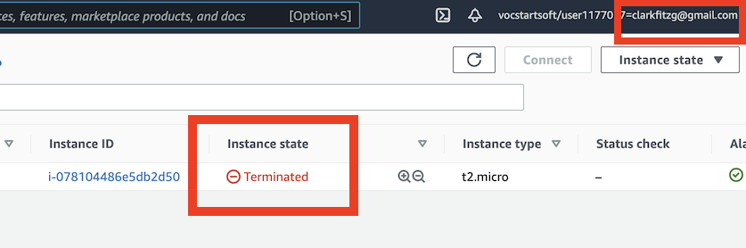

# S - Cloud Computing Basics

**Due** Thursday by 11:59pm | **Points** 5 | **Submitting** a file upload | **File Types** png, jpeg, jpg, and pdf

See exercise at [Cloud Computing Basics](https://github.com/matt2ology/csus-computer-science-csc/blob/master/stat196k-analyzing-and-processing-big-data/lecture-notes/20210201-cloud-computing-basics.pdf)

-------
## Set-up

1. **Login** [AWS Educate](https://www.awseducate.com/signin/SiteLogin)
2. SSH to an EC2 instance
   1. Click Instance ID 
      
   2. Click Connect
   3. In terminal: ssh -i key.pem ec2-user@hostname

-------

## Exercise

### Prerequisite: Activate your AWS educate account

19 out of 34 of you have already done this. Find an email from ***support@awseducate.com*** with subject line “Your AWS Educate Application”. The body starts like this:

    Hi -

    Your educator has invited you to join AWS Educate and access a “Classroom” for your course work. A “Classroom” is a hands-on learning environment for you to access AWS services and practice AWS. There are no costs or fees to access a Classroom.

If you cannot find it, then let me know, and I’ll resend the invite. Follow the steps and click through the email links to create and activate your account.

-------

1. Login to your [AWS Educate account](https://www.awseducate.com/signin/SiteLogin)
2. Navigate to *“My Classrooms”* on the top bar, find our class, *“Analyzing and Processing Big Data”*, and click *“Go to classroom”*, which will bring you to Vocareum.
3. Click on the blue *“AWS Console”* button to navigate to the [AWS Management Console](https://console.aws.amazon.com/console/home?region=us-east-1#)
4. Launch an EC2 instance.
5. Choose *“Community AMIs”* and search for *“stat196k”* to find one with a title like *“CSUS stat196k v1.0”*. Select that one, which has all the software and settings necessary for our class.
6. Use the default instance type, *“t2.micro”*, then click *“Review and Launch”*.
7. You’ll see a warning message: *“Improve your instances’ security. Your security group, launch-wizard-2, is open to the world.”*. That’s OK here, it just means anyone with valid credentials can login from any IP address.
8. When you launch, AWS will prompt you for a key pair. The first time, you’ll have to create a key pair, and subsequently you can use these keys. Alternatively, you can import your own existing public key from the management console.
9. For simplicity, I suggest you name the key pair your name with the date that you create it, for example, ***clark-2020-02-01***.
10. Download the key, and verify that your instance is running.
11. Click on your running instance, and then click *“Connect”*.
12. Follow the commands on the SSH client to login to the running machine using the keys you just created. For me on a mac, it looks like the following:
13.  
        ~/Downloads $ ssh -i "clark-2020-02-01.pem" ec2-user@ec2-35-173-178-203.compute-1.amazonaws.com

14. Once you login, print out the contents of the *README* file in your home directory, and your name. Take a screenshot.
15. Go back to the console, and figure out how to terminate your running instance. From Instances, take a screenshot showing the “Instance state” as “Terminated”, as well as your email.

### Submit these 2 screenshots on Canvas

The red boxes in the pictures below show what I’m looking for. Show that you were able to login to the machine, ***$ cat README*** and ***$ echo "your name"***.

Show that the instance is now terminated.

