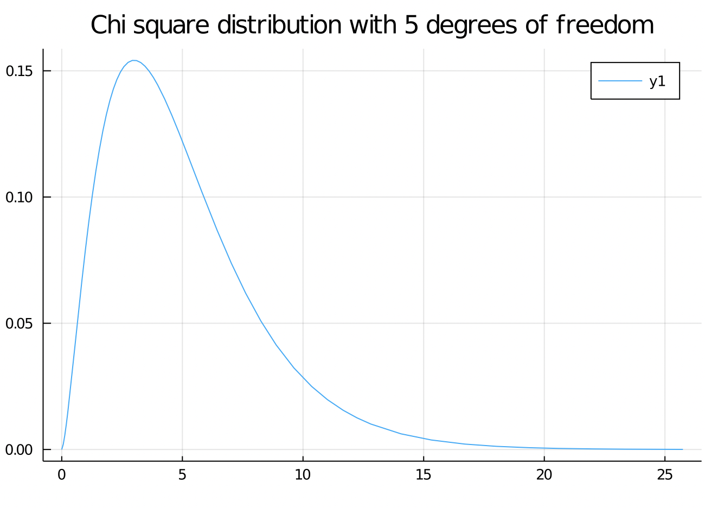
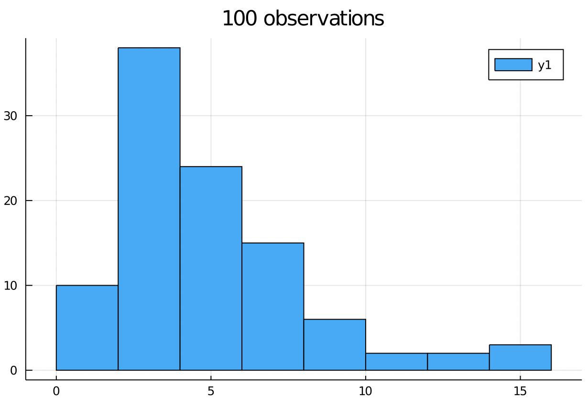
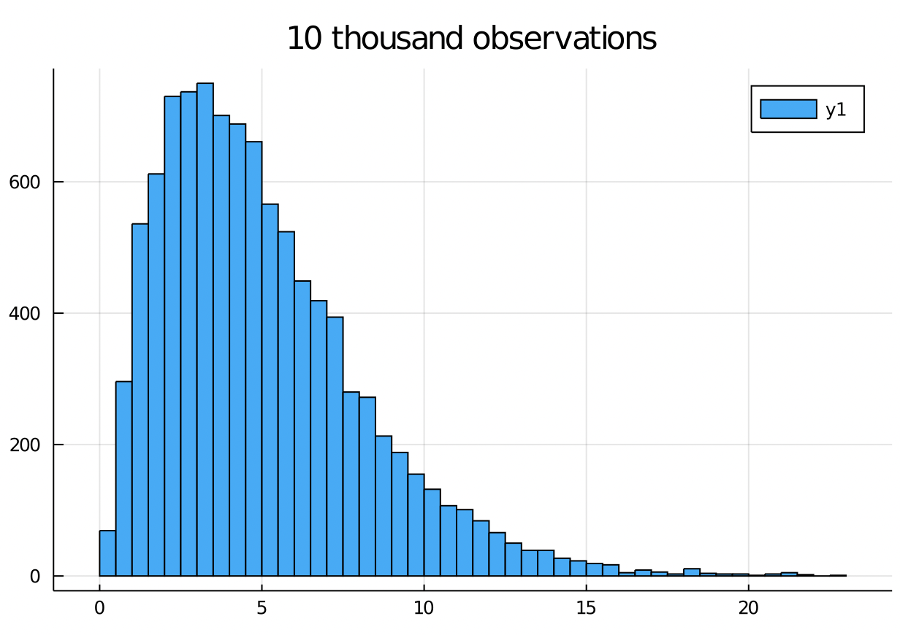
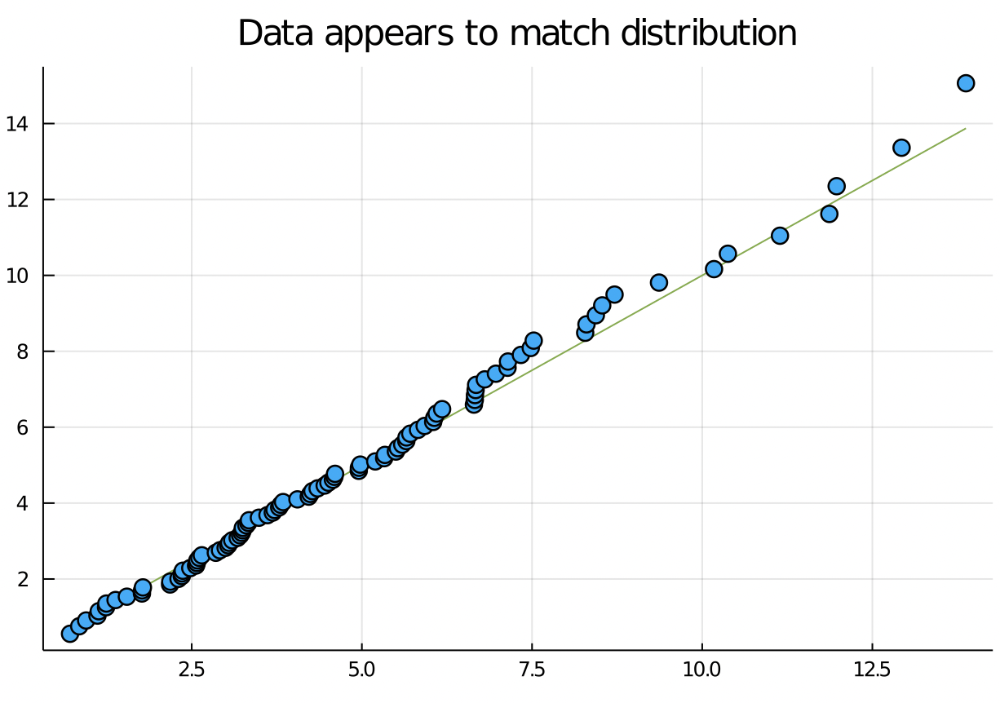
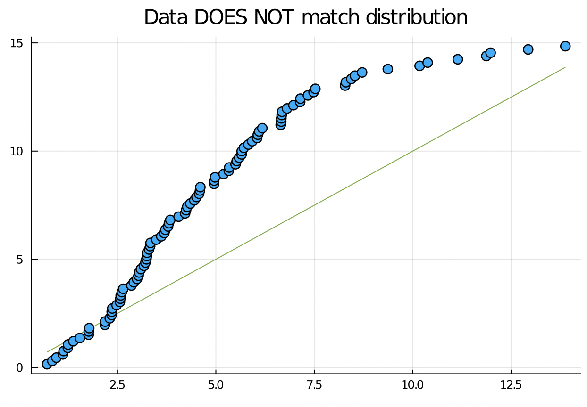

# S - QQ plot

**Due** Thursday by 11:59pm | **Points** 5 | **Submitting** a file upload | **File Types** png, jpeg, jpg, and pdf

Exercise at the bottom of http://webpages.csus.edu/fitzgerald/graphical-methods-for-comparing-distributions/

---

- Describe column storage
- Create and interpret QQ plots
- Sample from probability distributions to test statistical methods

123 GO - what's the last music you listened to?

## Announcements

- Added reminder assignment for when homework submission window closes (tomorrow)
- I've been pinning messages on Discord.
  Give a thumbs up or other reaction to helpful messages, including mine, so I know what is useful.
- I have an idea for a summer project.
  Reading the [Unix Philosophy](https://homepage.cs.uri.edu/~thenry/resources/unix_art/ch01s06.html) inspired me.

## Resources

- [QQ plots](https://github.com/JuliaPlots/StatsPlots.jl#quantile-quantile-plots) in Julia from `StatsPlots`

## Column Storage

I've been stuck on this streaming text files homework.
I changed how the data was stored, and the time it takes to do a simple column selection and line count on a t2.micro instance went from 4.5 minutes to 3.4 SECONDS, or 80X faster.
That's two orders of magnitude speedup, which is much more than the variation within the measured times of our homeworks.

```shell
# 3.4 seconds
time aws s3 cp ${COL31FILE} - |
    gunzip |
    wc -l

# 4 minutes, 32 seconds
time aws s3 cp ${S3FILE} - |
    gunzip |
    cut --fields=${GOLDSTEIN} |
    wc -l
```

Both programs produce the same answer, 61544481.

## Motivation

Motivation: We would like to characterize a data generating process with a distribution, i.e. uniform, normal, Poisson, etc.
Why do we want to do this?

Here I'm demonstrating important meta technique for understanding statistical methods: simulate data that exactly matches the assumptions and check that it works as expected.

## Chi Squared Distribution

The Chi squared distribution comes up as a sum of independent squared normal random variables.

```julia
using Distributions
using StatsPlots

# Object representing a Chi squared distribution
c5 = Chisq(5)

# Plots the PDF of the above Chi squared distribution
# (Takes ~10 seconds)
plot(c5)
title!("Chi square distribution with 5 degrees of freedom")
```



## histograms

The shape of the histogram of n IID samples from a distribution will match the PDF as n goes to infinity.

This suggests a quick way to test if data came from a distribution is to look at the histogram.

```julia
histogram(rand(c5, 100))
title!("100 observations")
```



```julia
histogram(rand(c5, 10_000))
title!("10 thousand observations")
```



## quantiles

The p quantile for a distribution X is the point xq that satisfies P(X <= xq) = p.


```julia
q = range(0, 1, step = 0.1)
collect(q)

collect(q)
#11-element Array{Float64,1}:
# 0.0
# 0.1
# 0.2
# 0.3
# 0.4
# 0.5
# 0.6
# 0.7
# 0.8
# 0.9
# 1.0

quantile(c5, q)
#julia> quantile(c5, q)
#11-element Array{Float64,1}:
#  0.0
#  1.61
#  2.34
#  2.99
#  3.65
#  4.35
#  5.13
#  6.06
#  7.28
#  9.23
# Inf
```

## QQ plots

The QQ (quantile - quantile) plot is a useful visual tool to check if whether a particular distribution models data well.
If the QQ plot follows the line y = x reasonably well, then it means that the reference distribution is a reasonable model for the data.

```julia
# Simulate n data points from this RV.
n = 100
x_from_c5 = rand(c5, n)

# 100-element Array{Float64,1}:
#   3.8
#  11.8
#   7.1
#   0.9
# ...

qqplot(x_from_c5, c5)
title!("Data appears to match distribution")

maximum(x_from_c5)
# 15.4
```



Suppose the data doesn't match the distribution:

```julia
# Represents a Uniform random variable
U15 = Uniform(0, 15)

qqplot(x_from_c5, U15)
title!("Data DOES NOT match distribution")
```



123 GO: how can you use the QQ plot to say that the data looks too god?

## Exercise

Pick two statistical distributions with PDF's that look completely different.
For example, in class we used the uniform distribution and the Chi squared distribution.
Generate data from one distribution, and create two QQ plots for this same data plotted against the quantiles of two different distributions.

Turn in these two QQ plots.
They can be on the same axes, or different.

Use any software you like.
