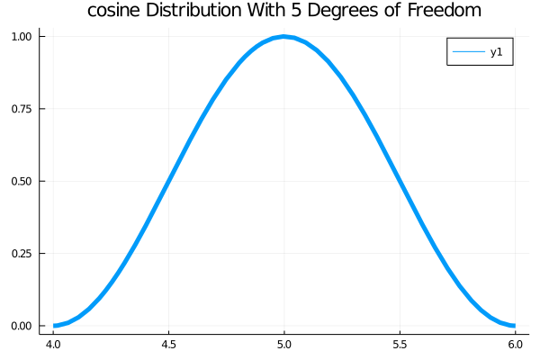
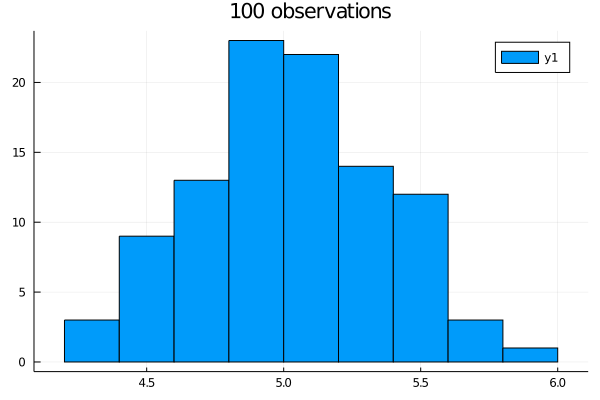
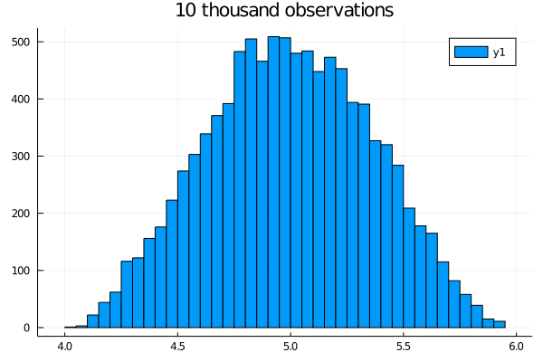
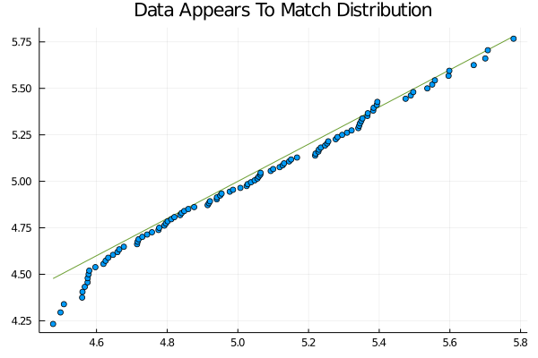
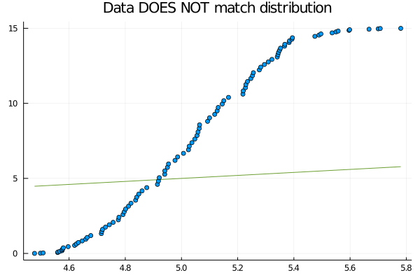

# Graphical Methods For Comparing Distributions

- [Graphical Methods For Comparing Distributions](#graphical-methods-for-comparing-distributions)
  - [Cosine Distribution](#cosine-distribution)
  - [Histograms](#histograms)
  - [Quantiles](#quantiles)
  - [QQ plots](#qq-plots)

## Cosine Distribution

The cosine Distribution is a probability distribution that is both continuous—for non-negative random variables—and stable.

```julia
using Plots 
using Distributions
using StatsPlots

# Object representing a cosine distribution
cosine_distribution = Cosine(5)

# Plots the probability density function (PDF) of the above cosine distribution
plot(cosine_distribution, lw=5 ,title="cosine Distribution With 5 Degrees of Freedom")
```



## Histograms

The shape of the histogram of n IID samples from a distribution will match the PDF as n goes to infinity.

This suggests a quick way to test if data came from a distribution is to look at the histogram.

```julia
histogram(rand(cosine_distribution, 100), title="100 observations")
```



```julia
histogram(rand(cosine_distribution, 10000), title="10 thousand observations")
```



## Quantiles

The p quantile for a distribution X is the point xq that satisfies P(X <= xq) = p.


```julia
q = range(0, 1, step = 0.1)
collect(q)

# julia> collect(q)
# 11-element Array{Float64,1}:
#  0.0
#  0.1
#  0.2
#  0.3
#  0.4
#  0.5
#  0.6
#  0.7
#  0.8
#  0.9
#  1.0

quantile(cosine_distribution, q)

# julia> quantile(cosine_distribution, q)
# 11-element Array{Float64,1}:
#  4.000000000000455
#  4.51781167217041
#  4.672633021498314
#  4.792841447379487
#  4.899160875972029
#  4.999999999999545
#  5.100839124027971
#  5.207158552620513
#  5.327366978501686
#  5.48218832782959
#  5.999995928498265 
```

## QQ plots

The QQ (quantile - quantile) plot is a useful visual tool to check if whether a particular distribution models data well.
If the QQ plot follows the line y = x reasonably well, then it means that the reference distribution is a reasonable model for the data.

```julia
# Simulate n data points from this RV coefficient.
n = 100
x_from_cosine_distribution = rand(cosine_distribution, n)

# julia> x_from_cosine_distribution = rand(cosine_distribution, n)
# 100-element Array{Float64,1}:
#  5.198876765397017
#  4.517976774752697
#  4.906660988847307
#  5.237532703931265
#  5.213949760383457
#  4.2578778073889225
#  5.034487475335936
#  5.010275373027525
#  4.980163829800858
#  ⋮
#  4.860984952053059
#  4.944159973939804
#  4.350931797298017
#  4.497079645145732
#  4.633258739833309
#  4.660299846510043
#  5.812807089541366
#  5.110161480319675
#  5.7790662823204
# ...

qqplot(x_from_cosine_distribution, cosine_distribution, title="Data Appears To Match Distribution")

maximum(x_from_cosine_distribution)
# 5.812807089541366
```



```julia
# Represents a Arcsine random variable
arcsine_distribution15 = Arcsine(0, 15)
qqplot(x_from_cosine_distribution, arcsine_distribution15, title="Data DOES NOT match distribution")
```


