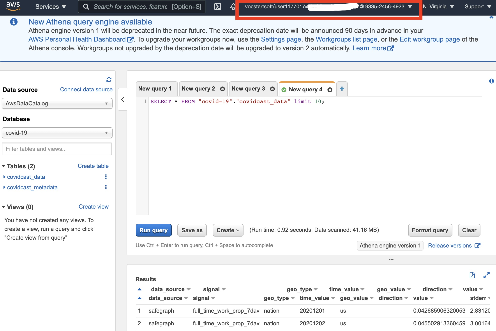

# S - Configuring SQL

**Due** Apr 25 at 11:59pm  | **Points** 5 pts | **Submitting** a text entry box or a file upload | **File Types** png, jpeg, pdf, and jpg

- [S - Configuring SQL](#s---configuring-sql)
  - [Goal](#goal)
  - [Announcements](#announcements)
    - [Final project](#final-project)
  - [Assignment](#assignment)
  - [Background](#background)

See website assignment: http://webpages.csus.edu/fitzgerald/configuring-SQL/#assignment

---

## Goal

- Configure SQL environment (AWS Athena)

## Announcements

- Sign in to your AWS student account right now
- Plan is to have one more homework based on SQL

### Final project

- Open ended
- Analyze data
- Use something you learned from this class (AWS, Julia, bash, stat technique, etc)

## Assignment

Take a screenshot of your working AWS Athena instance with the COVID-19 database. Show:

1. Your username
2. A successful query

For example:

The following are the high level steps. You will probably need to follow along
with lecture to see exactly how to do this.

1. Create a bucket in S3. You can name it whatever you want, but I suggest `stat196k-first-lastname`
2. Configure AWS Cloudformation using this template: `https://stat196k-data-examples.s3.amazonaws.com/CovidLakeStack.template.json`
3. Run a query in [Amazon Athena](https://console.aws.amazon.com/athena/home?force&region=us-east-1#query)

## Background

AWS Athena is built on Presto, originally developed in house by Facebook.

If there’s one technology / language you MUST be familiar with as a data scientist, it’s SQL, Structured Query Language. Fortunately, SQL is easier to learn than general programming languages, and we can cover the basics in an hour.

Here are three ways to access data:

1. GUI dashboard tools: Tableau, BI (business intelligence), etc. These are useful for quick visuals, and if you don’t want to code. Many of them generate SQL.
2. SQL: Database is already set up, so you can write queries to your heart’s content.
3. Direct access to the underlying storage: Requires the most knowledge.
