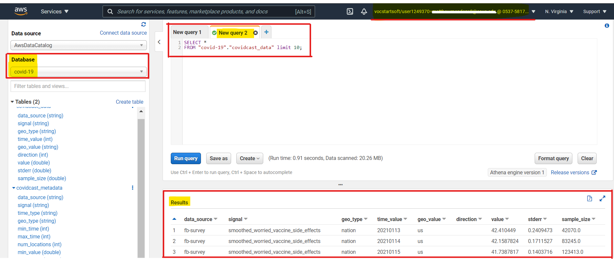

# Exercise18: S - Configuring SQL

- [Exercise18: S - Configuring SQL](#exercise18-s---configuring-sql)
  - [Assignment](#assignment)
  - [Step-by-step](#step-by-step)

## Assignment

Take a screenshot of your working AWS Athena instance with the COVID-19 database.
Show:

1. Your username
2. A successful query

## Step-by-step

1. **Sign in** to [AWS Educate](https://www.awseducate.com/signin/SiteLogin)
2. **Click** [My Classrooms](https://www.awseducate.com/student/s/classrooms)
3. `Go to classroom`
4. A `Confirm` prompt to AWS Educate Terms & Conditions will pop-up
5. **Click** `Continue`
6. You'll be redirected to `Vocareum` AWS Educate Account and Status page
7. **Click** `AWS Console`
8. You'll be takedn to `AWS Management Console`
9. **Set-up** a `S3 Bucket`
10. **Click** `S3` under the `Storage` category in the `AWS services` "_All services_" drop down menu
11. **Click** `Create bucket`
12. In the `General configuration` section for `Bucket name` name it whatever you want, but I suggest `stat196k-first-lastname`
13. For `AWS Region` leave it as the default `US East (N. Virginia) us-east-1` (you need to be in this default region for this to work)
14. **We don't need** Public Access settings for this bucket
15. `Bucket Versioning` **leave as Disable**
16. `Tags(0) - optional` **no tags needed**
17. `Default encryption` **leave as Disable**
18. `Advanced settings` **NO changes**
19. **Click** `Create bucket` at the bottom of page
20. This bucket will allow us to use `Amazon Athena` to save the query results
21. Under `Services` located at the top left next to the AWS icon (as of 2021-04-22)
22. In the `Management & Governance` category
23. **Click** `CloudFormation` (create and manage resources with templates)
24. **Click** `Create stack`
25. `Prerequisite - Prepare template` Amazon S3 URL"**Template is ready**"
26. `Specify template` **set to** "**Amazon S3 URL**"
27. `Amazon S3 template URL` **use template:** https://stat196k-data-examples.s3.amazonaws.com/CovidLakeStack.template.json
28. **Click** `Next`
29. `Specify stack details` Stack name can be what ever you want (I did *stat196k-spring2021*)
30. **Click** `Next`
31. Don't worry about `Configure stack options` the default works fine
32. **Click** `Next`
33. Ignore the review page
34. **Click** `Create stack`
35. Status will display "CREATE_IN_PROGRESS" give it about minute to be done "CREATE_COMPLETE"
36. Refresh the page if needed
37. For your `Logical ID` your Stack name status should now be "CREATE_COMPLETE"
38. Under `Services` located at the top left next to the AWS icon
39. **Click** `Athena` (the Query Data in S3 using SQL) in the `Analytics` category
40. Redirected to `Amazon Athena` welcome page
41. **Click** Get Started
42. On the left you should see a header `Database` and a drop-down menu below it with "covid-19" already selected
43. You should also get some kind of error message that says "Before you run your first query, you need to set up a query result location in Amazon S3. Learn more"
44. To get rid of this **go to** `Settings` (top right of page)
45. In settings **provide the Query result location** your `S3 buccket` name `s3://stat196k-first-lastname/` OR **click** "`Select`" to see the buckets you've created
46. **Click** Save
47. The error message should now be gone
48. NOW you should be able to start querying the data
49. Over in `covidcast_data` click the option icon (the three vertical dots)
50. **Select** `Preview table`
51. It will run a SQL query for you
    > SELECT * FROM "covid-19"."covidcast_data" limit 10;

    **Click** `Format query`

    > SELECT *\
    > FROM "covid-19"."covidcast_data" limit 10;

    The `*` (star) means all columns.
    The first argument after selecting the columns that you want, so this is SELECT all the columns from covid-19, that is, the database in quotes `"covid-19"."covidcast_data"`
