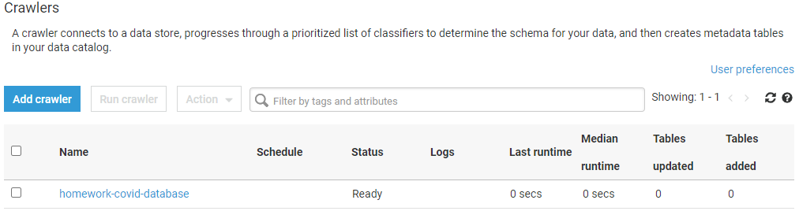
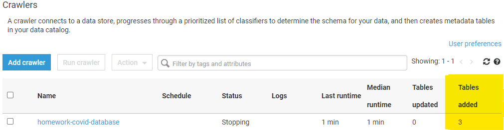
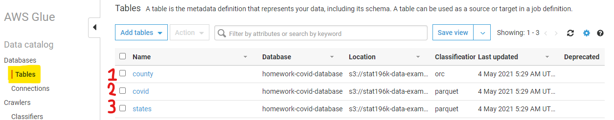
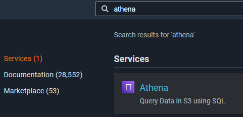
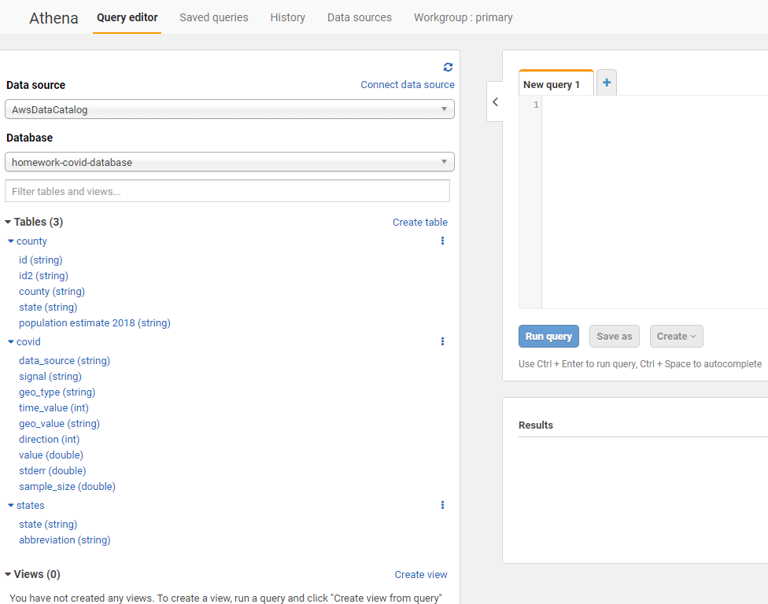

# Assignment21 - Homework COVID Database

**Due** May 6 at 11:59pm | **Points** 20 pts | **Submitting** a file upload | **File Types** PDF

- [Assignment21 - Homework COVID Database](#assignment21---homework-covid-database)
  - [Database Crawler Setup](#database-crawler-setup)
  - [Understanding The Data (4 points)](#understanding-the-data-4-points)
    - [Understanding The Data Question #1](#understanding-the-data-question-1)
    - [Understanding The Data Question #2](#understanding-the-data-question-2)
  - [Counting (8 points)](#counting-8-points)
    - [Counting Question #1](#counting-question-1)
    - [Counting Question #2](#counting-question-2)
    - [Counting Question #3](#counting-question-3)
  - [Open Ended Questions (8 points)](#open-ended-questions-8-points)
    - [Open Ended Question #1](#open-ended-question-1)
    - [Open Ended Question #2](#open-ended-question-2)

---

## Database Crawler Setup

Following steps used in lecture Apr 28,2021

1. Go to [AWS Glue](https://console.aws.amazon.com/glue/home?region=us-east-1#catalog:tab=crawlers)
2. Click `Add crawler`
3. **Specify crawler source type**
   1. Using `Crawler name`: homework-covid-database
   2. **No changes** to `Tags, description, security configuration, and classifiers (optional)`
4. Click `Next`
5. **Specify crawler source type**
   1. **Crawler source type**: `Data stores`
   2. **Repeat crawls of S3 data stores**: `Crawl all folders` _Crawl all folders again with every subsequent crawl._
6. Click `Next`
7. **Add a data store**
   1. **Choose a data store**: `S3`
   2. **Connection**: Not needed (leave blank)
   3. **Crawl data in**: `Specified path`
   4. **Include path** `s3://stat196k-data-examples/covid_db/`
8. Click `Next`
9. **Add another data store**: `No` (for now... later to load our own table and bring it into our own database/collection of tables)
10. **Choose an IAM role**
    1. Select: `Create an IAM role`
    2. **IAM role**: `AWSGlueServiceRole-`covid-database
11. Click `Next`
12. **Create a schedule for this crawler**
    1. **Frequency**: `Run on demand`
13. Click `Next`
14. **Configure the crawler's output**
    1. Click `Add database`
    2. **Database name (same name as crawler)**: homework-covid-database
    3. **Prefix added to tables (optional)**: Leave blank
    4. **Description and location (optional)**: Leave blank
    5. **Resource link name**: Leave blank
    6. **Shared database suggestions**: Leave blank
    7. **Shared database**: Leave blank
    8. **Shared database owner account ID**: Leave blank
15. Click `Create`
16. **Grouping behavior for S3 data (optional)**: Leave unchanged
17. **Configuration options (optional)**: Leave unchanged
18. Click `Next`
19. **Review all steps**

    1. **Crawler info**
       1. **Name** homework-covid-database
       2. **Tags**: -
    2. **Data stores**
       1. **Data store**: S3
       2. **Include pat**: h s3://stat196k-data-examples/covid_db/
       3. **Connection**: -
       4. **Exclude patterns**: -
    3. **IAM role**
       1. **IAM role**: arn:aws:iam::503811637238:role/service-role/AWSGlueServiceRole-covid-database
    4. **Schedule**
       1. **Schedule**: Run on demand
    5. **Output**
       1. **Database**: homework-covid-database
       2. **Prefix added to tables (optional)**: -
       3. **Create a single schema for each S3 path**: false
       4. **Configuration options**
          1. **Schema updates in the data store**: Update the table definition in the data catalog.
          2. **Object deletion in the data store**: Mark the table as deprecated in the data catalog.

20. Click `Finish`\
    
21. Click `homework-covid-database`
22. Click `Run crawler` (Will take a moment)
    1. When completed in `Tables added` you should see 3 added\
       
23. From `Data catalog` > `Databases` > `Tables` (located on the left-hand-side)\
    

24. You should see three tables
    1. county
    2. covid
    3. states
       

## Understanding The Data (4 points)

### Understanding The Data Question #1

Pick one of the [limitations described in the data documentation](https://cmu-delphi.github.io/delphi-epidata/api/covidcast-signals/fb-survey.html#limitations)
and elaborate on it. What does it mean?

- `Non-response bias`: The survey is voluntary, and people who accept the
  invitation when it is presented to them on Facebook may be different from
  those who do not. The [survey weights provided by Facebook](https://cmu-delphi.github.io/delphi-epidata/api/covidcast-signals/fb-survey.html#survey-weighting)
  attempt to model the probability of response for each user and hence adjust
  for this, but it is difficult to tell if these weights account for all
  possible non-response bias.

> This term is to articulate if you don't respond or partake in the survay you
> will be assumed to be a member of the majority; for example, if you are a
> Black woman living in a place that is majority White and you don't respond to
> the survay you are invited to Facebook would use a process called
> "[imputation](https://g.co/kgs/EnjxXZ)." Facebook would then say
> "hey, this person might be a White male."

### Understanding The Data Question #2

Find a row in the `covid` table that contains SE (standard error) for one signal.
Use this to construct and interpret a "quick and dirty" 95% confidence interval for that particular signal in that row.

Using [Athena](https://console.aws.amazon.com/athena/home?region=us-east-1#query)





```SQL
-- Conditional Query
SELECT stderr
FROM covid
LIMIT 3;
```

OUTPUT

| data_source | signal                   | geo_type | time_value | geo_value | direction | value      | stderr    | sample_size |
| ----------- | ------------------------ | -------- | ---------- | --------- | --------- | ---------- | --------- | ----------- |
| fb-survey   | smoothed_wlarge_event_1d | nation   | 20200908   | us        |           | 15.9247137 | 0.2631875 | 19329.0     |
| fb-survey   | smoothed_wlarge_event_1d | nation   | 20200909   | us        |           | 15.2445553 | 0.1571114 | 52344.0     |
| fb-survey   | smoothed_wlarge_event_1d | nation   | 20200910   | us        |           | 14.9683015 | 0.1223318 | 85050.0     |

```julia
value = 15.9247137
p_value = 15.9247137/100
z_confidence_level_value = 1.959964
s_sample_standard_deviation = 0.2631875
n_sample_size = 19329.0
square_root_of_the_sample_size = 100*sqrt((p_value*(1-p_value))/n_sample_size)
lower_bound = value-(z_confidence_level_value*square_root_of_the_sample_size)
upper_bound = value+(z_confidence_level_value*square_root_of_the_sample_size)
println("(",lower_bound, ",", upper_bound,")")
# (15.408875624584415 , 16.440551775415585)
```

> Using data from the first row we have a 95% confidence interval of
>
> (15.408875624584415 , 16.440551775415585)

## Counting (8 points)

_Include your answers and show SQL queries for the questions below._

### Counting Question #1

How many observations are there for each signal in the county level `covid` rows?\
County level rows means that `geo_type = 'county'`.\
Show the top 5 `signals` with the most counts.

```text
Dennis — 04/30/2021
For question 1 in the 'Counting' section of the homework, when it asks for how
many observations... Is it asking for the sum of the 'value' column or is it
asking for the COUNT of rows in this query?

Clark — 05/01/2021
By "number of observations" I mean the COUNT of rows.

Ryan H — 05/01/2021
for that same question ( 'Counting' question 1 ), we are supposed to find the
counts for each signal in the 'county' level. I am able to do this for one at
a time, but when trying to get through all of them (there are around 70), I am
getting a little stuck. Do I want to create a list with each signal name and
loop through it?  I feel like there should be an easier way to do this

Clark — 05/02/2021
Try GROUP BY signal
```

> ```sql
> SELECT signal, COUNT(signal) as signal_count
> FROM covid
> WHERE geo_type = 'county'
> GROUP BY signal
> ORDER BY signal_count DESC
> LIMIT 5;
> ```
>
> OUTPUT
> | signal | signal_count |
> | ------------------------- | :----------: |
> | confirmed_incidence_num | 3459570 |
> | confirmed_cumulative_num | 3459570 |
> | confirmed_incidence_prop | 3422517 |
> | confirmed_cumulative_prop | 3422517 |
> | deaths_cumulative_num | 3401785 |

### Counting Question #2

How many county level rows does the `covid` table have for each state?\
Show the top 5 states with the most counts, including the name of the state.\
How many observations does California have?

> ```sql
> SELECT geo_value,
>          COUNT(*) AS number_of_observations
> FROM covid, states
> WHERE geo_type = 'state'
>         AND UPPER(covid.geo_value) = states."abbreviation"
> GROUP BY  geo_value
> ORDER BY  number_of_observations DESC LIMIT 5
> ```

### Counting Question #3

The original data source claims to have around 20 million Facebook survey responses.\
Does it appear that there are around 20 million survey responses present in the `covid` table?

> ```sql
>
> ```

## Open Ended Questions (8 points)

_Include the SQL and at least 1 plot in your answers to the following questions.
It's sufficient to include a plot for either the first or second question._

### Open Ended Question #1

Pick one of the signals from Delphi's [Facebook survey](https://cmu-delphi.github.io/delphi-epidata/api/covidcast-signals/fb-survey.html) that you find personally interesting.\
Explain what the signal means, and use this signal to pose and answer a question using the `covid` table.

> ```sql
>
> ```

### Open Ended Question #2

Load an external table into your database and use it to ask and answer a new question by joining it with the existing tables.

```text
For example, we could look at the relationship between political backgrounds and COVID attitudes by finding a table with
votes for each party by state or county for the 2020 presidential election.
```

> ```sql
>
> ```
