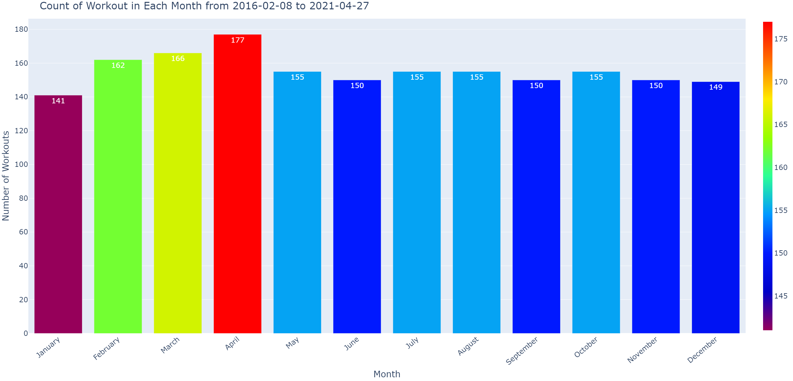
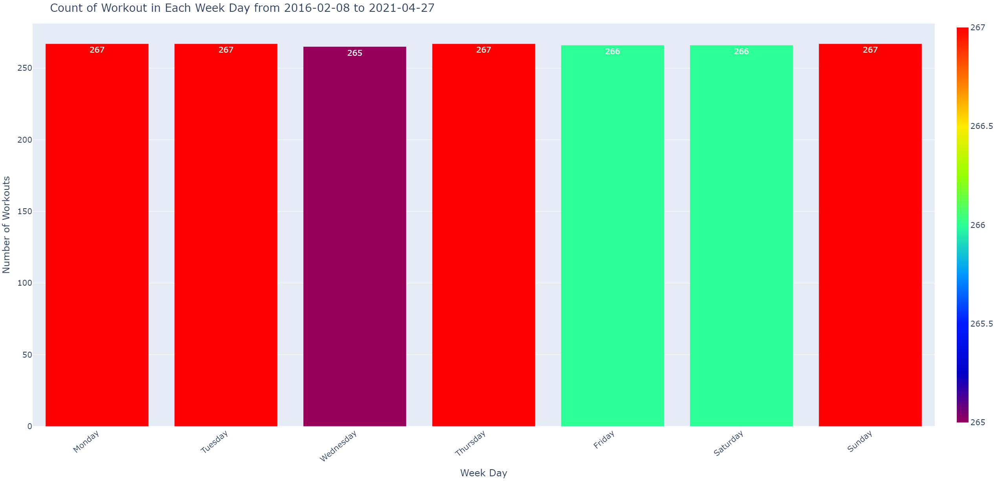
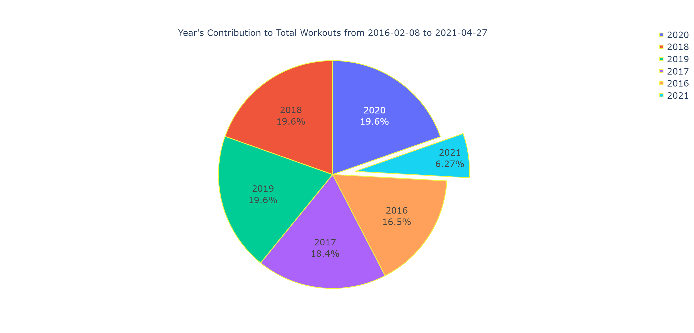

# Google Fit

Downloaded my personal [Google Fit data](https://support.google.com/fit/answer/3024190?hl=en).
With this data I can have a deeper insight into my `activities`/`workouts`, `sleep duration` and `sleep quality`.

- [Google Fit](#google-fit)
  - [This project would use](#this-project-would-use)
    - [With the information I have the opportunity but not limited to](#with-the-information-i-have-the-opportunity-but-not-limited-to)
  - [Datasource](#datasource)
  - [Folder structure](#folder-structure)
    - [Folders](#folders)
  - [Preparing the Data For Analysis](#preparing-the-data-for-analysis)
  - [Plotting The Data](#plotting-the-data)
    - [How many workouts were performed based on Months](#how-many-workouts-were-performed-based-on-months)
  - [How many workouts were performed based on Weekdays](#how-many-workouts-were-performed-based-on-weekdays)
  - [What was the yearly distribution of workouts](#what-was-the-yearly-distribution-of-workouts)
  - [Resources](#resources)

---

## This project would use

- Large datasets

  - **My Google Fit Data:** 1.63 GB (1,758,343,124 bytes)
    - `takeout-20210428T072453Z-001.tgz`

- Complex datasets

  - [`.TCX`](https://fileinfo.com/extension/tcx)
  - [`.JSON`](https://www.w3schools.com/js/js_json_intro.asp)

- Julia programming (although I might change course and go with Python)

- Dimension reduction / clustering

### With the information I have the opportunity but not limited to

- Calculate `heart rate`

  - My average heart rate in a day or a week
  - Average heart rate during a workout
  - What activity do I experience a higher average heart rate

- Track `sleep`

  - See if the is a correlation between **my** sleep and physical performance\
    (e.g. hours of sleep per night in relation to my "performance", measured by the
    ratio of calories burned per time unit)

- Track my `activities`/`workouts`
  - See if I generally workout better weekdays vs weekends

## Datasource

- **2020:** Qualcomm® Snapdragon Wear™ 4100
- **2018:** Sport 3100 SOC

| Use Date       | OEM    | Device                   | SoC                             |
| -------------- | ------ | ------------------------ | ------------------------------- |
| 2020 - Present | Mobvoi | TicWatch Pro 3 GPS       | Qualcomm® Snapdragon Wear™ 4100 |
| 2018 - 2020    | Fossil | Sport Smartwatch (Gen 1) | Qualcomm® Snapdragon Wear™ 3100 |

## Folder structure

    D:.
    |   project_summary.md
    |   README.md
    \---data
            takeout-20210428T072453Z-001.tgz

> ```sh
> tar -xvzf data/takeout-20210428T072453Z-001.tgz
> ```

    D:.
    +---data
    \---Takeout
        \---Fit
            +---Activities
            +---All Data
            +---All Sessions
            \---Daily activity metrics

### Folders

- **Activities:** Workouts and automatically tracked activities, like running or
  cycling. _(`TCX` files)_

  - **`TCX` files:** standard XML files like used by fitness trackers to share
    tracking information

- **Daily activity metrics:** Daily totals for each activity metric, like steps
  and distance. _(`CSV` files)_
- **All Data:** All my data from Google Fit, grouped by source. _(`JSON` files)_
- **All Sessions:** All the sessions recorded in Journal, including activities
  and sleep. _(`JSON` files)_

## Preparing the Data For Analysis

For analysis I am intrested in my "`Daily activity metrics`"
In the “`Daily activity metrics`” folder holds records of data in CSV file format
dating back to when I first downloaded GoogleFit app.

Each CSV data file contains the hourly stats of your workout for that particular date.
For example `2021-04-27.csv`

> ```python
> import pandas as pd
> df = pd.read_csv(r'Takeout/Fit/Daily activity metrics/Daily activity metrics.csv')
> df.info()
> ```

    <class 'pandas.core.frame.DataFrame'>
    RangeIndex: 1865 entries, 0 to 1864
    Data columns (total 38 columns):
    #   Column                            Non-Null Count  Dtype
    ---  ------                            --------------  -----
    0   Date                              1865 non-null   object
    1   Average weight (kg)               45 non-null     float64
    2   Max weight (kg)                   45 non-null     float64
    3   Min weight (kg)                   45 non-null     float64
    4   Calories (kcal)                   1710 non-null   float64
    5   Heart Points                      710 non-null    float64
    6   Heart Minutes                     710 non-null    float64
    7   Low latitude (deg)                529 non-null    float64
    8   Low longitude (deg)               529 non-null    float64
    9   High latitude (deg)               529 non-null    float64
    10  High longitude (deg)              529 non-null    float64
    11  Average heart rate (bpm)          772 non-null    float64
    12  Max heart rate (bpm)              772 non-null    float64
    13  Min heart rate (bpm)              772 non-null    float64
    14  Step count                        1862 non-null   float64
    15  Distance (m)                      1786 non-null   float64
    16  Average speed (m/s)               1858 non-null   float64
    17  Max speed (m/s)                   1858 non-null   float64
    18  Min speed (m/s)                   1858 non-null   float64
    19  Move Minutes count                1110 non-null   float64
    20  Biking duration (ms)              40 non-null     float64
    21  Inactive duration (ms)            1753 non-null   float64
    22  Walking duration (ms)             1791 non-null   float64
    23  Running duration (ms)             114 non-null    float64
    24  Spinning duration (ms)            1 non-null      float64
    25  Stationary biking duration (ms)   1 non-null      float64
    26  Elliptical duration (ms)          33 non-null     float64
    27  Hiking duration (ms)              3 non-null      float64
    28  Treadmill running duration (ms)   5 non-null      float64
    29  Strength training duration (ms)   5 non-null      float64
    30  Treadmill walking duration (ms)   2 non-null      float64
    31  Other duration (ms)               1 non-null      float64
    32  Light sleeping duration (ms)      131 non-null    float64
    33  Deep sleeping duration (ms)       129 non-null    float64
    34  REM sleeping duration (ms)        129 non-null    float64
    35  Awake mid-sleeping duration (ms)  131 non-null    float64
    36  Interval training duration (ms)   1 non-null      float64
    37  Guided breathing duration (ms)    4 non-null      float64
    dtypes: float64(37), object(1)
    memory usage: 553.8+ KB

Dropping columns I don't care for to calculate

1. How many workouts were performed based on Months?
2. How many workouts were performed based on Weekdays?
3. What was the yearly distribution of workouts?

> ```python
> df.drop(['Average weight (kg)', 'Max weight (kg)', 'Min weight (kg)', 'Average heart rate (bpm)',
>              'Min heart rate (bpm)', 'Max heart rate (bpm)'], inplace=True, axis=1)
> ```

## Plotting The Data

### How many workouts were performed based on Months

> ```python
> workout_month_value_count = df.workoutMonth.value_counts()
> months = ('January', 'February', 'March', 'April', 'May', 'June',
>             'July', 'August', 'September', 'October', 'November', 'December')
> month_value = tuple(workout_month_value_count[i] for i in months)
> fig = px.bar(workout_month_value_count,
>                 x=months,
>                 y=month_value,
>                 color=month_value,
>                 text=month_value,
>                 color_continuous_scale='Rainbow',
>                 labels={'color': ''}
>                 )
> fig.update_layout(
>     title="Count of Workout in Each Month from 2016-02-08 to 2021-04-27",
>     xaxis_title='Month',
>     yaxis_title='Number of Workouts',
>     xaxis_tickangle=-40,
>     yaxis={'visible': True, 'showticklabels': True},
>     font=dict(size=23)
> )
> fig.show()
> ```



## How many workouts were performed based on Weekdays

> ```python
> workout_weekday_value_count = df.workoutWeekDay.value_counts()
> months = ('Monday', 'Tuesday', 'Wednesday',
>             'Thursday', 'Friday', 'Saturday', 'Sunday')
> month_value = tuple(workout_weekday_value_count[i] for i in months)
> fig = px.bar(workout_weekday_value_count,
>                 x=months,
>                 y=month_value,
>                 color=month_value,
>                 text=month_value,
>                 color_continuous_scale='Rainbow',
>                 labels={'color': ''}
>                 )
> fig.update_layout(
>     title="Count of Workout in Each Week Day from 2016-02-08 to 2021-04-27",
>     xaxis_title='Week Day',
>     yaxis_title='Number of Workouts',
>     xaxis_tickangle=-40,
>     yaxis={'visible': True, 'showticklabels': True},
>     font=dict(size=20)
> )
> fig.show()
> ```



## What was the yearly distribution of workouts

> ```python
> year_value = df.workoutYear.value_counts()
> fig = go.Figure(data=[go.Pie(labels=year_value.index,
>                               values=year_value.values,
>                               textinfo='label+percent',
>                               pull=[0, 0, 0, 0, 0, 0.2],
>                               title="Year's Contribution to Total Workouts from 2016-02-08 to 2021-04-27"
>                               )])
> fig.update_traces(hoverinfo='label+value',  textfont_size=32,
>                   marker=dict(line=dict(color='#eff542', width=3)), showlegend=True)
> fig.update_layout(font=dict(size=32))
> fig.show()
> ```



## Resources

- [Pandas Tutorial](https://www.w3schools.com/python/pandas/default.asp)
- [Parsing TCX files with lxml](https://towardsdatascience.com/parsing-fitness-tracker-data-with-python-a59e7dc17418)
- [Plotly Python Open Source Graphing Library](https://plotly.com/python/)
- [How to read CSV File into Python using Pandas](https://towardsdatascience.com/how-to-read-csv-file-using-pandas-ab1f5e7e7b58)
- [Google Fit Data Analysis](https://towardsdatascience.com/google-fit-data-analysis-8541d5402f3b)
- [Exploratory Data Analysis of Google Fit data with Pandas and Seaborn](https://medium.com/analytics-vidhya/exploratory-data-analysis-of-google-fit-data-with-pandas-and-seaborn-a4369366c543)
- [Parsing date – a simple example](https://sukhbinder.wordpress.com/2018/07/31/parsing-date-a-simple-example/)
